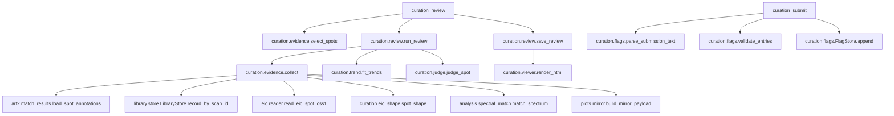

# アラインメントのキュレーション Implementation Plan

> **For agentic workers:** REQUIRED SUB-SKILL: Use superpowers:subagent-driven-development (recommended) or superpowers:executing-plans to implement this plan task-by-task. Steps use checkbox (`- [ ]`) syntax for tracking.

**Goal:** MS-DIAL アラインメントの注釈付きスポットを、EIC・対向プロット・Δppm・ΔRT・RT–m/z 傾向と機械判別つきの HTML ビューアで一覧確認し、ユーザーが付けた「間違い」「疑わしい」フラグをシステムに保存して差次的エクスポートへ反映する。

**Architecture:** 新パッケージ `lipidmix/curation/` に、純関数（EIC 形状・傾向回帰・判別・フラグ記録）と I/O（証拠収集・レビュー生成・ビューア HTML）を分けて置く。MessagePack の Key を知るのは `lipidmix/arf2/` だけ（`match_results.py` を新設）。MCP 面は `lipidmix/tools/curation_tools.py` の 4 ツール＋ `ui://` リソース 1 つ。エクスポートは契約 15 列を変えず、メタ行 1 本を足す。

**Tech Stack:** Python 3.14（`C:/Python314/python.exe`）、FastMCP（`mcp` 1.27.1）、numpy、pygoslin、msgpack/lz4、埋め込み canvas の素の JS（外部 CDN なし）。

**Spec:** `docs/superpowers/specs/2026-09-28-alignment-curation-design.md`

## Global Constraints

- **着手前に main を取り込む**: このブランチは NAS 撤回のマージ（main `48ced9a`）より前の `44d5870` から切ってある。Task 1 の前に worktree で `git merge --no-ff main -m "Merge main into feat/alignment-curation: NAS 撤回を取り込む"` を実行する（Task 10 の CLAUDE.md 編集が衝突しないように）。
- Python は `C:/Python314/python.exe`。テストはリポジトリ（worktree）ルートから `C:/Python314/python.exe -m pytest tests -q`。
- 全ツールに `structured_output=False`。JSON は `lipidmix.core.serialization.json_payload()`、float は丸める、行一覧は TSV（`arf2/reader.py format_spots_as_table`）。
- 前提状態が無いときは例外でなく `lipidmix.core.mcp_errors.missing_state(state, required_tools, message)`。
- 可変状態の正準は `lipidmix.core.session_state.session` / `lipidmix.core.mcp_core`。`from ... import DATA_DIR` を書かない。`lipidmix.core.mcp_core` から `lipidmix.tools.*` を import しない。
- `lipidmix/pipeline/{engine,worker,service,recovery,store}.py` を触らない（キュレーションは pipeline に入れない）。
- エクスポート契約 `lipidmix/analysis/export_contract.py` の `EXPORT_COLUMNS` と `CONTRACT_VERSION = 1` は変えない。`build_meta` の行順も変えない（キュレーション行は `source_lines` スロットの末尾に差す）。
- fixture はテスト自身が作る。研究データ・研究室ライブラリ・その派生（化合物名の一覧・スペクトル）をテスト・fixture・commit・文書に書かない。
- README.md / CLAUDE.md に数量表現を足さない（CLAUDE.md 冒頭の規模表記「ツール N・リソース N・リソーステンプレート N」だけは実登録と一致させる義務がある）。
- `git stash` を使わない。コミットは pre-commit で全テストが走る（数分）ので、バックグラウンド実行し出力をファイルへ落とす。実行中に作業ツリーを編集しない。
- 記録（`docs/HISTRY.md` / `docs/task.md`）は **main ツリー**（`C:/Users/yuu18/Metabolomix_with_LLM/docs/`）へ追記専用で書く。
- UNKNOWN 帯は FAIL に数えない（「MS/MS 未取得」と「合わなかった」を混ぜない）。⑤傾向は単独で総合判定を `suspect` 以上にしない。
- 判断の記録はユーザーが付けたフラグ（`wrong` / `suspect`、取り消し `clear`）だけ。無印は何も書かない。ローカル単独利用前提（共有を理由にした設計をしない）。

## 確定済みの事実（spec §8 の調査結果。上流 `afd5f9522`、kidney neg/pos で実測）

- アラインメント `.dcl` は `dcl[MasterAlignmentID]` が代表試料のスキャン（GUI も `LoadMSDecResultByIndexAsync(MasterAlignmentID)`）。その precursor/RT は代表試料の `.arf` 行の Mass（Key 22）/RT と 100% 一致。スペクトルが空なのは `no MS2:` のスポットと Unknown だけ。`MSDecResultIdUsed`（Key 59）は代表試料の個別 `.dcl` の索引で、ここでは使わない。
- 代表の照合結果 = 非 decoy・`Source != Unknown(1)` の候補の `argmax(IsManuallyModified, IsReferenceMatched, IsAnnotationSuggested, Priority, TotalScore)`。`IsManuallyModified = (Source & 64) != 0`。代表の Name はスポット名から接頭辞を除いたものと 100% 一致。
- 接頭辞の規則: `IsReferenceMatched` → 接頭辞なし。そうでなく `IsAnnotationSuggested` → MS/MS なしなら `no MS2: `、ありなら `low score: `。`Unsettled: ` は GUI の手動操作だけ。`w/o MS2: ` は MS-DIAL 5 の脂質・代謝物経路では出ない。
- 参照レコード: `record_index == LibraryID`（上流 ScanID）かつ `library_id == AnnotatorID から末尾の "_<数字>" を除いたもの`（`.msp` 由来の store では `library_id` は NULL）。代表は 100% 解決。名前の一致は 37% しかない（上流が脂質名を詳細化する）ので名前で照合しない。InChIKey は 100% 一致。
- Δ は代表試料の行（`AlignedPeakProperties` のうち `FileID == RepresentativeFileID`（spot Key 3））の Mass / RT と参照の precursor m/z / RT の差。これで MS-DIAL の `AcurateMassSimilarity` / `RtSimilarity` を誤差 0 で再現できる。`.dbs` の全レコードが RT > 0。|ΔRT| は中央値 0.22〜0.29 分、最大 2.0 分（RT 許容幅 2.0）。
- `.EIC.aef` のスポット番号 = MasterAlignmentID。試料の FileID の並びは `.arf` の行と同順（kidney は 1 スポット 56 試料）。gap-fill の試料にも EIC 系列がある。1 試料の点数は中央値 72〜82（最大 899）。
- イオンモード（spot Key 11）は `Positive=0, Negative=1`。
- **未確定**: スポットのアダクト（Key 54）が参照のアダクトと一致するのは 1183/1468（neg）。原因は未調査なので、判別には使わず情報の理由コード `adduct_differs_from_reference` にとどめる。

## Review Focus

1. **読み込んだライブラリがアラインメントに使われたものと違う**（研究室の `.msp` を読んだが解析は `.dbs` だった等）→ 参照が引けず、ΔRT・対向プロットが軒並み UNKNOWN になる。期待: エラーにせず、参照を解決できた割合が 50% 未満なら戻り値に `warnings` で「別のライブラリを読んでいる可能性」を出す。Task 9 のテストで縛る。
2. **MS-DIAL を再実行して `.arf2` が作り直された** → 古いフラグが新しい MasterAlignmentID に黙って当たる。期待: フラグはアラインメントファイルの sha256 で束ね、違えば適用しない。Task 5 と Task 10 のテストで縛る。
3. **チャットに貼られた送信用テキストの前後に余計な文や改行が付いている／存在しない review_id やレビュー外の spot_id を含む** → 期待: 前後の文は無視して `CURATION_SUBMIT ` 行だけ読む。不正な要素が 1 つでもあれば何も書かずに理由を返す（部分書き込みをしない）。Task 5 と Task 9 のテストで縛る。
4. **「注釈付き全部」で 2000 スポット近くを選ぶ** → HTML が数十 MB になり開けない。期待: EIC はピーク窓の周辺だけに切り詰め、数値を丸める。レビュー 1 回のスポット数は上限を持ち（既定 3000）、超えたら理由付きで拒否する。Task 6 と Task 9 のテストで縛る。
5. **脂質名として読めない注釈**（代謝物名、`RIKEN ... ID-45 from ...` のようなライブラリ固有名）→ 傾向の計算で例外。期待: 組成が取れないスポットは⑤だけ UNKNOWN にして、他の判別は続ける。Task 3 のテストで縛る。

---

## File Structure

| パス | 役割 | 作成/変更 |
|---|---|---|
| `docs/schema/MsScanMatchResult.md` | MsScanMatchResult と Container の Key 表（正準） | 作成 |
| `lipidmix/arf2/reader.py` | `iter_raw_spots()` を切り出し、`deserialize()` がそれを使う | 変更 |
| `lipidmix/arf2/match_results.py` | MatchResults の復号・代表の選択・接頭辞の読み取り | 作成 |
| `lipidmix/library/store.py` | `LibraryStore.record_by_scan_id()` | 変更 |
| `lipidmix/curation/__init__.py` | パッケージ | 作成 |
| `lipidmix/curation/eic_shape.py` | EIC 形状指標（純関数） | 作成 |
| `lipidmix/curation/trend.py` | 組成の取得と、クラス別の加法モデルの頑健回帰（純関数） | 作成 |
| `lipidmix/curation/judge.py` | しきい値・系統ごとの帯・総合判定（純関数） | 作成 |
| `lipidmix/curation/flags.py` | フラグの追記記録・有効フラグ・送信用テキスト | 作成 |
| `lipidmix/curation/evidence.py` | スポット選択と証拠収集（I/O） | 作成 |
| `lipidmix/curation/review.py` | レビューの生成・保存・要約 TSV | 作成 |
| `lipidmix/curation/viewer.py` | ビューア HTML の組み立て | 作成 |
| `lipidmix/curation/viewer.html` | ビューアのテンプレート（CSS/JS 埋め込み） | 作成 |
| `lipidmix/curation/apply.py` | エクスポートへのフラグ適用とメタ行 | 作成 |
| `lipidmix/core/session_state.py` | `CurationState` スロット | 変更 |
| `lipidmix/tools/curation_tools.py` | MCP ツール 4 つ＋ `ui://` リソース | 作成 |
| `server.py` | 登録と再エクスポート | 変更 |
| `lipidmix/arf/tools.py` | `arf_export_differential(apply_curation=True)` | 変更 |
| `lipidmix/analysis/dataset_export.py` / `lipidmix/tools/dataset_analysis_tools.py` | mzTab-M 経路の適用 | 変更 |
| `lipidmix/arf2/tools.py` | `arf2_annotate_identities` にフラグ列 | 変更 |
| `USAGE.md` `CLAUDE.md` `docs/workflow/{index,curation}.md` `docs/output_format/curation.md` `docs/output_format/core.md` | 文書 | 変更/作成 |
| `tests/curation_fixtures.py` | 合成 `.arf2`/`.dcl`/`.EIC.aef`/`.arf`/`.msp` の組 | 作成 |
| `tests/test_*` | 各タスクのテスト、腐敗防止テストの期待値 | 作成/変更 |

---

### Task 1: MatchResults の復号と Key 表

**Files:**
- Create: `docs/schema/MsScanMatchResult.md`
- Modify: `lipidmix/arf2/reader.py`（`deserialize` の中の入れ子展開を `iter_raw_spots` に切り出す）
- Create: `lipidmix/arf2/match_results.py`
- Create: `tests/curation_fixtures.py`
- Test: `tests/test_arf2_match_results.py`

**Interfaces:**
- Produces:
  - `lipidmix.arf2.reader.iter_raw_spots(datas: list) -> Iterator[list]`（`deserialize_lz4_packed_msgpack` の戻りから AlignmentSpotProperty の生配列を順に返す）
  - `lipidmix.arf2.reader.load_raw_spots(file_path) -> list[list]`
  - `lipidmix.arf2.match_results.decode_match_result(raw: list) -> dict | None`
  - `lipidmix.arf2.match_results.representative(container) -> dict | None`
  - `lipidmix.arf2.match_results.name_prefix(name: str | None) -> str | None`（`"no MS2"` / `"low score"` / `"unsettled"` / `"w/o MS2"` / None）
  - `lipidmix.arf2.match_results.spot_annotation(raw_spot: list) -> dict`（キー: `spot_id` `representative_file_id` `representative` `n_candidates`）
  - `lipidmix.arf2.match_results.load_spot_annotations(file_path) -> dict[int, dict]`
  - `tests.curation_fixtures`: `match_result(**overrides) -> list`、`arf2_spot_raw(**kw) -> list`、`write_arf2(path, spots) -> Path`

- [ ] **Step 1: Key 表を起こす**

`docs/schema/MsScanMatchResult.md` を作成する（既存の `docs/schema/AlignmentSpotProperty.md` と同じ書式。上流の出典とコミットを先頭に書く）:

````markdown
# MsScanMatchResult / MsScanMatchResultContainer の Key 番号

- 出典: `C:\Users\yuu18\source\repos\MsdialWorkbench`（`master`、`afd5f9522`、2026-09-08）
  - `src/Common/CommonStandard/DataObj/Result/MsScanMatchResult.cs`
  - `src/MSDIAL5/MsdialCore/DataObj/MsScanMatchResultContainer.cs`
- `.arf2` の `AlignmentSpotProperty` Key 56（`MatchResults`）がこのコンテナ。

## MsScanMatchResultContainer

| Key | 型 | 名前 | 備考 |
|---|---|---|---|
| 0 | `List<MsScanMatchResult>` | `MatchResults` | 候補の一覧。空なら上流は `UnknownResult` を返す |
| 1 | `Dictionary<int, MsScanMatchResult>` | `MSRawID2MspBasedMatchResult` | |
| 2 | `List<MsScanMatchResult>` | `TextDbBasedMatchResults` | |

代表（GUI が表示する 1 件）はシリアライズされない計算値 `Representative`:
非 decoy かつ `Source != Unknown` の候補の
`argmax(IsManuallyModified, IsReferenceMatched, IsAnnotationSuggested, Priority, TotalScore)`
（`ResultOrder`）。`IsManuallyModified = (Source & Manual) != 0`。

## MsScanMatchResult

| Key | 型 | 名前 |
|---|---|---|
| 0 | `string` | `Name` |
| 1 | `string` | `InChIKey` |
| 2 | `float` | `TotalScore` |
| 3 | `float` | `SquaredWeightedDotProduct`（MS/MS 無しは -1） |
| 4 | `float` | `SquaredSimpleDotProduct` |
| 5 | `float` | `SquaredReverseDotProduct` |
| 6 | `float` | `MatchedPeaksCount`（MS/MS 無しは -1） |
| 7 | `float` | `MatchedPeaksPercentage` |
| 8 | `float` | `EssentialFragmentMatchedScore` |
| 9 | `float` | `RtSimilarity` |
| 10 | `float` | `RiSimilarity` |
| 11 | `float` | `CcsSimilarity` |
| 12 | `float` | `IsotopeSimilarity` |
| 13 | `float` | `AcurateMassSimilarity` |
| 14 | `int` | `LibraryID`（参照の ScanID） |
| 15 | `bool` | `IsPrecursorMzMatch` |
| 16 | `bool` | `IsSpectrumMatch` |
| 17 | `bool` | `IsRtMatch` |
| 18 | `bool` | `IsCcsMatch` |
| 19 | `bool` | `IsLipidClassMatch` |
| 20 | `bool` | `IsLipidChainsMatch` |
| 21 | `bool` | `IsLipidPositionMatch` |
| 22 | `bool` | `IsOtherLipidMatch` |
| 23 | `bool` | `IsRiMatch` |
| 24 | `int` | `LibraryIDWhenOrdered` |
| 25 | — | 欠番 |
| 26 | `SourceType`（byte のビット集合） | `Source`: None=0, Unknown=1, FastaDB=2, MspDB=4, TextDB=16, GeneratedLipid=32, Manual=64 |
| 27 | `string` | `AnnotatorID`（`.dbs` では `<エントリ名>_<n>`） |
| 28 | `int` | `SpectrumID` |
| 29 | `float` | `AndromedaScore` |
| 30 | `bool` | `IsDecoy` |
| 31 | `int` | `Priority` |
| 32 | `float` | `PEPScore` |
| 33 | `bool` | `IsReferenceMatched` |
| 34 | `bool` | `IsAnnotationSuggested` |
| 35 | `bool` | `IsLipidDoubleBondPositionMatch` |
| 36 | `double` | `CollisionEnergy` |
| 37 | `float` | `EnhancedDotProduct` |
| 38 | `float` | `SpectralEntropy` |

## 注釈名の接頭辞（スポット Key 12）

上流 `StandardAnnotationProcess.SetRepresentativeProperty` / `DataAccess.SetMoleculeMsPropertyAsSuggested`:
`IsReferenceMatched` → 接頭辞なし。そうでなく `IsAnnotationSuggested` → MS/MS なしなら `no MS2: `、
ありなら `low score: `。`Unsettled: ` は GUI の手動操作（`SetMoleculeMsPropertyAsUnsettled`）だけ。
````

- [ ] **Step 2: 共有 fixture を書く**

`tests/curation_fixtures.py` を作成する。以降のタスクもここへ足していく（Task 6 で `.dcl`/`.EIC.aef`/`.arf`/`.msp` を追加）。

```python
"""キュレーション用の合成入力（.arf2 / .dcl / .EIC.aef / .arf / .msp）。

実データはリポジトリに含めないので、各形式のレイアウトをここで組み立てる。
Key 番号の正準は docs/schema/*.md（MsScanMatchResult.md / AlignmentSpotProperty.md）。
"""
from __future__ import annotations

from pathlib import Path

import lz4.block
import msgpack


def at_keys(size: int, values: dict) -> list:
    row = [None] * size
    for key, value in values.items():
        row[key] = value
    return row


def chromxs(rt: float, mz: float) -> list:
    """ChromXs の入れ子表現（1=RT, 3=m/z）。"""
    return [[1, [rt]], [3, [mz]]]


def match_result(**overrides) -> list:
    """MsScanMatchResult の生配列（39 要素）。既定は「参照一致した MS/MS あり」。"""
    values = {
        0: "PC 34:1", 1: "KEY-PC341", 2: 3.2,
        3: 0.81, 4: 0.64, 5: 0.9, 6: 12.0, 7: 0.7, 8: 0.0,
        9: 0.99, 10: 0.0, 11: 0.0, 12: -1.0, 13: 0.98,
        14: 5, 15: True, 16: True, 17: True, 18: False,
        19: True, 20: True, 21: False, 22: False, 23: False,
        24: -1, 26: 4, 27: "Msp20260101000000_lib_1", 28: -1,
        29: 0.0, 30: False, 31: 1, 32: 0.0, 33: True, 34: False,
        35: False, 36: 0.0, 37: float("nan"), 38: -1.0,
    }
    values.update(overrides)
    return at_keys(39, values)


def arf2_spot_raw(*, spot_id: int, name: str = "PC 34:1", mz: float = 760.5851,
                  rt: float = 12.0, ontology: str = "PC", adduct: str = "[M+H]+",
                  formula: str = "C42H82NO8P", ion_mode: int = 0,
                  representative_file_id: int = 0,
                  matches: list | None = None) -> list:
    """AlignmentSpotProperty の生配列（Key 0..59）。matches は match_result() の並び。"""
    values = {
        0: spot_id, 1: spot_id, 3: representative_file_id,
        4: chromxs(rt, mz), 5: mz, 11: ion_mode, 12: name,
        13: [formula, 0.0], 14: ontology, 15: "", 16: "",
        31: 10000.0, 32: 100.0, 33: 20000.0, 34: 0.2,
        35: 30.0, 36: 50.0, 37: 10.0, 43: mz - 0.001, 44: mz + 0.001,
        49: 1.0, 51: 1.0, 54: [0.0, 1, adduct],
        56: [list(matches or []), {}, []],
        59: -1,
    }
    return at_keys(60, values)


def write_arf2(path: Path, spots: list[list]) -> Path:
    """MS-DIAL の外側コンテナ msgpack([header, msgpack(非圧縮長) + LZ4]) で書く。"""
    inner = b"".join(msgpack.packb(spot, use_bin_type=True) for spot in spots)
    payload = msgpack.packb(len(inner), use_bin_type=True) + lz4.block.compress(
        inner, store_size=False)
    path = Path(path)
    path.write_bytes(msgpack.packb(["hdr", payload], use_bin_type=True))
    return path
```

- [ ] **Step 3: 失敗するテストを書く**

`tests/test_arf2_match_results.py`:

```python
"""MatchResults（.arf2 Key 56）の復号と、GUI が表示する代表の選択。"""
import io
import math

from lipidmix.arf2 import match_results as mr
from lipidmix.arf2 import reader as arf2_reader
from tests.curation_fixtures import arf2_spot_raw, match_result, write_arf2


def test_decode_names_every_key_from_the_schema():
    decoded = mr.decode_match_result(match_result())
    assert decoded["name"] == "PC 34:1"
    assert decoded["library_id"] == 5
    assert decoded["annotator_id"] == "Msp20260101000000_lib_1"
    assert decoded["is_reference_matched"] is True
    assert decoded["squared_weighted_dot_product"] == 0.81
    assert decoded["priority"] == 1
    assert decoded["is_manually_modified"] is False
    assert decoded["has_msms"] is True


def test_decode_marks_msms_absent_by_the_minus_one_sentinel():
    decoded = mr.decode_match_result(match_result(**{3: -1.0, 4: -1.0, 5: -1.0, 6: -1.0}))
    assert decoded["has_msms"] is False


def test_decode_rejects_rows_that_are_not_match_results():
    assert mr.decode_match_result(None) is None
    assert mr.decode_match_result([1, 2]) is None


def test_representative_follows_upstream_result_order():
    low = match_result(**{0: "A", 2: 9.0, 33: False, 34: True})
    matched = match_result(**{0: "B", 2: 1.0, 33: True})
    manual = match_result(**{0: "C", 2: 0.1, 33: False, 26: 4 | 64})
    assert mr.representative([[low, matched], {}, []])["name"] == "B"
    assert mr.representative([[low, matched, manual], {}, []])["name"] == "C"


def test_representative_ignores_decoys_and_unknown_source():
    decoy = match_result(**{0: "D", 30: True, 2: 99.0})
    unknown = match_result(**{0: "U", 26: 1, 2: 99.0})
    real = match_result(**{0: "R", 2: 0.5})
    assert mr.representative([[decoy, unknown, real], {}, []])["name"] == "R"
    assert mr.representative([[decoy, unknown], {}, []]) is None
    assert mr.representative([[], {}, []]) is None
    assert mr.representative(None) is None


def test_representative_priority_breaks_ties_before_total_score():
    a = match_result(**{0: "A", 31: 2, 2: 0.1})
    b = match_result(**{0: "B", 31: 1, 2: 9.0})
    assert mr.representative([[a, b], {}, []])["name"] == "A"


def test_name_prefix_reads_msdial_qualifiers():
    assert mr.name_prefix("low score: PC 34:1") == "low score"
    assert mr.name_prefix("no MS2: PC 34:1") == "no MS2"
    assert mr.name_prefix("Unsettled: PC 34:1") == "unsettled"
    assert mr.name_prefix("w/o MS2: PC 34:1") == "w/o MS2"
    assert mr.name_prefix("PC 34:1") is None
    assert mr.name_prefix(None) is None


def test_load_spot_annotations_keys_by_master_alignment_id(tmp_path):
    path = write_arf2(tmp_path / "AlignmentResult_x.arf2", [
        arf2_spot_raw(spot_id=0, matches=[match_result()], representative_file_id=2),
        arf2_spot_raw(spot_id=1, name="Unknown", matches=[]),
    ])
    annotations = mr.load_spot_annotations(path)
    assert set(annotations) == {0, 1}
    assert annotations[0]["representative"]["name"] == "PC 34:1"
    assert annotations[0]["representative_file_id"] == 2
    assert annotations[0]["n_candidates"] == 1
    assert annotations[1]["representative"] is None


def test_iter_raw_spots_keeps_deserialize_behaviour(tmp_path):
    path = write_arf2(tmp_path / "a.arf2", [arf2_spot_raw(spot_id=0), arf2_spot_raw(spot_id=1)])
    spots = arf2_reader.deserialize(io.BytesIO(path.read_bytes()))
    assert [s["MasterAlignmentID"] for s in spots] == [0, 1]
    assert len(arf2_reader.load_raw_spots(path)) == 2


def test_nan_scores_are_passed_through_as_none():
    decoded = mr.decode_match_result(match_result(**{37: float("nan")}))
    assert decoded["enhanced_dot_product"] is None
    assert not any(isinstance(v, float) and math.isnan(v) for v in decoded.values())
```

- [ ] **Step 4: 失敗を確認する**

Run: `C:/Python314/python.exe -m pytest tests/test_arf2_match_results.py -q`
Expected: FAIL（`ModuleNotFoundError: lipidmix.arf2.match_results`）

- [ ] **Step 5: `arf2/reader.py` に `iter_raw_spots` / `load_raw_spots` を足す**

`deserialize()` の本体を次に置き換え、その直前に 2 関数を足す（入れ子展開の規則は現行の `deserialize` と同一。`extract_arf2_data` は `len(data) < 10` を弾くので、`iter_raw_spots` も同じ条件で絞る）:

```python
def iter_raw_spots(datas: list):
    """`deserialize_lz4_packed_msgpack` の戻りから AlignmentSpotProperty の生配列を順に返す。

    `.arf2` は「スポットを直接並べる」形と「リストの入れ子に包む」形の両方がある
    （`deserialize` と同じ規則）。Key 番号を読む層（`match_results` など）は
    ここから生配列を受け取り、展開規則を重複して持たない。
    """
    for d in datas:
        if isinstance(d, list) and len(d) < 14:
            for item in d:
                if isinstance(item, list) and len(item) > 0:
                    for spot_raw in item:
                        if isinstance(spot_raw, list) and len(spot_raw) >= 10:
                            yield spot_raw
            continue
        if isinstance(d, list) and len(d) >= 10:
            yield d


def load_raw_spots(file_path) -> list:
    """`.arf2` を読み、AlignmentSpotProperty の生配列の一覧を返す。"""
    with open(os.fspath(file_path), "rb") as handle:
        datas = deserialize_lz4_packed_msgpack(handle.read())
    return list(iter_raw_spots(datas))


def deserialize(file_like_object) -> List[dict]:
    """バイナリストリームから .arf2 データをパースして辞書のリストを返す"""
    datas = deserialize_lz4_packed_msgpack(file_like_object.read())
    results = []
    for spot_raw in iter_raw_spots(datas):
        formatted = extract_arf2_data(spot_raw)
        if formatted:
            results.append(formatted)
    return results
```

- [ ] **Step 6: `lipidmix/arf2/match_results.py` を書く**

```python
"""MsScanMatchResult（`.arf2` Key 56 の中身）の復号と、GUI が表示する代表の選択。

Key 番号の正準は docs/schema/MsScanMatchResult.md。代表の選択は上流
`MsScanMatchResultContainer.Representative`（`ResultOrder` の argmax）の移植で、
シリアライズ済みの値だけから決まるので忠実に再現できる。
deps: arf2.reader / msdial.lipid_identity（接頭辞の正規表現）。tools_* は import しない。
"""
from __future__ import annotations

import math

from lipidmix.arf2.reader import load_raw_spots

MATCH_KEYS = {
    0: "name", 1: "inchikey", 2: "total_score",
    3: "squared_weighted_dot_product", 4: "squared_simple_dot_product",
    5: "squared_reverse_dot_product", 6: "matched_peaks_count",
    7: "matched_peaks_percentage", 8: "essential_fragment_matched_score",
    9: "rt_similarity", 10: "ri_similarity", 11: "ccs_similarity",
    12: "isotope_similarity", 13: "accurate_mass_similarity", 14: "library_id",
    15: "is_precursor_mz_match", 16: "is_spectrum_match", 17: "is_rt_match",
    18: "is_ccs_match", 19: "is_lipid_class_match", 20: "is_lipid_chains_match",
    21: "is_lipid_position_match", 22: "is_other_lipid_match", 23: "is_ri_match",
    24: "library_id_when_ordered", 26: "source", 27: "annotator_id",
    28: "spectrum_id", 29: "andromeda_score", 30: "is_decoy", 31: "priority",
    32: "pep_score", 33: "is_reference_matched", 34: "is_annotation_suggested",
    35: "is_lipid_double_bond_position_match", 36: "collision_energy",
    37: "enhanced_dot_product", 38: "spectral_entropy",
}

SOURCE_UNKNOWN = 1
SOURCE_MANUAL = 64

# spot Key 12 の接頭辞。上流の綴り（"Unsettled: " は大文字始まり）を大小無視で読む。
_PREFIXES = (
    ("no ms2:", "no MS2"),
    ("low score:", "low score"),
    ("unsettled:", "unsettled"),
    ("w/o ms2:", "w/o MS2"),
)


def _clean(value):
    if isinstance(value, bytes):
        value = value.decode("utf-8", errors="replace")
    if isinstance(value, float) and math.isnan(value):
        return None
    return value


def decode_match_result(raw) -> dict | None:
    """MsScanMatchResult の生配列を名前付き dict にする。読めなければ None。

    追加で 2 つの導出値を持つ:
    - `is_manually_modified`: `(Source & Manual) != 0`（上流の定義）
    - `has_msms`: 重み付きドット積が -1（比較不能の番兵）でない
    """
    if not isinstance(raw, list) or len(raw) < 35:
        return None
    decoded = {name: _clean(raw[key]) if key < len(raw) else None
               for key, name in MATCH_KEYS.items()}
    source = decoded.get("source") or 0
    decoded["is_manually_modified"] = bool(int(source) & SOURCE_MANUAL)
    weighted = decoded.get("squared_weighted_dot_product")
    decoded["has_msms"] = weighted is not None and float(weighted) >= 0
    return decoded


def _order_key(result: dict) -> tuple:
    return (
        bool(result.get("is_manually_modified")),
        bool(result.get("is_reference_matched")),
        bool(result.get("is_annotation_suggested")),
        int(result.get("priority") or 0),
        float(result.get("total_score") or 0.0),
    )


def _candidates(container) -> list[dict]:
    if not isinstance(container, list) or not container or not isinstance(container[0], list):
        return []
    decoded = [decode_match_result(raw) for raw in container[0]]
    return [d for d in decoded if d is not None]


def representative(container) -> dict | None:
    """GUI が表示する代表（非 decoy・Source != Unknown の ResultOrder 最大）。無ければ None。"""
    usable = [c for c in _candidates(container)
              if not c.get("is_decoy") and (c.get("source") or 0) != SOURCE_UNKNOWN]
    if not usable:
        return None
    return max(usable, key=_order_key)


def name_prefix(name) -> str | None:
    if not name:
        return None
    lowered = str(name).strip().lower()
    for token, label in _PREFIXES:
        if lowered.startswith(token):
            return label
    return None


def spot_annotation(raw_spot: list) -> dict:
    container = raw_spot[56] if len(raw_spot) > 56 else None
    return {
        "spot_id": int(raw_spot[0]),
        "representative_file_id": int(raw_spot[3]) if raw_spot[3] is not None else None,
        "representative": representative(container),
        "n_candidates": len(_candidates(container)),
    }


def load_spot_annotations(file_path) -> dict[int, dict]:
    """`.arf2` の全スポットについて代表の照合結果を MasterAlignmentID で引ける形にする。"""
    return {entry["spot_id"]: entry
            for entry in (spot_annotation(raw) for raw in load_raw_spots(file_path))}
```

- [ ] **Step 7: 通ることを確かめる**

Run: `C:/Python314/python.exe -m pytest tests/test_arf2_match_results.py tests/test_parser_decode.py -q`
Expected: PASS（既存の `.arf2` 復号テストも緑のまま）

- [ ] **Step 8: コミット**

```bash
git add docs/schema/MsScanMatchResult.md lipidmix/arf2/reader.py lipidmix/arf2/match_results.py tests/curation_fixtures.py tests/test_arf2_match_results.py
git commit -m "feat(arf2): MatchResults の復号と GUI 代表の選択を追加" > "$TEMP/claude-commit.txt" 2>&1   # バックグラウンド実行。FAILED を後で grep する
```

---

### Task 2: 参照レコードを ScanID で引く

**Files:**
- Modify: `lipidmix/library/store.py`（`candidates` の行→dict 変換を `_row_to_record` に切り出し、`record_by_scan_id` を足す）
- Test: `tests/test_library_store.py`（末尾に追加）

**Interfaces:**
- Produces: `LibraryStore.record_by_scan_id(scan_id: int, *, library_id: str | None, precursor_mz: float, mz_tol: float) -> dict | None`（戻りの dict は `candidates()` の要素と同じ 13 キー）
- Produces: `lipidmix.library.store.library_id_from_annotator(annotator_id: str | None) -> str | None`（末尾の `_<数字>` を除く。`.msp` 由来など該当しなければそのまま返す）

- [ ] **Step 1: 失敗するテストを書く**

`tests/test_library_store.py` の末尾に追加する（既存の `library` fixture を使う。`.msp` の record_index は出現順 A=0, B=1, C=2, D=3）:

```python
def test_record_by_scan_id_uses_the_mz_index_and_the_scan_id(library):
    s = store.open_store(library)
    try:
        hit = s.record_by_scan_id(1, library_id=None, precursor_mz=100.004, mz_tol=0.05)
        assert hit["name"] == "B"
        assert hit["record_index"] == 1
        assert s.record_by_scan_id(3, library_id=None, precursor_mz=100.0, mz_tol=0.05) is None
    finally:
        s.close()


def test_record_by_scan_id_filters_by_library_id_when_the_store_has_one(library):
    s = store.open_store(library)
    try:
        # .msp 由来は library_id が NULL。NULL は「区別不要」として残す。
        assert s.record_by_scan_id(0, library_id="Msp1_lib", precursor_mz=100.0,
                                   mz_tol=0.05)["name"] == "A"
    finally:
        s.close()


def test_library_id_from_annotator_strips_the_trailing_counter():
    assert store.library_id_from_annotator("Msp20260116160945_NCDK_dev_1") == "Msp20260116160945_NCDK_dev"
    assert store.library_id_from_annotator("plain") == "plain"
    assert store.library_id_from_annotator(None) is None
```

- [ ] **Step 2: 失敗を確認する**

Run: `C:/Python314/python.exe -m pytest tests/test_library_store.py -q`
Expected: FAIL（`AttributeError: 'LibraryStore' object has no attribute 'record_by_scan_id'`）

- [ ] **Step 3: 実装する**

`lipidmix/library/store.py` の `class LibraryStore` の前にモジュール関数を、`candidates` の後にメソッドを足し、`candidates` のループ本体を `_row_to_record` 経由にする:

```python
_RECORD_COLUMNS = (
    "name, precursor_mz, ion_mode, adduct, rt, formula, inchikey, "
    "smiles, compound_class, ontology, spectrum, library_id, record_index"
)
_ANNOTATOR_COUNTER = re.compile(r"_\d+$")


def library_id_from_annotator(annotator_id: str | None) -> str | None:
    """MsScanMatchResult の AnnotatorID（`<.dbs のエントリ名>_<n>`）を store の library_id にする。"""
    if annotator_id is None:
        return None
    return _ANNOTATOR_COUNTER.sub("", str(annotator_id))


def _row_to_record(row) -> dict:
    (name, row_mz, row_ion_mode, adduct, row_rt, formula, inchikey,
     smiles, compound_class, ontology, spectrum_blob, library_id, record_index) = row
    return {
        "name": name, "precursor_mz": row_mz, "ion_mode": row_ion_mode,
        "adduct": adduct, "rt": row_rt, "formula": formula, "inchikey": inchikey,
        "smiles": smiles, "compound_class": compound_class, "ontology": ontology,
        "spectrum": msgpack.unpackb(spectrum_blob, use_list=True),
        "library_id": library_id, "record_index": record_index,
    }
```

`candidates` の SELECT 句を `f"SELECT {_RECORD_COLUMNS} FROM record WHERE precursor_mz BETWEEN ? AND ?"` に、末尾のループを `return [_row_to_record(row) for row in rows]` に置き換える。メソッドを追加:

```python
    def record_by_scan_id(self, scan_id: int, *, library_id: str | None,
                          precursor_mz: float, mz_tol: float) -> dict | None:
        """MsScanMatchResult.LibraryID（上流 ScanID = record_index）で参照を 1 件引く。

        `record_index` には索引が無いので、索引のある precursor_mz の窓で先に絞る
        （参照の precursor はスポットの m/z から高々 0.03 Da 程度しか離れない）。
        `library_id` は `.dbs` の複数エントリを区別する。NULL（`.msp` 由来）の行は残す。
        """
        query = (f"SELECT {_RECORD_COLUMNS} FROM record "
                 "WHERE precursor_mz BETWEEN ? AND ? AND record_index = ?")
        params: list = [precursor_mz - mz_tol, precursor_mz + mz_tol, int(scan_id)]
        if library_id is not None:
            query += " AND (library_id = ? OR library_id IS NULL)"
            params.append(library_id)
        row = self._conn.execute(query + " LIMIT 1", params).fetchone()
        return _row_to_record(row) if row else None
```

`import re` をファイル先頭の import に足す。

- [ ] **Step 4: 通ることを確かめる**

Run: `C:/Python314/python.exe -m pytest tests/test_library_store.py tests/test_library_tools.py -q`
Expected: PASS

- [ ] **Step 5: コミット**

```bash
git add lipidmix/library/store.py tests/test_library_store.py
git commit -m "feat(library): 参照レコードを ScanID と library_id で引く record_by_scan_id を追加"
```

---

### Task 3: EIC 形状と RT–m/z 傾向（純関数）

**Files:**
- Create: `lipidmix/curation/__init__.py`（空。docstring だけ）
- Create: `lipidmix/curation/eic_shape.py`
- Create: `lipidmix/curation/trend.py`
- Test: `tests/test_curation_eic_shape.py`, `tests/test_curation_trend.py`

**Interfaces:**
- Produces:
  - `eic_shape.sample_shape(chromatogram: list[list[float]], *, left: float, top: float, right: float) -> dict`（キー: `n_points` `apex_rt` `apex_in_window` `gauss_r2` `n_maxima` `symmetry`）
  - `eic_shape.sample_is_good(shape: dict, th: dict) -> bool`
  - `eic_shape.spot_shape(samples: list[dict], th: dict) -> dict`（`samples` の要素: `file_id` `detected` `chromatogram` `left` `top` `right`。戻りのキー: `n_detected` `n_good` `good_fraction` `apex_rt_sd` `per_sample`（`file_id`→shape）`band`）
  - `trend.composition(name: str | None) -> tuple[int, int] | None`（`(総炭素数, 総二重結合数)`）
  - `trend.fit_trends(points: list[dict], th: dict) -> dict`（`points` の要素: `spot_id` `ontology` `rt` `mz` `carbon` `db`。戻りのキー: `classes` `groups` `spots`）
- Consumes: しきい値 dict のキーは Task 4 の `DEFAULT_THRESHOLDS` と同じ名前（このタスクのテストは値を直接渡す）。

- [ ] **Step 1: 失敗するテストを書く**

`tests/test_curation_eic_shape.py`:

```python
import math

from lipidmix.curation import eic_shape

TH = {"eic_min_points": 5, "eic_min_r2": 0.8, "eic_max_maxima": 2,
      "eic_pass_frac": 0.5, "eic_borderline_frac": 0.2, "eic_rt_scatter_sd": 0.1}


def gaussian(center=10.0, sigma=0.05, height=1000.0, n=41, step=0.01):
    start = center - (n // 2) * step
    return [[start + i * step, height * math.exp(-((start + i * step - center) ** 2) / (2 * sigma ** 2))]
            for i in range(n)]


def test_clean_gaussian_is_good():
    shape = eic_shape.sample_shape(gaussian(), left=9.85, top=10.0, right=10.15)
    assert shape["apex_in_window"] is True
    assert shape["gauss_r2"] > 0.95
    assert shape["n_maxima"] == 1
    assert eic_shape.sample_is_good(shape, TH)


def test_jagged_trace_has_many_maxima():
    trace = gaussian()
    for i in range(1, len(trace) - 1, 3):
        trace[i][1] *= 1.6
    shape = eic_shape.sample_shape(trace, left=9.85, top=10.0, right=10.15)
    assert shape["n_maxima"] > 2
    assert not eic_shape.sample_is_good(shape, TH)


def test_apex_at_the_window_edge_is_not_in_window():
    shape = eic_shape.sample_shape(gaussian(center=10.15), left=9.85, top=10.15, right=10.15)
    assert shape["apex_in_window"] is False


def test_empty_window_is_reported_not_raised():
    shape = eic_shape.sample_shape(gaussian(), left=20.0, top=20.1, right=20.2)
    assert shape["n_points"] == 0
    assert shape["gauss_r2"] is None


def test_spot_band_uses_only_detected_samples():
    good = {"file_id": 0, "detected": True, "chromatogram": gaussian(),
            "left": 9.85, "top": 10.0, "right": 10.15}
    flat = {"file_id": 1, "detected": False, "chromatogram": [[9.9, 1.0], [10.0, 1.0], [10.1, 1.0]],
            "left": 9.85, "top": 10.0, "right": 10.15}
    result = eic_shape.spot_shape([good, flat], TH)
    assert result["n_detected"] == 1
    assert result["good_fraction"] == 1.0
    assert result["band"] == "PASS"


def test_spot_without_detected_samples_is_unknown():
    flat = {"file_id": 1, "detected": False, "chromatogram": gaussian(),
            "left": 9.85, "top": 10.0, "right": 10.15}
    assert eic_shape.spot_shape([flat], TH)["band"] == "UNKNOWN"
```

`tests/test_curation_trend.py`:

```python
from lipidmix.curation import trend

TH = {"trend_min_points": 5, "trend_outlier_z": 3.0, "trend_min_r2": 0.7}


def test_composition_from_species_and_molecular_species():
    assert trend.composition("PC 34:1") == (34, 1)
    assert trend.composition("PC 16:0_18:1") == (34, 1)
    assert trend.composition("low score: PE O-38:5") == (38, 5)
    assert trend.composition("Cer 42:1;O2|Cer 18:1;O2/24:0") == (42, 1)


def test_composition_is_none_for_non_lipid_names():
    assert trend.composition("RIKEN N-VS1 ID-45 from Mouse") is None
    assert trend.composition("") is None
    assert trend.composition(None) is None


def _pc(spot_id, carbon, db, rt=None):
    rt = 2.0 + 0.5 * carbon - 0.8 * db if rt is None else rt
    return {"spot_id": spot_id, "ontology": "PC", "rt": rt, "mz": 400 + 14 * carbon - 2 * db,
            "carbon": carbon, "db": db}


def test_additive_model_flags_the_one_off_point():
    points = [_pc(i, c, d) for i, (c, d) in enumerate(
        [(32, 0), (34, 0), (36, 0), (34, 1), (36, 1), (38, 1), (36, 2), (38, 4)])]
    points.append(_pc(99, 34, 2, rt=30.0))
    result = trend.fit_trends(points, TH)
    assert result["classes"]["PC"]["n"] == 9
    assert result["spots"][99]["outlier"] is True
    assert result["spots"][99]["reliable"] is True
    assert result["spots"][0]["outlier"] is False


def test_class_with_too_few_points_is_not_fitted():
    result = trend.fit_trends([_pc(0, 34, 1), _pc(1, 36, 1)], TH)
    assert "PC" not in result["classes"]
    assert result["spots"] == {}


def test_groups_report_per_unsaturation_fit_quality():
    points = [_pc(i, c, 1) for i, c in enumerate([32, 34, 36, 38, 40])]
    group = trend.fit_trends(points, TH)["groups"]["PC"][1]
    assert group["n"] == 5
    assert group["r2"] > 0.99
```

- [ ] **Step 2: 失敗を確認する**

Run: `C:/Python314/python.exe -m pytest tests/test_curation_eic_shape.py tests/test_curation_trend.py -q`
Expected: FAIL（`ModuleNotFoundError: lipidmix.curation`）

- [ ] **Step 3: `lipidmix/curation/__init__.py` と `eic_shape.py` を書く**

`lipidmix/curation/__init__.py`:

```python
"""アラインメントのキュレーション（注釈の一覧確認と機械判別）。spec 2026-09-28。"""
```

`lipidmix/curation/eic_shape.py`:

```python
"""EIC の形状指標（純関数）。画像ではなく系列の数値に対して計算する。

最適化を伴うガウス当てはめは収束の失敗が判定を揺らすので使わない。頂点と半値幅から
決まる理想ガウスとの R² を「ガウスらしさ」とする（決定的で、同じ入力に同じ値）。
"""
from __future__ import annotations

import math
import statistics

_FWHM_TO_SIGMA = 2.354820045


def _half_height_x(xs, ys, apex, half, step):
    i = apex
    while 0 <= i + step < len(xs) and ys[i + step] > half:
        i += step
    j = i + step
    if not 0 <= j < len(xs):
        return xs[i]
    y0, y1 = ys[i], ys[j]
    if y0 == y1:
        return xs[j]
    return xs[i] + (xs[j] - xs[i]) * (y0 - half) / (y0 - y1)


def sample_shape(chromatogram, *, left, top, right) -> dict:
    points = [(float(x), float(y)) for x, y in chromatogram if left <= x <= right]
    if not points:
        return {"n_points": 0, "apex_rt": None, "apex_in_window": False,
                "gauss_r2": None, "n_maxima": 0, "symmetry": None}
    xs = [p[0] for p in points]
    ys = [p[1] for p in points]
    apex = max(range(len(ys)), key=ys.__getitem__)
    height = ys[apex]
    apex_in_window = 0 < apex < len(ys) - 1

    n_maxima = sum(
        1 for i in range(1, len(ys) - 1)
        if ys[i] > ys[i - 1] and ys[i] >= ys[i + 1] and ys[i] >= 0.1 * height)
    if apex_in_window and n_maxima == 0:
        n_maxima = 1

    gauss_r2 = None
    symmetry = None
    if height > 0 and len(ys) >= 3:
        half = height / 2.0
        left_x = _half_height_x(xs, ys, apex, half, -1)
        right_x = _half_height_x(xs, ys, apex, half, +1)
        sigma = (right_x - left_x) / _FWHM_TO_SIGMA
        if sigma > 0:
            model = [height * math.exp(-((x - xs[apex]) ** 2) / (2 * sigma ** 2)) for x in xs]
            mean = sum(ys) / len(ys)
            ss_tot = sum((y - mean) ** 2 for y in ys)
            ss_res = sum((y - m) ** 2 for y, m in zip(ys, model))
            gauss_r2 = round(1.0 - ss_res / ss_tot, 4) if ss_tot > 0 else None
        lw, rw = xs[apex] - left_x, right_x - xs[apex]
        symmetry = round(lw / rw, 3) if lw > 0 and rw > 0 else None

    return {"n_points": len(points), "apex_rt": round(xs[apex], 4),
            "apex_in_window": apex_in_window, "gauss_r2": gauss_r2,
            "n_maxima": n_maxima, "symmetry": symmetry}


def sample_is_good(shape: dict, th: dict) -> bool:
    return (shape["apex_in_window"]
            and shape["n_points"] >= th["eic_min_points"]
            and shape["gauss_r2"] is not None and shape["gauss_r2"] >= th["eic_min_r2"]
            and shape["n_maxima"] <= th["eic_max_maxima"])


def spot_shape(samples: list[dict], th: dict) -> dict:
    per_sample = {}
    detected = []
    for sample in samples:
        shape = sample_shape(sample["chromatogram"], left=sample["left"],
                             top=sample["top"], right=sample["right"])
        per_sample[sample["file_id"]] = shape
        if sample["detected"]:
            detected.append((sample, shape))

    n_detected = len(detected)
    n_good = sum(1 for _, shape in detected if sample_is_good(shape, th))
    fraction = round(n_good / n_detected, 3) if n_detected else None
    tops = [s["top"] for s, _ in detected]
    apex_rt_sd = round(statistics.pstdev(tops), 4) if len(tops) >= 2 else None

    if fraction is None:
        band = "UNKNOWN"
    elif fraction >= th["eic_pass_frac"]:
        band = "PASS"
    elif fraction >= th["eic_borderline_frac"]:
        band = "BORDERLINE"
    else:
        band = "FAIL"
    return {"n_detected": n_detected, "n_good": n_good, "good_fraction": fraction,
            "apex_rt_sd": apex_rt_sd, "per_sample": per_sample, "band": band}
```

- [ ] **Step 4: `trend.py` を書く**

```python
"""RT–m/z 傾向（純関数）。判断材料の 1 つにとどめる（spec §4 ⑤）。

判定はクラスごとに 1 本の加法モデル RT = a + b·C + c·DB を Huber の IRLS で頑健回帰し、
残差を頑健尺度（1.4826·MAD）で割った z で外れを見る。不飽和度が上がると線形性が落ちる
ので、群（クラス×DB）ごとの RT–m/z 直線の R² と点数も返し、ビューアが当てはまりの
悪い群を弱めて表示できるようにする。
"""
from __future__ import annotations

import numpy as np

from lipidmix.msdial.lipid_identity import _clean_msdial_name


def composition(name) -> tuple[int, int] | None:
    if not name or not str(name).strip():
        return None
    clean, _ = _clean_msdial_name(name)
    if not clean:
        return None
    try:
        from pygoslin.parser.Parser import LipidParser
        lipid = LipidParser().parse(clean)
        info = lipid.lipid.info
        return int(info.num_carbon), int(info.double_bonds)
    except Exception:  # noqa: BLE001 - 脂質名として読めない注釈は傾向の対象外
        return None


def _huber(X: np.ndarray, y: np.ndarray, iterations: int = 30):
    weights = np.ones(len(y))
    beta = np.zeros(X.shape[1])
    scale = 0.0
    for _ in range(iterations):
        sw = np.sqrt(weights)
        beta, *_ = np.linalg.lstsq(X * sw[:, None], y * sw, rcond=None)
        residual = y - X @ beta
        mad = np.median(np.abs(residual - np.median(residual)))
        scale = 1.4826 * mad
        if scale <= 1e-9:
            break
        k = 1.345 * scale
        weights = np.where(np.abs(residual) <= k, 1.0, k / np.maximum(np.abs(residual), 1e-12))
    return beta, y - X @ beta, scale


def _r2(y, residual) -> float | None:
    ss_tot = float(np.sum((y - y.mean()) ** 2))
    return round(1.0 - float(np.sum(residual ** 2)) / ss_tot, 4) if ss_tot > 0 else None


def fit_trends(points: list[dict], th: dict) -> dict:
    classes: dict = {}
    groups: dict = {}
    spots: dict = {}
    by_class: dict[str, list[dict]] = {}
    for p in points:
        by_class.setdefault(p["ontology"] or "", []).append(p)

    for ontology, members in by_class.items():
        if len(members) < th["trend_min_points"] or len({p["carbon"] for p in members}) < 2:
            continue
        y = np.array([p["rt"] for p in members], dtype=float)
        columns = [np.ones(len(members)), np.array([p["carbon"] for p in members], dtype=float)]
        if len({p["db"] for p in members}) >= 2:
            columns.append(np.array([p["db"] for p in members], dtype=float))
        X = np.column_stack(columns)
        beta, residual, scale = _huber(X, y)
        r2 = _r2(y, residual)
        reliable = r2 is not None and r2 >= th["trend_min_r2"]
        classes[ontology] = {"n": len(members), "r2": r2,
                             "coef": [round(float(b), 5) for b in beta],
                             "scale": round(float(scale), 5)}
        for p, r in zip(members, residual):
            z = float(r) / scale if scale > 1e-9 else 0.0
            spots[p["spot_id"]] = {"residual": round(float(r), 4), "z": round(z, 3),
                                   "outlier": abs(z) > th["trend_outlier_z"],
                                   "reliable": reliable}

        per_db: dict[int, dict] = {}
        for db in sorted({p["db"] for p in members}):
            subset = [p for p in members if p["db"] == db]
            entry = {"n": len(subset), "slope": None, "intercept": None, "r2": None}
            if len(subset) >= 3 and len({p["mz"] for p in subset}) >= 2:
                xs = np.array([p["mz"] for p in subset], dtype=float)
                ys = np.array([p["rt"] for p in subset], dtype=float)
                slope, intercept = np.polyfit(xs, ys, 1)
                entry.update(slope=round(float(slope), 6), intercept=round(float(intercept), 4),
                             r2=_r2(ys, ys - (slope * xs + intercept)))
            per_db[db] = entry
        groups[ontology] = per_db
    return {"classes": classes, "groups": groups, "spots": spots}
```

- [ ] **Step 5: 通ることを確かめる**

Run: `C:/Python314/python.exe -m pytest tests/test_curation_eic_shape.py tests/test_curation_trend.py -q`
Expected: PASS

- [ ] **Step 6: コミット**

```bash
git add lipidmix/curation/__init__.py lipidmix/curation/eic_shape.py lipidmix/curation/trend.py tests/test_curation_eic_shape.py tests/test_curation_trend.py
git commit -m "feat(curation): EIC 形状指標と RT–m/z 傾向の頑健回帰を追加"
```

---

### Task 4: 機械判別（純関数）

**Files:**
- Create: `lipidmix/curation/judge.py`
- Test: `tests/test_curation_judge.py`

**Interfaces:**
- Consumes: 証拠 dict（Task 6 が作る。ここで使うキー: `name_prefix` `match`（`decode_match_result` の戻り or None）`reference`（dict or None）`ppm` `adduct_band` `drt` `rescore`（dict or None）`eic_shape`（`spot_shape` の戻り）`notes`（list[str]）`adduct` `reference_adduct`）と、`trend.fit_trends(...)["spots"].get(spot_id)`
- Produces:
  - `judge.DEFAULT_THRESHOLDS: dict[str, float]`
  - `judge.resolve_thresholds(overrides: dict | None) -> dict`（未知のキーは `ValueError`）
  - `judge.judge_spot(ev: dict, trend_entry: dict | None, th: dict) -> dict`（キー: `checks`（`msms` `mz` `rt` `eic` `trend` → `{"band", "reasons"}`）`verdict`（`ok`/`suspect`/`likely_wrong`）`reasons`（強い順の理由コード）`info`（情報の理由コード））
  - `judge.STRONG_REASONS` / `judge.WEAK_REASONS`（frozenset）

- [ ] **Step 1: 失敗するテストを書く**

`tests/test_curation_judge.py`:

```python
import pytest

from lipidmix.curation import judge

TH = judge.resolve_thresholds(None)


def match(**kw):
    base = {"has_msms": True, "is_reference_matched": True, "is_annotation_suggested": False,
            "is_precursor_mz_match": True, "is_spectrum_match": True,
            "is_manually_modified": False, "squared_weighted_dot_product": 0.81}
    base.update(kw)
    return base


def ev(**kw):
    base = {"name_prefix": None, "match": match(), "reference": {"rt": 12.0},
            "ppm": 1.5, "adduct_band": "PASS", "drt": 0.1, "rescore": {"weighted_dot_product": 0.9},
            "eic_shape": {"band": "PASS", "apex_rt_sd": 0.01}, "notes": [],
            "adduct": "[M+H]+", "reference_adduct": "[M+H]+"}
    base.update(kw)
    return base


def test_clean_spot_is_ok():
    result = judge.judge_spot(ev(), {"outlier": False, "reliable": True}, TH)
    assert result["verdict"] == "ok"
    assert result["reasons"] == []


def test_no_ms2_is_unknown_not_fail():
    result = judge.judge_spot(ev(name_prefix="no MS2", match=match(has_msms=False,
                              is_reference_matched=False, is_annotation_suggested=True)), None, TH)
    assert result["checks"]["msms"]["band"] == "UNKNOWN"
    assert result["verdict"] == "ok"


def test_low_score_is_suspect():
    result = judge.judge_spot(ev(name_prefix="low score", match=match(is_reference_matched=False,
                              is_annotation_suggested=True)), None, TH)
    assert result["checks"]["msms"]["band"] == "FAIL"
    assert result["verdict"] == "suspect"
    assert "low_score" in result["reasons"]


def test_large_ppm_is_likely_wrong():
    result = judge.judge_spot(ev(ppm=25.0), None, TH)
    assert result["verdict"] == "likely_wrong"
    assert result["reasons"][0] == "ppm_out"


def test_polarity_mismatch_is_likely_wrong():
    assert judge.judge_spot(ev(adduct_band="FAIL"), None, TH)["verdict"] == "likely_wrong"


def test_precursor_unmatched_flag_from_msdial_is_strong():
    result = judge.judge_spot(ev(match=match(is_precursor_mz_match=False)), None, TH)
    assert result["verdict"] == "likely_wrong"


def test_trend_alone_never_raises_the_verdict():
    result = judge.judge_spot(ev(), {"outlier": True, "reliable": True, "z": 5.0}, TH)
    assert result["checks"]["trend"]["band"] == "BORDERLINE"
    assert result["verdict"] == "ok"


def test_trend_reinforces_a_single_borderline():
    result = judge.judge_spot(ev(ppm=7.0), {"outlier": True, "reliable": True, "z": 5.0}, TH)
    assert result["verdict"] == "suspect"


def test_unreliable_trend_is_information_only():
    result = judge.judge_spot(ev(ppm=7.0), {"outlier": True, "reliable": False, "z": 5.0}, TH)
    assert result["checks"]["trend"]["band"] == "PASS"
    assert "trend_outlier_unreliable" in result["info"]
    assert result["verdict"] == "ok"


def test_missing_reference_makes_rt_unknown():
    result = judge.judge_spot(ev(reference=None, drt=None, rescore=None), None, TH)
    assert result["checks"]["rt"]["band"] == "UNKNOWN"
    assert "reference_not_found" in result["info"]


def test_poor_eic_is_suspect():
    result = judge.judge_spot(ev(eic_shape={"band": "FAIL", "apex_rt_sd": 0.01}), None, TH)
    assert result["verdict"] == "suspect"
    assert "eic_poor" in result["reasons"]


def test_rescore_discrepancy_is_information():
    result = judge.judge_spot(ev(rescore={"weighted_dot_product": 0.2}), None, TH)
    assert "rescore_discrepancy" in result["info"]


def test_adduct_differing_from_reference_is_information():
    result = judge.judge_spot(ev(reference_adduct="[M+Na]+"), None, TH)
    assert "adduct_differs_from_reference" in result["info"]
    assert result["verdict"] == "ok"


def test_unknown_threshold_key_is_rejected():
    with pytest.raises(ValueError):
        judge.resolve_thresholds({"ppm_pas": 3})
```

- [ ] **Step 2: 失敗を確認する**

Run: `C:/Python314/python.exe -m pytest tests/test_curation_judge.py -q`
Expected: FAIL（`ModuleNotFoundError`）

- [ ] **Step 3: 実装する**

`lipidmix/curation/judge.py`:

```python
"""機械判別（純関数）。spec §4。

各系統を PASS / BORDERLINE / FAIL / UNKNOWN の帯と理由コードにし、総合判定を出す。
- UNKNOWN は FAIL に数えない（MS/MS 未取得・参照 RT なしは「合わなかった」ではない）。
- MS-DIAL 自身がその解析の許容幅で出した判定（IsPrecursorMzMatch / IsReferenceMatched）を
  そのまま使う。ppm と ΔRT の帯はこちらの固定既定値で、引数で上書きできる。
- ⑤傾向は単独で総合判定を上げない。①〜④の BORDERLINE と重なったときだけ補強する。
"""
from __future__ import annotations

import math

DEFAULT_THRESHOLDS: dict[str, float] = {
    "ppm_pass": 5.0, "ppm_borderline": 10.0,
    "drt_pass": 0.5, "drt_borderline": 1.0,
    "eic_min_points": 5, "eic_min_r2": 0.8, "eic_max_maxima": 2,
    "eic_pass_frac": 0.5, "eic_borderline_frac": 0.2, "eic_rt_scatter_sd": 0.1,
    "trend_min_points": 5, "trend_outlier_z": 3.0, "trend_min_r2": 0.7,
    "rescore_tolerance": 0.1,
}

STRONG_REASONS = frozenset({"ppm_out", "polarity_mismatch", "precursor_unmatched"})
WEAK_REASONS = frozenset({"low_score", "drt_out", "eic_poor"})
_ORDER = ["ppm_out", "polarity_mismatch", "precursor_unmatched",
          "low_score", "drt_out", "eic_poor",
          "ppm_borderline", "drt_borderline", "eic_borderline", "rt_scatter", "trend_outlier"]


def resolve_thresholds(overrides: dict | None) -> dict:
    unknown = set(overrides or {}) - set(DEFAULT_THRESHOLDS)
    if unknown:
        raise ValueError(f"未知のしきい値キー: {sorted(unknown)}（有効: {sorted(DEFAULT_THRESHOLDS)}）")
    return {**DEFAULT_THRESHOLDS, **(overrides or {})}


def _check(band: str, reasons: list[str] | None = None) -> dict:
    return {"band": band, "reasons": list(reasons or [])}


def _msms(ev: dict, info: list[str], th: dict) -> dict:
    m = ev.get("match")
    prefix = ev.get("name_prefix")
    if prefix == "unsettled":
        info.append("manually_unsettled")
    if m is None:
        info.append("no_match_result")
        return _check("UNKNOWN")
    if m.get("is_manually_modified"):
        info.append("manually_modified")
    rescore = ev.get("rescore")
    msdial_weighted = m.get("squared_weighted_dot_product")
    if rescore and msdial_weighted is not None and msdial_weighted >= 0:
        ours = rescore.get("weighted_dot_product")
        if ours is not None and ours >= 0 and abs(ours - math.sqrt(msdial_weighted)) > th["rescore_tolerance"]:
            info.append("rescore_discrepancy")
    if not m.get("has_msms") or prefix in ("no MS2", "w/o MS2"):
        info.append("msms_absent")
        return _check("UNKNOWN")
    if m.get("is_reference_matched"):
        return _check("PASS")
    return _check("FAIL", ["low_score"])


def _mz(ev: dict, th: dict) -> dict:
    reasons = []
    if ev.get("adduct_band") == "FAIL":
        reasons.append("polarity_mismatch")
    m = ev.get("match")
    if m is not None and m.get("is_precursor_mz_match") is False:
        reasons.append("precursor_unmatched")
    ppm = ev.get("ppm")
    if ppm is not None:
        if abs(ppm) > th["ppm_borderline"]:
            reasons.append("ppm_out")
        elif abs(ppm) > th["ppm_pass"]:
            reasons.append("ppm_borderline")
    if any(r in STRONG_REASONS for r in reasons):
        return _check("FAIL", reasons)
    if reasons:
        return _check("BORDERLINE", reasons)
    return _check("UNKNOWN" if ppm is None else "PASS")


def _rt(ev: dict, info: list[str], th: dict) -> dict:
    if ev.get("reference") is None:
        info.append("reference_not_found")
        return _check("UNKNOWN")
    drt = ev.get("drt")
    if drt is None:
        info.append("reference_rt_absent")
        return _check("UNKNOWN")
    if abs(drt) > th["drt_borderline"]:
        return _check("FAIL", ["drt_out"])
    if abs(drt) > th["drt_pass"]:
        return _check("BORDERLINE", ["drt_borderline"])
    return _check("PASS")


def _eic(ev: dict, th: dict) -> dict:
    shape = ev.get("eic_shape") or {"band": "UNKNOWN"}
    band = shape.get("band", "UNKNOWN")
    reasons = {"FAIL": ["eic_poor"], "BORDERLINE": ["eic_borderline"]}.get(band, [])
    sd = shape.get("apex_rt_sd")
    if sd is not None and sd > th["eic_rt_scatter_sd"]:
        reasons.append("rt_scatter")
        if band == "PASS":
            band = "BORDERLINE"
    return _check(band, reasons)


def _trend(entry: dict | None, info: list[str]) -> dict:
    if entry is None:
        return _check("UNKNOWN")
    if entry.get("outlier") and entry.get("reliable"):
        return _check("BORDERLINE", ["trend_outlier"])
    if entry.get("outlier"):
        info.append("trend_outlier_unreliable")
    return _check("PASS")


def judge_spot(ev: dict, trend_entry: dict | None, th: dict) -> dict:
    info: list[str] = list(ev.get("notes") or [])
    ref_adduct = ev.get("reference_adduct")
    if ref_adduct and ev.get("adduct") and ref_adduct != ev.get("adduct"):
        info.append("adduct_differs_from_reference")
    checks = {"msms": _msms(ev, info, th), "mz": _mz(ev, th), "rt": _rt(ev, info, th),
              "eic": _eic(ev, th), "trend": _trend(trend_entry, info)}
    core = [checks[k] for k in ("msms", "mz", "rt", "eic")]
    reasons = [r for c in checks.values() for r in c["reasons"]]
    reasons.sort(key=lambda r: _ORDER.index(r) if r in _ORDER else len(_ORDER))

    if any(r in STRONG_REASONS for r in reasons):
        verdict = "likely_wrong"
    else:
        weak_fail = any(c["band"] == "FAIL" for c in core)
        borderlines = sum(1 for c in core if c["band"] == "BORDERLINE")
        trend_flag = checks["trend"]["band"] == "BORDERLINE"
        if weak_fail or borderlines >= 2 or (borderlines >= 1 and trend_flag):
            verdict = "suspect"
        else:
            verdict = "ok"
    return {"checks": checks, "verdict": verdict, "reasons": reasons,
            "info": sorted(set(info))}
```

- [ ] **Step 4: 通ることを確かめる**

Run: `C:/Python314/python.exe -m pytest tests/test_curation_judge.py -q`
Expected: PASS

- [ ] **Step 5: コミット**

```bash
git add lipidmix/curation/judge.py tests/test_curation_judge.py
git commit -m "feat(curation): 系統ごとの帯と総合判定を追加"
```

---

### Task 5: フラグの記録と送信用テキスト

**Files:**
- Create: `lipidmix/curation/flags.py`
- Test: `tests/test_curation_flags.py`

**Interfaces:**
- Produces:
  - `flags.FLAG_VALUES = ("wrong", "suspect", "clear")`
  - `flags.SUBMISSION_PREFIX = "CURATION_SUBMIT "`
  - `flags.alignment_key(arf2_path) -> dict`（`{"alignment_file": 名前, "alignment_sha256": 16進}`）
  - `flags.curation_dir(arf2_path) -> Path`（`<arf2 のフォルダ>/curation`）
  - `flags.FlagStore(directory: Path)`: `.append(entries, *, alignment, review_id, source) -> int`、`.effective(alignment_sha256) -> dict[int, dict]`、`.digest(alignment_sha256) -> str`
  - `flags.validate_entries(entries, *, allowed_spot_ids: set[int] | None) -> list[dict]`（不正なら `ValueError`。1 件でも不正なら全体を拒否）
  - `flags.build_submission_text(review_id, entries) -> str` / `flags.parse_submission_text(text) -> dict`（`{"review_id", "flags"}`）

- [ ] **Step 1: 失敗するテストを書く**

`tests/test_curation_flags.py`:

```python
import json

import pytest

from lipidmix.curation import flags

ALIGN = {"alignment_file": "AlignmentResult_x.arf2", "alignment_sha256": "aa" * 32}


def test_latest_flag_wins_and_clear_removes(tmp_path):
    store = flags.FlagStore(tmp_path)
    store.append([{"spot_id": 1, "flag": "suspect"}, {"spot_id": 2, "flag": "wrong"}],
                 alignment=ALIGN, review_id="cr-1", source="user")
    store.append([{"spot_id": 1, "flag": "wrong", "note": "EIC が二峰"},
                  {"spot_id": 2, "flag": "clear"}],
                 alignment=ALIGN, review_id="cr-2", source="user")
    effective = store.effective(ALIGN["alignment_sha256"])
    assert set(effective) == {1}
    assert effective[1]["flag"] == "wrong"
    assert effective[1]["note"] == "EIC が二峰"


def test_file_is_append_only(tmp_path):
    store = flags.FlagStore(tmp_path)
    store.append([{"spot_id": 1, "flag": "wrong"}], alignment=ALIGN, review_id="r", source="user")
    first = (tmp_path / "flags.jsonl").read_text(encoding="utf-8")
    store.append([{"spot_id": 1, "flag": "clear"}], alignment=ALIGN, review_id="r", source="user")
    assert (tmp_path / "flags.jsonl").read_text(encoding="utf-8").startswith(first)


def test_flags_of_another_alignment_do_not_apply(tmp_path):
    store = flags.FlagStore(tmp_path)
    store.append([{"spot_id": 1, "flag": "wrong"}], alignment=ALIGN, review_id="r", source="user")
    assert store.effective("bb" * 32) == {}


def test_invalid_entry_rejects_the_whole_submission():
    with pytest.raises(ValueError):
        flags.validate_entries([{"spot_id": 1, "flag": "wrong"}, {"spot_id": 2, "flag": "maybe"}],
                               allowed_spot_ids={1, 2})
    with pytest.raises(ValueError):
        flags.validate_entries([{"spot_id": 9, "flag": "wrong"}], allowed_spot_ids={1, 2})
    with pytest.raises(ValueError):
        flags.validate_entries([{"spot_id": "x", "flag": "wrong"}], allowed_spot_ids=None)


def test_submission_text_round_trips_through_surrounding_chat_text():
    text = flags.build_submission_text("cr-1", [{"spot_id": 3, "flag": "wrong", "note": "a\tb"}])
    pasted = "これを送ります\n\n" + text + "\nよろしく"
    parsed = flags.parse_submission_text(pasted)
    assert parsed["review_id"] == "cr-1"
    assert parsed["flags"] == [{"spot_id": 3, "flag": "wrong", "note": "a\tb"}]


def test_submission_text_without_marker_is_rejected():
    with pytest.raises(ValueError):
        flags.parse_submission_text(json.dumps({"review_id": "x", "flags": []}))


def test_digest_changes_with_effective_flags(tmp_path):
    store = flags.FlagStore(tmp_path)
    empty = store.digest(ALIGN["alignment_sha256"])
    store.append([{"spot_id": 1, "flag": "wrong"}], alignment=ALIGN, review_id="r", source="user")
    assert store.digest(ALIGN["alignment_sha256"]) != empty


def test_alignment_key_hashes_the_file(tmp_path):
    path = tmp_path / "AlignmentResult_x.arf2"
    path.write_bytes(b"abc")
    key = flags.alignment_key(path)
    assert key["alignment_file"] == "AlignmentResult_x.arf2"
    assert len(key["alignment_sha256"]) == 64
    assert flags.curation_dir(path) == tmp_path / "curation"
```

- [ ] **Step 2: 失敗を確認する**

Run: `C:/Python314/python.exe -m pytest tests/test_curation_flags.py -q`
Expected: FAIL（`ModuleNotFoundError`）

- [ ] **Step 3: 実装する**

`lipidmix/curation/flags.py`:

```python
"""キュレーションのフラグ記録（追記専用 JSON Lines）と送信用テキスト。spec §6。

記録するのはユーザーが付けたフラグだけ（wrong / suspect、取り消しは clear）。
無印のスポットは「間違っていない」で何も書かない。キーはアラインメントファイルの
sha256 と MasterAlignmentID の組で、MS-DIAL を再実行して `.arf2` が作り直されたら
古いフラグは当たらない（新しい ID に黙って当てない）。
"""
from __future__ import annotations

import hashlib
import json
import os
from datetime import datetime, timezone
from pathlib import Path

FLAG_VALUES = ("wrong", "suspect", "clear")
SUBMISSION_PREFIX = "CURATION_SUBMIT "
FLAGS_FILENAME = "flags.jsonl"


def curation_dir(arf2_path) -> Path:
    return Path(arf2_path).parent / "curation"


def alignment_key(arf2_path) -> dict:
    digest = hashlib.sha256()
    with open(arf2_path, "rb") as handle:
        for chunk in iter(lambda: handle.read(1 << 20), b""):
            digest.update(chunk)
    return {"alignment_file": Path(arf2_path).name, "alignment_sha256": digest.hexdigest()}


def validate_entries(entries, *, allowed_spot_ids: set[int] | None) -> list[dict]:
    if not isinstance(entries, list) or not entries:
        raise ValueError("flags は 1 件以上のリストで渡してください。")
    cleaned = []
    for index, entry in enumerate(entries):
        if not isinstance(entry, dict):
            raise ValueError(f"flags[{index}] が dict ではありません。")
        spot_id = entry.get("spot_id")
        if isinstance(spot_id, bool) or not isinstance(spot_id, int):
            raise ValueError(f"flags[{index}].spot_id が整数ではありません: {spot_id!r}")
        if allowed_spot_ids is not None and spot_id not in allowed_spot_ids:
            raise ValueError(f"flags[{index}].spot_id={spot_id} はこのレビューの対象外です。")
        flag = entry.get("flag")
        if flag not in FLAG_VALUES:
            raise ValueError(f"flags[{index}].flag={flag!r} は {FLAG_VALUES} のいずれかにしてください。")
        note = entry.get("note") or ""
        cleaned.append({"spot_id": spot_id, "flag": flag, "note": str(note)[:500]})
    return cleaned


class FlagStore:
    def __init__(self, directory):
        self.directory = Path(directory)
        self.path = self.directory / FLAGS_FILENAME

    def append(self, entries, *, alignment: dict, review_id: str, source: str) -> int:
        self.directory.mkdir(parents=True, exist_ok=True)
        now = datetime.now(timezone.utc).isoformat()
        lines = [json.dumps({"ts": now, **alignment, "review_id": review_id,
                             "source": source, **entry}, ensure_ascii=False)
                 for entry in entries]
        with open(self.path, "a", encoding="utf-8", newline="\n") as handle:
            handle.write("\n".join(lines) + "\n")
            handle.flush()
            os.fsync(handle.fileno())
        return len(lines)

    def _rows(self):
        if not self.path.exists():
            return []
        rows = []
        for line in self.path.read_text(encoding="utf-8").splitlines():
            if line.strip():
                rows.append(json.loads(line))
        return rows

    def effective(self, alignment_sha256: str) -> dict[int, dict]:
        latest: dict[int, dict] = {}
        for row in self._rows():
            if row.get("alignment_sha256") == alignment_sha256:
                latest[int(row["spot_id"])] = row
        return {spot: row for spot, row in latest.items() if row.get("flag") != "clear"}

    def digest(self, alignment_sha256: str) -> str:
        effective = self.effective(alignment_sha256)
        canonical = json.dumps(sorted((spot, row["flag"]) for spot, row in effective.items()))
        return hashlib.sha256(canonical.encode("utf-8")).hexdigest()


def build_submission_text(review_id: str, entries: list[dict]) -> str:
    return SUBMISSION_PREFIX + json.dumps({"review_id": review_id, "flags": entries},
                                          ensure_ascii=False, separators=(",", ":"))


def parse_submission_text(text: str) -> dict:
    for line in (text or "").splitlines():
        line = line.strip()
        if line.startswith(SUBMISSION_PREFIX):
            try:
                body = json.loads(line[len(SUBMISSION_PREFIX):])
            except json.JSONDecodeError as exc:
                raise ValueError(f"送信用テキストの JSON が壊れています: {exc}") from exc
            if not isinstance(body, dict) or "review_id" not in body or "flags" not in body:
                raise ValueError("送信用テキストに review_id と flags がありません。")
            return {"review_id": str(body["review_id"]), "flags": body["flags"]}
    raise ValueError(f"送信用テキストが見つかりません（`{SUBMISSION_PREFIX.strip()}` で始まる行）。")
```

- [ ] **Step 4: 通ることを確かめる**

Run: `C:/Python314/python.exe -m pytest tests/test_curation_flags.py -q`
Expected: PASS

- [ ] **Step 5: コミット**

```bash
git add lipidmix/curation/flags.py tests/test_curation_flags.py
git commit -m "feat(curation): フラグの追記記録と送信用テキストを追加"
```

---

### Task 6: 証拠の収集

**Files:**
- Create: `lipidmix/curation/evidence.py`
- Modify: `tests/curation_fixtures.py`（`.dcl`/`.EIC.aef`/`.arf`/`.msp` と一式を書く `write_alignment_set` を足す）
- Test: `tests/test_curation_evidence.py`

**Interfaces:**
- Consumes: Task 1 `load_spot_annotations` `name_prefix`、Task 2 `record_by_scan_id` `library_id_from_annotator`、Task 3 `spot_shape`、`lipidmix.dcl.reader.deserialize_dcl`、`lipidmix.eic.reader.read_eic_spot_css1`、`lipidmix.arf.reader.deserialize` / `alignment_feature_row`、`lipidmix.analysis.spectral_match.match_spectrum`、`lipidmix.plots.mirror.build_mirror_payload`、`lipidmix.msdial.peak_verification.mass_error_ppm` / `adduct_consistency`
- Produces:
  - `evidence.MAX_SPOTS = 3000`
  - `evidence.sibling_files(arf2_path) -> dict`（キー `dcl` `eic` `arf`。無ければ None）
  - `evidence.select_spots(catalog: list[dict], *, ontology: list[str] | None, name_contains: str | None) -> list[dict]`（注釈付き＝Name が空でも "Unknown" でもないもの）
  - `evidence.collect(arf2_path, spots, *, store, ms2_tol, th, file_ids=None, max_traces=12) -> tuple[list[dict], dict]`（戻り: 証拠のリストと `stats`（`n_reference_resolved` `n_with_match` `missing_files`））

証拠 dict のキー（Task 4・7・8 が読む。**ここが正準**）:
`spot_id` `name` `ontology` `adduct` `ion_mode` `mz` `rt` `rep_mz` `rep_rt` `name_prefix` `match` `n_candidates` `reference`（`name` `precursor_mz` `rt` `adduct` `inchikey` `record_index` `library_id` または None）`reference_adduct` `ppm` `ppm_basis`（`"reference"`/`"formula"`/None）`adduct_band` `drt` `rescore`（`weighted_dot_product` `simple_dot_product` `reverse_dot_product` `matched_peaks_percentage` または None）`mirror`（`build_mirror_payload` の戻り、または None）`eic`（`samples`: `file_id` `detected` `representative` `left` `top` `right` `points`）`eic_shape` `notes`

- [ ] **Step 1: fixture を足す**

`tests/curation_fixtures.py` の末尾に追加する:

```python
import struct
import textwrap

from tests.dcl_fixture import build_dcl_bytes


def css1_bytes(spots: list[dict]) -> bytes:
    """`.EIC.aef`（CSS1）。spots[i] = {"rt","mz","samples":[{"file_id","top","left","right","points"}]}"""
    chunks = []
    for spot in spots:
        chunk = bytearray(struct.pack("<ffffbi", spot["rt"], 0.0, spot["mz"], 0.0, 0,
                                      len(spot["samples"])))
        for sample in spot["samples"]:
            chunk.extend(struct.pack("<iifff", sample["file_id"], len(sample["points"]),
                                     sample["top"], sample["left"], sample["right"]))
            for x, y in sample["points"]:
                chunk.extend(struct.pack("<ff", x, y))
        chunks.append(bytes(chunk))
    header = 14 + 8 * len(chunks)
    offsets, cursor = [], header
    for chunk in chunks:
        offsets.append(cursor)
        cursor += len(chunk)
    body = bytearray(b"CSS1" + b"\x00" * 6 + struct.pack("<i", len(chunks)))
    for offset in offsets:
        body.extend(struct.pack("<q", offset))
    for chunk in chunks:
        body.extend(chunk)
    return bytes(body)


def arf_row(*, file_id: int, mz: float, rt: float, height: float, gap_filled: bool) -> list:
    """AlignmentChromPeakFeature の行（docs/schema/AlignmentChromPeakFeature.md）。"""
    row = [None] * 50
    row[0] = file_id
    row[1] = f"sample_{file_id}"
    row[2] = -2 if gap_filled else file_id + 100
    row[3] = file_id + 1000
    row[10] = {}
    row[15] = chromxs(rt, mz)
    row[18] = height
    row[20] = height * 2
    row[21] = height * 1.5
    row[22] = mz
    row[23] = 0
    row[24] = ""
    row[37] = [1.0, 20.0]
    return row


def write_arf(path: Path, groups: list[list[list]]) -> Path:
    inner = b"".join(msgpack.packb(item, use_bin_type=True) for item in [[0, 0, *groups]])
    payload = msgpack.packb(len(inner), use_bin_type=True) + lz4.block.compress(
        inner, store_size=False)
    path = Path(path)
    path.write_bytes(msgpack.packb(msgpack.ExtType(99, payload), use_bin_type=True))
    return path


def gaussian_points(center: float, *, height: float = 1000.0, sigma: float = 0.03,
                    n: int = 31, step: float = 0.01) -> list[list[float]]:
    import math
    start = center - (n // 2) * step
    return [[start + i * step, height * math.exp(-((start + i * step - center) ** 2) / (2 * sigma ** 2))]
            for i in range(n)]


LIBRARY_MSP = textwrap.dedent("""\
    NAME: PC 34:1
    PRECURSORMZ: 760.5851
    PRECURSORTYPE: [M+H]+
    IONMODE: Positive
    RETENTIONTIME: 12.1
    INCHIKEY: KEY-PC341
    Num Peaks: 2
    184.07 999
    760.58 200

    NAME: PC 36:2
    PRECURSORMZ: 786.6007
    PRECURSORTYPE: [M+H]+
    IONMODE: Positive
    RETENTIONTIME: 12.4
    INCHIKEY: KEY-PC362
    Num Peaks: 1
    184.07 999
""")


def write_alignment_set(folder: Path, *, n_files: int = 3) -> dict:
    """スポット 3 件の一式を `AlignmentResult_x.*` として書く。

    spot 0: PC 34:1、参照一致・きれいなピーク（ok になるべき）
    spot 1: low score: PC 36:2、参照 RT から 1.5 分ずれ・ピークがギザギザ
    spot 2: Unknown（選択されない）
    """
    folder.mkdir(parents=True, exist_ok=True)
    specs = [
        {"spot_id": 0, "name": "PC 34:1", "mz": 760.5851, "rt": 12.1, "scan": 0,
         "matches": [match_result(**{0: "PC 34:1", 14: 0, 27: "lib_1"})]},
        {"spot_id": 1, "name": "low score: PC 36:2", "mz": 786.6007, "rt": 13.9, "scan": 1,
         "matches": [match_result(**{0: "PC 36:2", 14: 1, 27: "lib_1", 33: False, 34: True})]},
        {"spot_id": 2, "name": "Unknown", "mz": 500.0, "rt": 5.0, "scan": None, "matches": []},
    ]
    write_arf2(folder / "AlignmentResult_x.arf2", [
        arf2_spot_raw(spot_id=s["spot_id"], name=s["name"], mz=s["mz"], rt=s["rt"],
                      matches=s["matches"], representative_file_id=0)
        for s in specs])
    (folder / "AlignmentResult_x.dcl").write_bytes(build_dcl_bytes([
        {"precursor_mz": s["mz"], "rt": s["rt"],
         "spectrum": [(184.07, 1000.0), (s["mz"], 150.0)] if s["scan"] is not None else []}
        for s in specs]))
    eic_spots, groups = [], []
    for s in specs:
        samples, rows = [], []
        for file_id in range(n_files):
            points = gaussian_points(s["rt"])
            if s["spot_id"] == 1:
                for i in range(1, len(points) - 1, 2):
                    points[i][1] *= 0.3
            samples.append({"file_id": file_id, "top": s["rt"], "left": s["rt"] - 0.1,
                            "right": s["rt"] + 0.1, "points": points})
            rows.append(arf_row(file_id=file_id, mz=s["mz"], rt=s["rt"],
                                height=1000.0 * (file_id + 1), gap_filled=(file_id == n_files - 1)))
        eic_spots.append({"rt": s["rt"], "mz": s["mz"], "samples": samples})
        groups.append(rows)
    (folder / "AlignmentResult_x.EIC.aef").write_bytes(css1_bytes(eic_spots))
    write_arf(folder / "AlignmentResult_x_PeakProperties.arf", groups)
    (folder / "lib.msp").write_text(LIBRARY_MSP, encoding="utf-8")
    return {"arf2": folder / "AlignmentResult_x.arf2", "msp": folder / "lib.msp"}
```

`.msp` 由来の store では `library_id` は NULL、`record_index` は出現順（PC 34:1=0, PC 36:2=1）なので、`match_result` の `LibraryID`（Key 14）を 0 / 1 にしてある。`AnnotatorID` の `lib_1` は `library_id_from_annotator` で `lib` になり、NULL の行は残る規則で引ける。

- [ ] **Step 2: 失敗するテストを書く**

`tests/test_curation_evidence.py`:

```python
import pytest

from lipidmix.arf2.reader import load_catalog
from lipidmix.curation import evidence, judge
from lipidmix.library import store as library_store
from tests.curation_fixtures import write_alignment_set


@pytest.fixture()
def dataset(tmp_path, monkeypatch):
    monkeypatch.setenv(library_store.LIBRARY_CACHE_ENV, str(tmp_path / "cache"))
    paths = write_alignment_set(tmp_path / "neg")
    s = library_store.open_store(paths["msp"])
    yield paths, s
    s.close()


def test_sibling_files_share_the_alignment_stem(dataset):
    paths, _ = dataset
    files = evidence.sibling_files(paths["arf2"])
    assert files["dcl"].name == "AlignmentResult_x.dcl"
    assert files["eic"].name == "AlignmentResult_x.EIC.aef"
    assert files["arf"].name == "AlignmentResult_x_PeakProperties.arf"


def test_select_spots_skips_unknown_and_filters(dataset):
    paths, _ = dataset
    catalog = load_catalog(paths["arf2"])
    assert [s["MasterAlignmentID"] for s in evidence.select_spots(catalog, ontology=None, name_contains=None)] == [0, 1]
    assert [s["MasterAlignmentID"] for s in evidence.select_spots(catalog, ontology=None, name_contains="36:2")] == [1]
    assert evidence.select_spots(catalog, ontology=["PE"], name_contains=None) == []


def test_collect_builds_the_evidence_contract(dataset):
    paths, s = dataset
    catalog = load_catalog(paths["arf2"])
    spots = evidence.select_spots(catalog, ontology=None, name_contains=None)
    th = judge.resolve_thresholds(None)
    evs, stats = evidence.collect(paths["arf2"], spots, store=s, ms2_tol=0.025, th=th)
    by_id = {e["spot_id"]: e for e in evs}
    first = by_id[0]
    assert first["reference"]["name"] == "PC 34:1"
    assert first["ppm_basis"] == "reference"
    assert abs(first["ppm"]) < 1.0
    assert first["drt"] == pytest.approx(0.0, abs=1e-6)
    assert first["mirror"]["measured"] and first["mirror"]["reference"]
    assert first["rescore"]["weighted_dot_product"] > 0.5
    assert [smp["detected"] for smp in first["eic"]["samples"]] == [True, True, False]
    assert first["eic"]["samples"][0]["representative"] is True
    assert first["eic_shape"]["band"] == "PASS"
    second = by_id[1]
    assert second["name_prefix"] == "low score"
    assert second["drt"] == pytest.approx(1.5, abs=1e-3)
    assert stats["n_reference_resolved"] == 2


def test_eic_points_are_trimmed_around_the_peak(dataset):
    paths, s = dataset
    catalog = load_catalog(paths["arf2"])
    spots = evidence.select_spots(catalog, ontology=None, name_contains=None)
    evs, _ = evidence.collect(paths["arf2"], spots, store=s, ms2_tol=0.025,
                              th=judge.resolve_thresholds(None))
    sample = evs[0]["eic"]["samples"][0]
    xs = [p[0] for p in sample["points"]]
    width = sample["right"] - sample["left"]
    assert min(xs) >= sample["left"] - 1.5 * width - 1e-6
    assert max(xs) <= sample["right"] + 1.5 * width + 1e-6


def test_missing_reference_is_reported_not_raised(dataset, tmp_path):
    paths, _ = dataset
    other = tmp_path / "other.msp"
    other.write_text("NAME: X\nPRECURSORMZ: 100.0\nIONMODE: Positive\nNum Peaks: 0\n", encoding="utf-8")
    s = library_store.open_store(other)
    try:
        catalog = load_catalog(paths["arf2"])
        spots = evidence.select_spots(catalog, ontology=None, name_contains=None)
        evs, stats = evidence.collect(paths["arf2"], spots, store=s, ms2_tol=0.025,
                                      th=judge.resolve_thresholds(None))
        assert all(e["reference"] is None for e in evs)
        assert evs[0]["ppm_basis"] == "formula"
        assert stats["n_reference_resolved"] == 0
    finally:
        s.close()
```

- [ ] **Step 3: 失敗を確認する**

Run: `C:/Python314/python.exe -m pytest tests/test_curation_evidence.py -q`
Expected: FAIL（`ModuleNotFoundError: lipidmix.curation.evidence`）

- [ ] **Step 4: 実装する**

`lipidmix/curation/evidence.py`:

```python
"""スポット単位の証拠収集（I/O）。spec §3・§4。

ファイルの対応は上流の実装と実測で確定している（plan「確定済みの事実」）:
- アラインメント `.dcl` は `dcl[MasterAlignmentID]` が代表試料のスキャン。
- `.EIC.aef` のスポット番号 = MasterAlignmentID、試料の並びは `.arf` の行と同順。
- 参照は `record_index == LibraryID` かつ `library_id == AnnotatorID - "_<n>"`。
- Δ は代表試料の行（FileID == RepresentativeFileID）の Mass / RT と参照の差。
deps: arf / arf2 / dcl / eic reader、library.store、analysis.spectral_match、
plots.mirror、msdial.peak_verification、curation.eic_shape。tools_* は import しない。
"""
from __future__ import annotations

from pathlib import Path

from lipidmix.analysis.spectral_match import match_spectrum
from lipidmix.arf import reader as arf_reader
from lipidmix.arf2.match_results import load_spot_annotations, name_prefix
from lipidmix.curation.eic_shape import spot_shape
from lipidmix.dcl.reader import deserialize_dcl
from lipidmix.eic.reader import read_eic_spot_css1
from lipidmix.library.store import library_id_from_annotator
from lipidmix.msdial.peak_verification import adduct_consistency, mass_error_ppm
from lipidmix.plots.mirror import build_mirror_payload

MAX_SPOTS = 3000
REFERENCE_MZ_WINDOW = 0.05     # 参照 precursor の検索窓（実測の最大差 0.023 Da の倍以上）
EIC_WINDOW_FACTOR = 1.5        # 積分範囲の外側に残す幅（範囲の幅に対する倍率）
_UNANNOTATED = {"", "unknown"}


def sibling_files(arf2_path) -> dict:
    arf2_path = Path(arf2_path)
    stem = arf2_path.name[: -len(".arf2")]
    folder = arf2_path.parent

    def existing(name):
        path = folder / name
        return path if path.is_file() else None

    return {"dcl": existing(f"{stem}.dcl"), "eic": existing(f"{stem}.EIC.aef"),
            "arf": existing(f"{stem}_PeakProperties.arf")}


def select_spots(catalog, *, ontology, name_contains) -> list[dict]:
    wanted = {o.strip().lower() for o in ontology} if ontology else None
    needle = name_contains.lower() if name_contains else None
    selected = []
    for spot in catalog:
        name = (spot.get("Name") or "").strip()
        if name.lower() in _UNANNOTATED:
            continue
        if wanted is not None and (spot.get("Ontology") or "").strip().lower() not in wanted:
            continue
        if needle is not None and needle not in name.lower():
            continue
        selected.append(spot)
    return selected


def _arf_rows(arf_path) -> dict[int, list[dict]]:
    if arf_path is None:
        return {}
    with open(arf_path, "rb") as handle:
        spots = arf_reader.deserialize(handle)
    return {spot["MasterAlignmentID"]: [arf_reader.alignment_feature_row(row)
                                        for row in spot["AlignedPeakProperties"]]
            for spot in spots}


def _trim(points, left, right):
    margin = (right - left) * EIC_WINDOW_FACTOR
    return [[round(x, 3), round(y, 1)] for x, y in points
            if left - margin <= x <= right + margin]


def _choose_file_ids(rows, representative_file_id, file_ids, max_traces):
    if file_ids is not None:
        return list(file_ids)[:max_traces]
    detected = sorted((r for r in rows if not r.get("is_gap_filled")),
                      key=lambda r: -(r.get("height") or 0.0))
    chosen = [representative_file_id] if representative_file_id is not None else []
    for row in detected:
        if len(chosen) >= max_traces:
            break
        if row["file_id"] not in chosen:
            chosen.append(row["file_id"])
    for row in rows:                       # 検出が足りなければ gap-fill で埋めて比較対象を残す
        if len(chosen) >= max_traces:
            break
        if row["file_id"] not in chosen:
            chosen.append(row["file_id"])
    return chosen


def _reference(store, match, rep_mz):
    if store is None or match is None or match.get("library_id") is None or rep_mz is None:
        return None
    record = store.record_by_scan_id(
        int(match["library_id"]),
        library_id=library_id_from_annotator(match.get("annotator_id")),
        precursor_mz=float(rep_mz), mz_tol=REFERENCE_MZ_WINDOW)
    if record is None:
        return None
    if match.get("inchikey") and record.get("inchikey") and match["inchikey"] != record["inchikey"]:
        return None                        # ScanID が別の行に当たった（別ライブラリ）
    return record


def collect(arf2_path, spots, *, store, ms2_tol, th, file_ids=None, max_traces=12):
    files = sibling_files(arf2_path)
    annotations = load_spot_annotations(arf2_path)
    dcl = (deserialize_dcl(str(files["dcl"]), include_spectrum=True, top_n_peaks=None)
           if files["dcl"] else [])
    rows_by_spot = _arf_rows(files["arf"])
    stats = {"n_reference_resolved": 0, "n_with_match": 0,
             "missing_files": sorted(k for k, v in files.items() if v is None)}

    results = []
    for spot in spots:
        spot_id = spot["MasterAlignmentID"]
        annotation = annotations.get(spot_id) or {}
        match = annotation.get("representative")
        rep_file = annotation.get("representative_file_id")
        rows = rows_by_spot.get(spot_id, [])
        rep_row = next((r for r in rows if r.get("file_id") == rep_file), None)
        rep_mz = rep_row.get("m_z") if rep_row else spot.get("MassCenter")
        rep_rt = rep_row.get("rt") if rep_row else spot.get("RT")
        notes = []
        if match is not None:
            stats["n_with_match"] += 1

        reference = _reference(store, match, rep_mz)
        if reference is not None:
            stats["n_reference_resolved"] += 1
            ppm = (float(rep_mz) - reference["precursor_mz"]) / reference["precursor_mz"] * 1e6
            ppm_basis = "reference"
            ref_rt = reference.get("rt")
            drt = float(rep_rt) - float(ref_rt) if ref_rt and ref_rt > 0 else None
        else:
            computed = mass_error_ppm(rep_mz, spot.get("Formula"), spot.get("AdductType"))
            ppm = computed["ppm"]
            ppm_basis = "formula" if ppm is not None else None
            drt = None

        measured = []
        if spot_id < len(dcl):
            entry = dcl[spot_id]
            if rep_mz is not None and abs(entry["precursor_mz"] - float(rep_mz)) > 0.01:
                notes.append("dcl_precursor_mismatch")
            else:
                measured = entry["msms_spectrum"]
        rescore = mirror = None
        if measured and reference is not None and reference.get("spectrum"):
            scores = match_spectrum(measured, reference["spectrum"], ms2_tol=ms2_tol)
            rescore = {k: round(scores[k], 4) for k in (
                "weighted_dot_product", "simple_dot_product", "reverse_dot_product",
                "matched_peaks_percentage")}
            mirror = build_mirror_payload(measured, reference["spectrum"], scores["alignment"],
                                          title=spot.get("Name") or "", ms2_tol=ms2_tol)

        samples = []
        if files["eic"] is not None and rows:
            chosen = _choose_file_ids(rows, rep_file, file_ids, max_traces)
            detected = {r["file_id"]: not r.get("is_gap_filled") for r in rows}
            eic = read_eic_spot_css1(str(files["eic"]), spot_id, chosen,
                                     max_traces=max_traces, max_total_points=max_traces * 5000)
            for sample in eic["samples"]:
                samples.append({
                    "file_id": sample["file_id"],
                    "detected": detected.get(sample["file_id"], False),
                    "representative": sample["file_id"] == rep_file,
                    "left": round(sample["peak_left"], 4), "top": round(sample["peak_top"], 4),
                    "right": round(sample["peak_right"], 4),
                    "points": _trim(sample["chromatogram"], sample["peak_left"], sample["peak_right"]),
                })
        shape = spot_shape([{**s, "chromatogram": s["points"]} for s in samples], th)
        shape.pop("per_sample", None)

        results.append({
            "spot_id": spot_id, "name": spot.get("Name"), "ontology": spot.get("Ontology"),
            "adduct": spot.get("AdductType"), "ion_mode": spot.get("IonMode"),
            "mz": spot.get("MassCenter"), "rt": spot.get("RT"),
            "rep_mz": rep_mz, "rep_rt": rep_rt,
            "name_prefix": name_prefix(spot.get("Name")),
            "match": match, "n_candidates": annotation.get("n_candidates", 0),
            "reference": None if reference is None else {
                k: reference.get(k) for k in ("name", "precursor_mz", "rt", "adduct",
                                              "inchikey", "record_index", "library_id")},
            "reference_adduct": None if reference is None else reference.get("adduct"),
            "ppm": None if ppm is None else round(ppm, 2), "ppm_basis": ppm_basis,
            "adduct_band": adduct_consistency(spot.get("AdductType"), spot.get("IonMode"),
                                              spot.get("Ontology"))["band"],
            "drt": None if drt is None else round(drt, 4),
            "rescore": rescore, "mirror": mirror,
            "eic": {"samples": samples}, "eic_shape": shape, "notes": notes,
        })
    return results, stats
```

- [ ] **Step 5: 通ることを確かめる**

Run: `C:/Python314/python.exe -m pytest tests/test_curation_evidence.py -q`
Expected: PASS。`ppm_basis == "formula"` のテストが落ちる場合は、fixture の組成式 `C42H82NO8P` と `[M+H]+` の理論値（760.5851）を `mass_error_ppm` で確認する（PC 34:1 の [M+H]+ は 760.5851 で一致するはず）。

- [ ] **Step 6: コミット**

```bash
git add lipidmix/curation/evidence.py tests/curation_fixtures.py tests/test_curation_evidence.py
git commit -m "feat(curation): スポット単位の証拠収集を追加"
```

---

### Task 7: レビューの生成とビューア HTML

**Files:**
- Create: `lipidmix/curation/review.py`
- Create: `lipidmix/curation/viewer.py`
- Create: `lipidmix/curation/viewer.html`
- Modify: `pyproject.toml` が package data を列挙している場合は `viewer.html` を足す（`git grep -n "package-data\|package_data" pyproject.toml setup.cfg` で確認し、無ければ不要）
- Test: `tests/test_curation_review.py`

**Interfaces:**
- Consumes: Task 3 `composition` `fit_trends`、Task 4 `judge_spot`、Task 5 `curation_dir` `alignment_key` `FlagStore`、Task 6 `collect`
- Produces:
  - `review.new_review_id() -> str`（`cr-YYYYMMDD-HHMMSS-xxxx`）
  - `review.run_review(arf2_path, spots, *, store, ms2_tol, th, file_ids, max_traces, selection: dict) -> dict`（レビュー dict。キー: `review_id` `created_at` `arf2_path` `alignment` `selection` `thresholds` `ms2_tol` `counts` `stats` `warnings` `trend` `spots`（証拠＋判別＋`flag`））
  - `review.save_review(review: dict) -> dict`（`{"json": Path, "html": Path}`。`<curation_dir>/review-<id>.json` と `.html`）
  - `review.load_review(arf2_path_or_dir, review_id) -> dict`
  - `review.summary_tsv(review: dict, *, min_verdict: str = "suspect") -> str`
  - `review.page(review: dict, page: int, page_size: int = 50) -> dict`（`{"spots", "page", "n_pages"}`。MCP Apps 用）
  - `viewer.render_html(review: dict | None) -> str`（None のときは MCP Apps 用の空テンプレート）

- [ ] **Step 1: 失敗するテストを書く**

`tests/test_curation_review.py`:

```python
import json

import pytest

from lipidmix.arf2.reader import load_catalog
from lipidmix.curation import evidence, flags, judge, review, viewer
from lipidmix.library import store as library_store
from tests.curation_fixtures import write_alignment_set


@pytest.fixture()
def built(tmp_path, monkeypatch):
    monkeypatch.setenv(library_store.LIBRARY_CACHE_ENV, str(tmp_path / "cache"))
    paths = write_alignment_set(tmp_path / "neg")
    s = library_store.open_store(paths["msp"])
    spots = evidence.select_spots(load_catalog(paths["arf2"]), ontology=None, name_contains=None)
    result = review.run_review(paths["arf2"], spots, store=s, ms2_tol=0.025,
                               th=judge.resolve_thresholds(None), file_ids=None, max_traces=12,
                               selection={"kind": "annotated"})
    yield paths, result
    s.close()


def test_verdicts_follow_the_evidence(built):
    _, result = built
    by_id = {s["spot_id"]: s for s in result["spots"]}
    assert by_id[0]["verdict"] == "ok"
    # spot 1: low_score（弱）+ drt_out 1.5 分（弱）+ ギザギザの EIC（弱）→ suspect
    assert by_id[1]["verdict"] == "suspect"
    assert {"low_score", "drt_out", "eic_poor"} <= set(by_id[1]["reasons"])
    assert result["counts"] == {"ok": 1, "suspect": 1, "likely_wrong": 0}


def test_summary_tsv_lists_only_flagged_spots(built):
    _, result = built
    lines = review.summary_tsv(result).splitlines()
    assert lines[0].split("\t")[:3] == ["spot_id", "name", "ontology"]
    assert [line.split("\t")[0] for line in lines[1:]] == ["1"]


def test_save_and_load_round_trip(built):
    paths, result = built
    saved = review.save_review(result)
    assert saved["json"].parent == flags.curation_dir(paths["arf2"])
    loaded = review.load_review(paths["arf2"], result["review_id"])
    assert loaded["review_id"] == result["review_id"]
    html = saved["html"].read_text(encoding="utf-8")
    assert "</script>" in html
    assert result["review_id"] in html


def test_embedded_json_cannot_break_out_of_the_script_tag(built):
    _, result = built
    result["spots"][0]["name"] = "</script><b>x</b>"
    html = viewer.render_html(result)
    assert "</script><b>" not in html


def test_existing_flags_are_attached_to_spots(built):
    paths, result = built
    store = flags.FlagStore(flags.curation_dir(paths["arf2"]))
    store.append([{"spot_id": 1, "flag": "wrong"}], alignment=result["alignment"],
                 review_id="old", source="user")
    s = library_store.open_store(paths["msp"])
    try:
        spots = evidence.select_spots(load_catalog(paths["arf2"]), ontology=None, name_contains=None)
        again = review.run_review(paths["arf2"], spots, store=s, ms2_tol=0.025,
                                  th=judge.resolve_thresholds(None), file_ids=None,
                                  max_traces=12, selection={"kind": "annotated"})
    finally:
        s.close()
    assert {sp["spot_id"]: sp["flag"] for sp in again["spots"]} == {0: None, 1: "wrong"}


def test_low_reference_resolution_warns_about_the_library(built, tmp_path):
    paths, _ = built
    other = tmp_path / "other.msp"
    other.write_text("NAME: X\nPRECURSORMZ: 100.0\nIONMODE: Positive\nNum Peaks: 0\n", encoding="utf-8")
    s = library_store.open_store(other)
    try:
        spots = evidence.select_spots(load_catalog(paths["arf2"]), ontology=None, name_contains=None)
        result = review.run_review(paths["arf2"], spots, store=s, ms2_tol=0.025,
                                   th=judge.resolve_thresholds(None), file_ids=None,
                                   max_traces=12, selection={"kind": "annotated"})
    finally:
        s.close()
    assert any("別のライブラリ" in w for w in result["warnings"])


def test_page_splits_spots(built):
    _, result = built
    first = review.page(result, 0, page_size=1)
    assert first["n_pages"] == 2 and len(first["spots"]) == 1


def test_app_template_has_no_embedded_data():
    html = viewer.render_html(None)
    assert "const EMBEDDED = null" in html
```

- [ ] **Step 2: 失敗を確認する**

Run: `C:/Python314/python.exe -m pytest tests/test_curation_review.py -q`
Expected: FAIL（`ModuleNotFoundError`）

- [ ] **Step 3: `review.py` を書く**

```python
"""レビューの生成・保存・要約。spec §3・§5。

1 回のレビュー = 対象スポットの証拠＋判別＋傾向＋既存フラグ。`<arf2 のフォルダ>/curation/`
に `review-<id>.json`（正準）と `review-<id>.html`（ビューア）を書く。LLM へ返すのは
`summary_tsv` の要約だけで、EIC 系列やスペクトル座標は返さない。
"""
from __future__ import annotations

import json
import secrets
from datetime import datetime, timezone
from pathlib import Path

from lipidmix.core.atomic_io import atomic_write_json
from lipidmix.curation import evidence, flags, trend, viewer
from lipidmix.curation.judge import judge_spot

VERDICT_RANK = {"ok": 0, "suspect": 1, "likely_wrong": 2}
REFERENCE_WARN_FRACTION = 0.5
TSV_COLUMNS = ["spot_id", "name", "ontology", "adduct", "verdict", "reasons",
               "ppm", "drt", "wdot", "mpp", "eic_good", "trend_z", "flag"]


def new_review_id() -> str:
    return f"cr-{datetime.now():%Y%m%d-%H%M%S}-{secrets.token_hex(2)}"


def run_review(arf2_path, spots, *, store, ms2_tol, th, file_ids, max_traces, selection) -> dict:
    arf2_path = Path(arf2_path)
    evs, stats = evidence.collect(arf2_path, spots, store=store, ms2_tol=ms2_tol, th=th,
                                  file_ids=file_ids, max_traces=max_traces)
    points = []
    for ev in evs:
        comp = trend.composition(ev["name"])
        if comp is not None and ev["rt"] is not None and ev["mz"] is not None:
            points.append({"spot_id": ev["spot_id"], "ontology": ev["ontology"] or "",
                           "rt": ev["rt"], "mz": ev["mz"], "carbon": comp[0], "db": comp[1]})
        ev["composition"] = list(comp) if comp else None
    trends = trend.fit_trends(points, th)

    alignment = flags.alignment_key(arf2_path)
    existing = flags.FlagStore(flags.curation_dir(arf2_path)).effective(alignment["alignment_sha256"])
    counts = {"ok": 0, "suspect": 0, "likely_wrong": 0}
    for ev in evs:
        ev.update(judge_spot(ev, trends["spots"].get(ev["spot_id"]), th))
        ev["trend"] = trends["spots"].get(ev["spot_id"])
        ev["flag"] = (existing.get(ev["spot_id"]) or {}).get("flag")
        ev["flag_note"] = (existing.get(ev["spot_id"]) or {}).get("note")
        counts[ev["verdict"]] += 1

    warnings = []
    if stats["n_with_match"] and stats["n_reference_resolved"] / stats["n_with_match"] < REFERENCE_WARN_FRACTION:
        warnings.append(
            f"照合結果を持つ {stats['n_with_match']} 件のうち参照を引けたのは "
            f"{stats['n_reference_resolved']} 件です。アラインメントに使われたものと別のライブラリを"
            "読んでいる可能性があります（同じフォルダの *_Loaded.msp2.dbs を library_load してください）。")
    if stats["missing_files"]:
        warnings.append(f"兄弟ファイルがありません: {', '.join(stats['missing_files'])}"
                        "（その系統の判別は UNKNOWN になります）。")

    return {
        "review_id": new_review_id(),
        "created_at": datetime.now(timezone.utc).isoformat(),
        "arf2_path": str(arf2_path), "alignment": alignment, "selection": selection,
        "thresholds": th, "ms2_tol": ms2_tol, "counts": counts, "stats": stats,
        "warnings": warnings, "trend": {"classes": trends["classes"],
                                        "groups": {k: {str(db): g for db, g in v.items()}
                                                   for k, v in trends["groups"].items()}},
        "spots": evs,
    }


def save_review(review: dict) -> dict:
    directory = flags.curation_dir(review["arf2_path"])
    directory.mkdir(parents=True, exist_ok=True)
    json_path = directory / f"review-{review['review_id']}.json"
    html_path = directory / f"review-{review['review_id']}.html"
    atomic_write_json(json_path, review)
    html_path.write_text(viewer.render_html(review), encoding="utf-8")
    return {"json": json_path, "html": html_path}


def load_review(arf2_path_or_dir, review_id: str) -> dict:
    base = Path(arf2_path_or_dir)
    directory = base if base.is_dir() else flags.curation_dir(base)
    path = directory / f"review-{review_id}.json"
    if not path.is_file():
        raise FileNotFoundError(f"review_id={review_id} のレビューがありません: {path}")
    return json.loads(path.read_text(encoding="utf-8"))


def _cell(value) -> str:
    if value is None:
        return ""
    if isinstance(value, float):
        return f"{value:.3f}".rstrip("0").rstrip(".")
    return str(value).replace("\t", " ").replace("\n", " ")


def summary_tsv(review: dict, *, min_verdict: str = "suspect") -> str:
    floor = VERDICT_RANK[min_verdict]
    lines = ["\t".join(TSV_COLUMNS)]
    for s in sorted(review["spots"], key=lambda s: (-VERDICT_RANK[s["verdict"]], s["spot_id"])):
        if VERDICT_RANK[s["verdict"]] < floor and not s.get("flag"):
            continue
        match = s.get("match") or {}
        weighted = match.get("squared_weighted_dot_product")
        lines.append("\t".join(_cell(v) for v in [
            s["spot_id"], s["name"], s["ontology"], s["adduct"], s["verdict"],
            ",".join(s["reasons"]), s["ppm"], s["drt"],
            round(weighted ** 0.5, 3) if weighted is not None and weighted >= 0 else None,
            match.get("matched_peaks_percentage"),
            (s.get("eic_shape") or {}).get("good_fraction"),
            (s.get("trend") or {}).get("z"), s.get("flag")]))
    return "\n".join(lines)


def page(review: dict, page_index: int, page_size: int = 50) -> dict:
    spots = review["spots"]
    n_pages = max(1, -(-len(spots) // page_size))
    start = page_index * page_size
    return {"spots": spots[start:start + page_size], "page": page_index, "n_pages": n_pages}
```

`lipidmix.core.atomic_io.atomic_write_json` の実在とシグネチャを `git grep -n "def atomic_write_json" lipidmix/core/atomic_io.py` で確認する（store.py が `atomic_write_json(base / DIGEST_INDEX_NAME, index)` で使っている）。

- [ ] **Step 4: `viewer.py` を書く**

```python
"""ビューア HTML の組み立て。テンプレートは同じフォルダの viewer.html。

データを埋め込むときは `</` を `<\\/` にして script 要素から抜け出せないようにする。
None を渡すと MCP Apps 用の空テンプレート（データは curation_view_data で取る）。
"""
from __future__ import annotations

import json
from pathlib import Path

from lipidmix.curation.flags import SUBMISSION_PREFIX

_TEMPLATE = Path(__file__).with_name("viewer.html")
_PLACEHOLDER = "/*__CURATION_DATA__*/null"


def render_html(review: dict | None) -> str:
    template = _TEMPLATE.read_text(encoding="utf-8")
    if review is None:
        data = "null"
    else:
        data = json.dumps(review, ensure_ascii=False, separators=(",", ":"), allow_nan=False,
                          default=str).replace("</", "<\\/")
    html = template.replace(_PLACEHOLDER, data, 1)
    return html.replace("__SUBMISSION_PREFIX__", SUBMISSION_PREFIX.strip())
```

`allow_nan=False` で NaN が紛れたら書き出し時に落ちる。証拠 dict は Task 1 で NaN を None にしてあり、`round` 済みの値だけを持つ。

- [ ] **Step 5: `viewer.html` を書く**

`lipidmix/curation/viewer.html`（外部読み込みなし。`const EMBEDDED = /*__CURATION_DATA__*/null;` の行が置換点）:

```html
<!doctype html>
<html lang="ja">
<head>
<meta charset="utf-8">
<meta name="viewport" content="width=device-width, initial-scale=1">
<title>Alignment curation</title>
<style>
:root { --bg:#fbfbfa; --fg:#1f2328; --muted:#6a737d; --card:#ffffff; --line:#d8dde3;
        --ok:#2e7d32; --suspect:#b26a00; --wrong:#c62828; --meas:#2471a3; --ref:#c0392b; --match:#27ae60; }
@media (prefers-color-scheme: dark) {
  :root { --bg:#16181b; --fg:#e6e6e6; --muted:#9aa0a6; --card:#1f2226; --line:#33383e;
          --ok:#66bb6a; --suspect:#ffb74d; --wrong:#ef5350; --meas:#5dade2; --ref:#ec7063; --match:#58d68d; }
}
* { box-sizing: border-box; }
body { margin:0; font:14px/1.45 system-ui, sans-serif; background:var(--bg); color:var(--fg); }
header { position:sticky; top:0; z-index:2; background:var(--bg); border-bottom:1px solid var(--line);
         padding:10px 16px; display:flex; flex-wrap:wrap; gap:10px; align-items:center; }
header h1 { font-size:15px; margin:0 12px 0 0; }
select, button, input[type=text] { font:inherit; color:inherit; background:var(--card);
         border:1px solid var(--line); border-radius:6px; padding:4px 8px; }
button.primary { background:var(--meas); color:#fff; border-color:var(--meas); }
#status { color:var(--muted); }
main { padding:12px 16px 40px; }
.warn { border-left:3px solid var(--suspect); padding:6px 10px; margin:6px 0; background:var(--card); }
#trends { display:grid; grid-template-columns:repeat(auto-fill, minmax(320px, 1fr)); gap:12px; margin-bottom:16px; }
#grid { display:grid; grid-template-columns:repeat(auto-fill, minmax(300px, 1fr)); gap:12px; }
.card { background:var(--card); border:1px solid var(--line); border-radius:8px; padding:10px; }
.card.flag-wrong { outline:2px solid var(--wrong); }
.card.flag-suspect { outline:2px solid var(--suspect); }
.card h2 { font-size:14px; margin:0 0 4px; word-break:break-word; }
.meta { color:var(--muted); font-size:12px; }
.badge { display:inline-block; border-radius:4px; padding:0 6px; font-size:12px; color:#fff; }
.badge.ok { background:var(--ok); } .badge.suspect { background:var(--suspect); } .badge.likely_wrong { background:var(--wrong); }
canvas { width:100%; height:110px; display:block; margin-top:6px; }
.flags { display:flex; gap:10px; margin-top:6px; flex-wrap:wrap; }
.flags input[type=text] { flex:1 1 120px; min-width:0; }
textarea { width:100%; height:80px; font:12px monospace; }
</style>
</head>
<body>
<header>
  <h1 id="title">Alignment curation</h1>
  <label>クラス <select id="f-class"><option value="">すべて</option></select></label>
  <label>判定 <select id="f-verdict"><option value="">すべて</option><option value="flagged">suspect 以上</option></select></label>
  <label>フラグ <select id="f-flag"><option value="">すべて</option><option value="set">付けたもの</option></select></label>
  <button id="send" class="primary" hidden>送信</button>
  <button id="copy">送信用テキストをコピー</button>
  <span id="status"></span>
</header>
<main>
  <div id="warnings"></div>
  <section id="trends"></section>
  <section id="grid"></section>
  <textarea id="fallback" hidden readonly></textarea>
</main>
<script>
const EMBEDDED = /*__CURATION_DATA__*/null;
const PREFIX = "__SUBMISSION_PREFIX__";
let REVIEW = EMBEDDED;
const edits = new Map();   // spot_id -> {flag, note}

const css = name => getComputedStyle(document.documentElement).getPropertyValue(name).trim();
const el = (tag, attrs = {}, text) => { const e = document.createElement(tag);
  for (const [k, v] of Object.entries(attrs)) e.setAttribute(k, v);
  if (text !== undefined) e.textContent = text; return e; };

function currentFlag(spot) { return edits.has(spot.spot_id) ? edits.get(spot.spot_id).flag : (spot.flag || ""); }

function canvasFor(card) {
  const c = el("canvas"); card.appendChild(c);
  const ratio = window.devicePixelRatio || 1;
  return () => { const w = c.clientWidth, h = c.clientHeight; c.width = w * ratio; c.height = h * ratio;
    const ctx = c.getContext("2d"); ctx.scale(ratio, ratio); return {ctx, w, h}; };
}

function drawEic(prepare, spot) {
  const {ctx, w, h} = prepare(); const samples = spot.eic.samples; if (!samples.length) return;
  const xs = samples.flatMap(s => s.points.map(p => p[0])); const ys = samples.flatMap(s => s.points.map(p => p[1]));
  if (!xs.length) return;
  const x0 = Math.min(...xs), x1 = Math.max(...xs), y1 = Math.max(...ys) || 1;
  const px = x => 4 + (x - x0) / ((x1 - x0) || 1) * (w - 8), py = y => h - 12 - y / y1 * (h - 18);
  const rep = samples.find(s => s.representative) || samples[0];
  ctx.fillStyle = css("--line"); ctx.globalAlpha = 0.5;
  ctx.fillRect(px(rep.left), 4, px(rep.right) - px(rep.left), h - 16); ctx.globalAlpha = 1;
  for (const s of samples) {
    ctx.beginPath(); ctx.strokeStyle = s.representative ? css("--meas") : css("--muted");
    ctx.lineWidth = s.representative ? 2 : 1; ctx.setLineDash(s.detected ? [] : [4, 3]);
    s.points.forEach((p, i) => i ? ctx.lineTo(px(p[0]), py(p[1])) : ctx.moveTo(px(p[0]), py(p[1])));
    ctx.stroke();
  }
  ctx.setLineDash([]); ctx.fillStyle = css("--muted"); ctx.font = "10px system-ui";
  ctx.fillText(x0.toFixed(2) + "–" + x1.toFixed(2) + " min", 4, h - 2);
}

function drawMirror(prepare, spot) {
  const {ctx, w, h} = prepare(); const m = spot.mirror;
  if (!m) { ctx.fillStyle = css("--muted"); ctx.font = "12px system-ui";
    ctx.fillText(spot.match && !spot.match.has_msms ? "MS/MS なし" : "参照スペクトルなし", 8, h / 2); return; }
  const all = m.measured.concat(m.reference).map(p => p[0]);
  const x0 = Math.min(...all) - 5, x1 = Math.max(...all) + 5, mid = h / 2;
  const px = x => 4 + (x - x0) / ((x1 - x0) || 1) * (w - 8);
  const norm = pts => { const top = Math.max(...pts.map(p => p[1])) || 1; return pts.map(p => [p[0], p[1] / top]); };
  const matched = new Set(m.matched_mz.map(v => v.toFixed(2)));
  for (const [x, y] of norm(m.measured)) { ctx.strokeStyle = css("--meas"); ctx.beginPath();
    ctx.moveTo(px(x), mid); ctx.lineTo(px(x), mid - y * (mid - 4)); ctx.stroke(); }
  for (const [x, y] of norm(m.reference)) { ctx.strokeStyle = matched.has(x.toFixed(2)) ? css("--match") : css("--ref");
    ctx.beginPath(); ctx.moveTo(px(x), mid); ctx.lineTo(px(x), mid + y * (mid - 4)); ctx.stroke(); }
  ctx.strokeStyle = css("--line"); ctx.beginPath(); ctx.moveTo(0, mid); ctx.lineTo(w, mid); ctx.stroke();
}

function drawTrend(prepare, ontology, spots) {
  const {ctx, w, h} = prepare(); const pts = spots.filter(s => s.ontology === ontology && s.composition);
  if (!pts.length) return;
  const x0 = Math.min(...pts.map(s => s.mz)), x1 = Math.max(...pts.map(s => s.mz));
  const y0 = Math.min(...pts.map(s => s.rt)), y1 = Math.max(...pts.map(s => s.rt));
  const px = x => 24 + (x - x0) / ((x1 - x0) || 1) * (w - 32), py = y => h - 14 - (y - y0) / ((y1 - y0) || 1) * (h - 24);
  const palette = ["#2471a3", "#c0392b", "#27ae60", "#8e44ad", "#d35400", "#16a085", "#7f8c8d"];
  const groups = ((REVIEW.trend.groups || {})[ontology]) || {};
  for (const [db, g] of Object.entries(groups)) {
    if (g.slope === null) continue; const color = palette[Number(db) % palette.length];
    ctx.strokeStyle = color; ctx.globalAlpha = g.r2 !== null && g.r2 < 0.7 ? 0.35 : 0.9;
    ctx.beginPath(); ctx.moveTo(px(x0), py(g.slope * x0 + g.intercept)); ctx.lineTo(px(x1), py(g.slope * x1 + g.intercept)); ctx.stroke();
  }
  ctx.globalAlpha = 1;
  for (const s of pts) { const db = s.composition[1]; ctx.fillStyle = palette[db % palette.length];
    ctx.beginPath(); ctx.arc(px(s.mz), py(s.rt), s.trend && s.trend.outlier ? 5 : 3, 0, 7); ctx.fill();
    if (s.trend && s.trend.outlier) { ctx.strokeStyle = css("--wrong"); ctx.stroke(); } }
  ctx.fillStyle = css("--muted"); ctx.font = "10px system-ui";
  ctx.fillText("m/z →", w - 40, h - 2); ctx.fillText("RT", 2, 10);
}

function spotCard(spot) {
  const card = el("article", {class: "card", id: "spot-" + spot.spot_id});
  card.appendChild(el("h2", {}, spot.name));
  const badge = el("span", {class: "badge " + spot.verdict}, spot.verdict);
  const meta = el("div", {class: "meta"});
  meta.append(badge, " ", `#${spot.spot_id} ${spot.adduct || ""} m/z ${spot.mz?.toFixed(4)} RT ${spot.rt?.toFixed(2)}`);
  card.appendChild(meta);
  const w = spot.match && spot.match.squared_weighted_dot_product >= 0 ? Math.sqrt(spot.match.squared_weighted_dot_product).toFixed(2) : "–";
  card.appendChild(el("div", {class: "meta"},
    `Δppm ${spot.ppm ?? "–"} / ΔRT ${spot.drt ?? "–"} / wdot ${w} / EIC ${spot.eic_shape.good_fraction ?? "–"}`));
  if (spot.reasons.length || spot.info.length)
    card.appendChild(el("div", {class: "meta"}, [...spot.reasons, ...spot.info.map(r => "(" + r + ")")].join(", ")));
  const eic = canvasFor(card), mirror = canvasFor(card);
  const flagsRow = el("div", {class: "flags"});
  for (const [value, label] of [["", "なし"], ["suspect", "疑わしい"], ["wrong", "間違い"]]) {
    const id = `f-${spot.spot_id}-${value || "none"}`;
    const radio = el("input", {type: "radio", name: "flag-" + spot.spot_id, id, value});
    radio.checked = currentFlag(spot) === value;
    radio.addEventListener("change", () => setFlag(spot, value, note.value, card));
    const lab = el("label", {for: id}); lab.append(radio, " " + label); flagsRow.appendChild(lab);
  }
  const note = el("input", {type: "text", placeholder: "メモ"}); note.value = spot.flag_note || "";
  note.addEventListener("change", () => setFlag(spot, currentFlag(spot), note.value, card));
  flagsRow.appendChild(note); card.appendChild(flagsRow);
  card.classList.toggle("flag-" + currentFlag(spot), !!currentFlag(spot));
  card._draw = () => { drawEic(eic, spot); drawMirror(mirror, spot); };
  return card;
}

function setFlag(spot, flag, note, card) {
  const original = spot.flag || "";
  if (flag === original && (note || "") === (spot.flag_note || "")) edits.delete(spot.spot_id);
  else edits.set(spot.spot_id, {flag, note});
  card.classList.remove("flag-wrong", "flag-suspect"); if (flag) card.classList.add("flag-" + flag);
  document.getElementById("status").textContent = `未送信の変更 ${edits.size} 件`;
}

function submission() {
  const flags = [...edits.entries()].map(([spot_id, e]) => ({spot_id, flag: e.flag || "clear", note: e.note || ""}));
  return {review_id: REVIEW.review_id, flags};
}

const observer = new IntersectionObserver(entries => { for (const e of entries)
  if (e.isIntersecting && e.target._draw) { e.target._draw(); observer.unobserve(e.target); } }, {rootMargin: "200px"});

function render() {
  const grid = document.getElementById("grid"); grid.textContent = "";
  const cls = document.getElementById("f-class").value, ver = document.getElementById("f-verdict").value,
        flg = document.getElementById("f-flag").value;
  for (const spot of REVIEW.spots) {
    if (cls && spot.ontology !== cls) continue;
    if (ver === "flagged" && spot.verdict === "ok") continue;
    if (flg === "set" && !currentFlag(spot)) continue;
    const card = spotCard(spot); grid.appendChild(card); observer.observe(card);
  }
}

function renderTrends() {
  const box = document.getElementById("trends"); box.textContent = "";
  for (const [ontology, info] of Object.entries(REVIEW.trend.classes || {})) {
    const card = el("article", {class: "card"});
    card.appendChild(el("h2", {}, `${ontology}（n=${info.n}, R²=${info.r2 ?? "–"}）`));
    const prepare = canvasFor(card); box.appendChild(card);
    card._draw = () => drawTrend(prepare, ontology, REVIEW.spots); observer.observe(card);
  }
}

function start() {
  document.getElementById("title").textContent = `Alignment curation — ${REVIEW.alignment.alignment_file}`;
  const classes = [...new Set(REVIEW.spots.map(s => s.ontology).filter(Boolean))].sort();
  const select = document.getElementById("f-class");
  for (const c of classes) select.appendChild(el("option", {value: c}, c));
  for (const id of ["f-class", "f-verdict", "f-flag"]) document.getElementById(id).addEventListener("change", render);
  const warnings = document.getElementById("warnings");
  for (const w of REVIEW.warnings || []) warnings.appendChild(el("div", {class: "warn"}, w));
  document.getElementById("status").textContent =
    `ok ${REVIEW.counts.ok} / suspect ${REVIEW.counts.suspect} / likely_wrong ${REVIEW.counts.likely_wrong}`;
  renderTrends(); render();
}

document.getElementById("copy").addEventListener("click", async () => {
  const text = PREFIX + " " + JSON.stringify(submission());
  const area = document.getElementById("fallback");
  try { await navigator.clipboard.writeText(text); document.getElementById("status").textContent = "コピーしました。チャットに貼って送ってください。"; }
  catch { area.hidden = false; area.value = text; area.select(); document.getElementById("status").textContent = "下の欄を選択してコピーしてください。"; }
});

// ---- MCP Apps（ui:// で表示されたとき）。2026-09 時点で Claude Desktop のローカル stdio では未検証。 ----
let rpcId = 0; const pending = new Map();
function rpc(method, params) { const id = ++rpcId;
  window.parent.postMessage({jsonrpc: "2.0", id, method, params}, "*");
  return new Promise((resolve, reject) => pending.set(id, {resolve, reject})); }
function notify(method, params) { window.parent.postMessage({jsonrpc: "2.0", method, params}, "*"); }
function toolText(result) { return ((result && result.content) || []).filter(c => c.type === "text").map(c => c.text).join(""); }

window.addEventListener("message", async event => {
  const m = event.data; if (!m || m.jsonrpc !== "2.0") return;
  if (m.id !== undefined && pending.has(m.id)) { const p = pending.get(m.id); pending.delete(m.id);
    m.error ? p.reject(m.error) : p.resolve(m.result); return; }
  if (m.method === "ui/notifications/tool-result" && !REVIEW) {
    const match = /"review_id":"([^"]+)"/.exec(toolText(m.params)); if (!match) return;
    const spots = []; let meta = null;
    for (let page = 0; ; page++) {
      const body = JSON.parse(toolText(await rpc("tools/call", {name: "curation_view_data",
        arguments: {review_id: match[1], page}})));
      meta = meta || body.review; spots.push(...body.spots); if (page + 1 >= body.n_pages) break;
    }
    REVIEW = {...meta, spots}; document.getElementById("send").hidden = false; start();
  }
});

document.getElementById("send").addEventListener("click", async () => {
  const result = await rpc("tools/call", {name: "curation_submit", arguments: {submission_text: PREFIX + " " + JSON.stringify(submission())}});
  document.getElementById("status").textContent = toolText(result).slice(0, 200); edits.clear();
});

if (REVIEW) start();
else if (window.parent !== window) {
  rpc("ui/initialize", {protocolVersion: "2025-06-18", appCapabilities: {},
                        clientInfo: {name: "ms-data-parser-curation", version: "1"}})
    .then(() => notify("ui/notifications/initialized", {}));
}
</script>
</body>
</html>
```

- [ ] **Step 6: 通ることを確かめる**

Run: `C:/Python314/python.exe -m pytest tests/test_curation_review.py -q`
Expected: PASS

- [ ] **Step 7: コミット**

```bash
git add lipidmix/curation/review.py lipidmix/curation/viewer.py lipidmix/curation/viewer.html tests/test_curation_review.py
git commit -m "feat(curation): レビューの生成・保存とビューア HTML を追加"
```

---

### Task 8: MCP ツールと ui:// リソース

**Files:**
- Modify: `lipidmix/core/session_state.py`（`CurationState` と `AnalysisSession.curation`）
- Create: `lipidmix/tools/curation_tools.py`
- Modify: `server.py`（import と `from lipidmix.tools.curation_tools import *`）
- Modify: `tests/test_server_registration.py`（`EXPECTED_TOOLS` に 4 つ、`EXPECTED_RESOURCES` に `ui://ms-data-parser/curation-viewer`）
- Modify: `tests/test_tool_annotations.py`（4 つの annotations）
- Test: `tests/test_curation_tools.py`

**Interfaces:**
- Consumes: Task 5・6・7 の公開関数、`lipidmix.core.path_resolvers.resolve_arf2_file_path`、`session_state.session.library.store`、`lipidmix.library.defaults.pick_tol` / `DEFAULT_MS2_TOL`
- Produces（MCP ツール）:
  - `curation_review(ontology: list[str] | None = None, name_contains: str | None = None, file_ids: list[int] | None = None, max_traces: int = 12, thresholds: dict | None = None, file_path: str | None = None) -> str`
  - `curation_submit(submission_text: str | None = None, review_id: str | None = None, flags: list[dict] | None = None, source: str = "user") -> str`
  - `curation_flags(file_path: str | None = None) -> str`
  - `curation_view_data(review_id: str, page: int = 0) -> str`（`_meta.ui.visibility = ["app"]`）
  - リソース `ui://ms-data-parser/curation-viewer`（mime `text/html;profile=mcp-app`）
- Produces（session）: `session.curation.last_review_id: str | None`、`session.curation.review_dirs: dict[str, str]`（review_id → curation フォルダ）

- [ ] **Step 1: 失敗するテストを書く**

`tests/test_curation_tools.py`:

```python
import json

import pytest

from lipidmix.core import mcp_core, session_state
from lipidmix.curation import flags
from lipidmix.library import store as library_store
from lipidmix.tools import curation_tools
from tests.curation_fixtures import write_alignment_set


@pytest.fixture()
def ready(tmp_path, monkeypatch):
    monkeypatch.setenv(library_store.LIBRARY_CACHE_ENV, str(tmp_path / "cache"))
    paths = write_alignment_set(tmp_path / "neg")
    monkeypatch.setattr(mcp_core, "DATA_DIR", paths["arf2"].parent)
    session_state.session.__init__()
    session_state.session.library.store = library_store.open_store(paths["msp"])
    yield paths
    session_state.session.library.store.close()
    session_state.session.__init__()


def test_review_requires_a_loaded_library(tmp_path, monkeypatch):
    paths = write_alignment_set(tmp_path / "neg")
    monkeypatch.setattr(mcp_core, "DATA_DIR", paths["arf2"].parent)
    session_state.session.__init__()
    body = json.loads(curation_tools.curation_review())
    assert body["error"]["code"] == "missing_state"
    assert body["error"]["required_tools"] == ["library_load"]


def test_review_returns_summary_and_writes_the_viewer(ready):
    body = json.loads(curation_tools.curation_review())
    assert body["counts"]["ok"] == 1
    assert body["table"].splitlines()[0].startswith("spot_id\tname")
    assert body["html_path"].endswith(".html")
    assert "EIC" not in body and "spots" not in body       # 座標を LLM に返さない
    assert session_state.session.curation.last_review_id == body["review_id"]


def test_submit_via_pasted_text_records_flags(ready):
    review_id = json.loads(curation_tools.curation_review())["review_id"]
    text = flags.build_submission_text(review_id, [{"spot_id": 1, "flag": "wrong", "note": ""}])
    body = json.loads(curation_tools.curation_submit(submission_text="送ります\n" + text))
    assert body["recorded"] == 1
    listing = json.loads(curation_tools.curation_flags())
    assert listing["table"].splitlines()[1].split("\t")[:2] == ["1", "wrong"]


def test_submit_rejects_spots_outside_the_review_without_writing(ready):
    review_id = json.loads(curation_tools.curation_review(name_contains="34:1"))["review_id"]
    body = json.loads(curation_tools.curation_submit(
        review_id=review_id, flags=[{"spot_id": 0, "flag": "wrong"}, {"spot_id": 1, "flag": "wrong"}]))
    assert body["status"] == "error"
    assert json.loads(curation_tools.curation_flags())["n_flags"] == 0


def test_submit_rejects_unknown_review(ready):
    body = json.loads(curation_tools.curation_submit(review_id="cr-nope", flags=[{"spot_id": 0, "flag": "wrong"}]))
    assert body["status"] == "error"


def test_view_data_pages_the_saved_review(ready):
    review_id = json.loads(curation_tools.curation_review())["review_id"]
    body = json.loads(curation_tools.curation_view_data(review_id, 0))
    assert body["n_pages"] == 1
    assert {s["spot_id"] for s in body["spots"]} == {0, 1}
    assert body["review"]["review_id"] == review_id
    assert "spots" not in body["review"]


def test_too_many_spots_is_refused(ready, monkeypatch):
    monkeypatch.setattr(curation_tools.evidence, "MAX_SPOTS", 1)
    body = json.loads(curation_tools.curation_review())
    assert body["status"] == "error"
    assert "ontology" in body["message"]
```

- [ ] **Step 2: 失敗を確認する**

Run: `C:/Python314/python.exe -m pytest tests/test_curation_tools.py -q`
Expected: FAIL（`ImportError: cannot import name 'curation_tools'`）

- [ ] **Step 3: session のスロットを足す**

`lipidmix/core/session_state.py` の `class LibraryState` の後に:

```python
class CurationState:
    """キュレーションのスロット。レビューの正準はディスク上の review-<id>.json で、
    ここは review_id からそのフォルダを引くためのポインタだけを持つ。"""

    def __init__(self):
        self.last_review_id: str | None = None
        self.review_dirs: dict[str, str] = {}
```

`AnalysisSession.__init__` の `self.library = LibraryState()` の直後に `self.curation = CurationState()` を足す。

- [ ] **Step 4: ツールを書く**

`lipidmix/tools/curation_tools.py`:

```python
"""アラインメントのキュレーション: curation_review / curation_submit / curation_flags /
curation_view_data と、MCP Apps 用の ui:// ビューア。spec 2026-09-28。

deps: mcp_core / session_state / mcp_errors / serialization / path_resolvers / curation.*。
lipidmix.tools.* の他モジュールと server は import しない。
"""
from __future__ import annotations

from pathlib import Path

from mcp.types import ToolAnnotations

from lipidmix.arf2.reader import load_catalog
from lipidmix.core import mcp_errors, session_state
from lipidmix.core.mcp_core import mcp
from lipidmix.core.path_resolvers import resolve_arf2_file_path
from lipidmix.core.serialization import json_payload, round_floats
# モジュール名を flag_log にするのは、curation_submit の引数 `flags`（公開 API の名前）が
# モジュールを隠すため。
from lipidmix.curation import evidence, judge, review, viewer
from lipidmix.curation import flags as flag_log
from lipidmix.library.defaults import DEFAULT_MS2_TOL, pick_tol

__all__ = ["curation_review", "curation_submit", "curation_flags", "curation_view_data"]

VIEWER_URI = "ui://ms-data-parser/curation-viewer"
_UI_META = {"ui": {"resourceUri": VIEWER_URI}, "ui/resourceUri": VIEWER_URI}
_APP_ONLY_META = {"ui": {"resourceUri": VIEWER_URI, "visibility": ["app"]}}
_LOCAL_WRITE = ToolAnnotations(readOnlyHint=False, destructiveHint=False, idempotentHint=True)
_LOCAL_WRITE_APPEND = ToolAnnotations(readOnlyHint=False, destructiveHint=False, idempotentHint=False)


def _error(message: str, **details) -> str:
    return json_payload({"status": "error", "message": message, **details})


def _review_dir(review_id: str) -> Path | None:
    known = session_state.session.curation.review_dirs.get(review_id)
    if known:
        return Path(known)
    arf2 = resolve_arf2_file_path(None)
    return flag_log.curation_dir(arf2) if arf2 else None


@mcp.resource(VIEWER_URI, name="curation-viewer", mime_type="text/html;profile=mcp-app",
              description="キュレーションの一覧ビューア（MCP Apps）。データは curation_view_data から取る。")
def curation_viewer_resource() -> str:
    return viewer.render_html(None)


@mcp.tool(annotations=_LOCAL_WRITE, structured_output=False, meta=_UI_META)
def curation_review(ontology: list[str] | None = None, name_contains: str | None = None,
                    file_ids: list[int] | None = None, max_traces: int = 12,
                    thresholds: dict | None = None, file_path: str | None = None) -> str:
    """注釈付きスポットを一覧で確かめるレビューを作る（EIC・対向プロット・Δppm・ΔRT・
    RT–m/z 傾向と機械判別）。**先に library_load**（アラインメントに使われた
    `*_Loaded.msp2.dbs` を推奨）。

    対象: 既定は注釈付き全部。`ontology=["PG"]` でクラス、`name_contains` で名前の部分一致。
    戻り値は suspect 以上（とフラグ済み）のスポットだけの TSV、判定の件数、クラス別の
    傾向要約、HTML ビューアのパス。**EIC 系列やスペクトルは返さない**——ユーザーには
    `html_path` をブラウザで開いてもらい、ビューアで付けたフラグを「送信用テキストを
    コピー」→ チャットに貼ってもらう。貼られたら curation_submit(submission_text=...) に渡す。

    判定: likely_wrong（強い不一致: ppm_out / polarity_mismatch / precursor_unmatched）、
    suspect（low_score / drt_out / eic_poor、または弱い兆候の重なり）、ok。
    RT–m/z 傾向（trend_outlier）は補強にしか使わない。UNKNOWN は不一致に数えない。
    `thresholds` で既定のしきい値（ppm_pass=5, ppm_borderline=10, drt_pass=0.5 分 など）を上書きできる。
    """
    arf2_path = resolve_arf2_file_path(file_path)
    if not arf2_path:
        return mcp_errors.missing_state(
            "arf2_file", ["load_dataset", "arf2_parser"],
            ".arf2 が見つかりません。先に load_dataset で MS-DIAL の出力フォルダを指定してください。")
    store = session_state.session.library.store
    if store is None:
        return mcp_errors.missing_state(
            "library", ["library_load"],
            "参照ライブラリが読み込まれていません。先に library_load を実行してください"
            "（アラインメントと同じフォルダの *_Loaded.msp2.dbs を推奨）。")
    try:
        th = judge.resolve_thresholds(thresholds)
    except ValueError as exc:
        return _error(str(exc))

    spots = evidence.select_spots(load_catalog(arf2_path), ontology=ontology,
                                  name_contains=name_contains)
    if not spots:
        return _error("条件に合う注釈付きスポットがありません。",
                      selection={"ontology": ontology, "name_contains": name_contains})
    if len(spots) > evidence.MAX_SPOTS:
        return _error(f"対象が {len(spots)} 件あり、1 回のレビューの上限 {evidence.MAX_SPOTS} を"
                      "超えています。ontology か name_contains で絞ってください。")

    search_params = store.summary().get("search_params") or {}
    ms2_tol = pick_tol(None, search_params, "ms2_tolerance", DEFAULT_MS2_TOL)
    result = review.run_review(arf2_path, spots, store=store, ms2_tol=ms2_tol, th=th,
                               file_ids=file_ids, max_traces=max_traces,
                               selection={"ontology": ontology, "name_contains": name_contains})
    saved = review.save_review(result)
    session_state.session.curation.last_review_id = result["review_id"]
    session_state.session.curation.review_dirs[result["review_id"]] = str(saved["json"].parent)

    return json_payload(round_floats({
        "review_id": result["review_id"],
        "n_spots": len(result["spots"]),
        "counts": result["counts"],
        "warnings": result["warnings"],
        "trend": {name: {"n": c["n"], "r2": c["r2"]} for name, c in result["trend"]["classes"].items()},
        "table": review.summary_tsv(result),
        "html_path": str(saved["html"]),
        "thresholds": th, "ms2_tol": ms2_tol,
    }, 4))


@mcp.tool(annotations=_LOCAL_WRITE_APPEND, structured_output=False)
def curation_submit(submission_text: str | None = None, review_id: str | None = None,
                    flags: list[dict] | None = None, source: str = "user") -> str:
    """キュレーションのフラグを記録する（追記。フラグの無いスポットは「間違っていない」で何も書かない）。

    ユーザーがビューアの「送信用テキストをコピー」で貼った文をそのまま `submission_text` に渡す
    （`CURATION_SUBMIT ` で始まる行だけを読む。書き写さないこと）。直接渡すなら `review_id` と
    `flags=[{"spot_id": 12, "flag": "wrong" | "suspect" | "clear", "note": "..."}]`。
    `source` は誰の判断か: ユーザー自身の判断は "user"、LLM の提案にユーザーがチャットで同意した
    ものは "llm"。**ユーザーの同意なしに呼ばない。**
    不正な要素が 1 つでもあれば何も書かずにエラーを返す。
    """
    if source not in ("user", "llm"):
        return _error("source は 'user' か 'llm' にしてください。")
    if submission_text:
        try:
            parsed = flag_log.parse_submission_text(submission_text)
        except ValueError as exc:
            return _error(str(exc))
        review_id, entries = parsed["review_id"], parsed["flags"]
    else:
        entries = flags
    if not review_id:
        return _error("review_id がありません。")
    directory = _review_dir(review_id)
    try:
        saved = review.load_review(directory, review_id) if directory else None
    except FileNotFoundError:
        saved = None
    if saved is None:
        return _error(f"review_id={review_id} のレビューが見つかりません。curation_review をやり直してください。")
    try:
        cleaned = flag_log.validate_entries(
            entries, allowed_spot_ids={s["spot_id"] for s in saved["spots"]})
    except ValueError as exc:
        return _error(str(exc))
    current = flag_log.alignment_key(saved["arf2_path"])
    if current["alignment_sha256"] != saved["alignment"]["alignment_sha256"]:
        return _error("レビューの後でアラインメント（.arf2）が変わっています。curation_review をやり直してください。")
    store = flag_log.FlagStore(flag_log.curation_dir(saved["arf2_path"]))
    n = store.append(cleaned, alignment=current, review_id=review_id, source=source)
    effective = store.effective(current["alignment_sha256"])
    return json_payload({"status": "ok", "recorded": n, "review_id": review_id,
                         "n_wrong": sum(1 for r in effective.values() if r["flag"] == "wrong"),
                         "n_suspect": sum(1 for r in effective.values() if r["flag"] == "suspect")})


@mcp.tool(annotations=ToolAnnotations(readOnlyHint=True), structured_output=False)
def curation_flags(file_path: str | None = None) -> str:
    """現在のアラインメントで有効なフラグ（スポットごとの最新 1 行、clear 済みは除く）を TSV で返す。"""
    arf2_path = resolve_arf2_file_path(file_path)
    if not arf2_path:
        return mcp_errors.missing_state("arf2_file", ["load_dataset", "arf2_parser"],
                                        ".arf2 が見つかりません。先に load_dataset を実行してください。")
    key = flag_log.alignment_key(arf2_path)
    effective = flag_log.FlagStore(flag_log.curation_dir(arf2_path)).effective(key["alignment_sha256"])
    lines = ["spot_id\tflag\tnote\tsource\tts"]
    for spot_id in sorted(effective):
        row = effective[spot_id]
        lines.append("\t".join([str(spot_id), row["flag"], (row.get("note") or "").replace("\t", " "),
                                row.get("source", ""), row.get("ts", "")]))
    return json_payload({"alignment_file": key["alignment_file"], "n_flags": len(effective),
                         "table": "\n".join(lines)})


@mcp.tool(annotations=ToolAnnotations(readOnlyHint=True), structured_output=False, meta=_APP_ONLY_META)
def curation_view_data(review_id: str, page: int = 0) -> str:
    """ビューア（MCP Apps）専用。保存済みレビューのスポットをページ単位で返す。LLM は呼ばない。"""
    directory = _review_dir(review_id)
    try:
        saved = review.load_review(directory, review_id) if directory else None
    except FileNotFoundError:
        saved = None
    if saved is None:
        return _error(f"review_id={review_id} のレビューが見つかりません。")
    chunk = review.page(saved, page)
    head = {k: v for k, v in saved.items() if k != "spots"}
    return json_payload({"review": head, **chunk})

```


- [ ] **Step 5: `server.py` と登録テストを更新する**

`server.py` の他の `from lipidmix.tools.xxx import *` の並びに `from lipidmix.tools.curation_tools import *` を足す（import 副作用でツールとリソースが登録される）。

`tests/test_server_registration.py` の `EXPECTED_TOOLS` に `"curation_flags", "curation_review", "curation_submit", "curation_view_data"` を、`EXPECTED_RESOURCES` に `"ui://ms-data-parser/curation-viewer"` を足す。

`tests/test_tool_annotations.py` の `EXPECTED_ANNOTATIONS` に:

```python
    # --- キュレーション。review は <arf2>/curation/ に review-<id>.json/.html を書く（新しい
    # review_id で別ファイルになるが既存は壊さない）。submit は flags.jsonl に追記する。 ---
    "curation_review": LOCAL_WRITE,
    "curation_submit": LOCAL_WRITE_APPEND,
    "curation_flags": READ_ONLY,
    "curation_view_data": READ_ONLY,
```

- [ ] **Step 6: `_meta` が MCP に出ることを確かめるテストを足す**

`tests/test_curation_tools.py` の末尾に:

```python
import asyncio

import server


def test_review_tool_advertises_the_viewer_resource():
    tools = {t.name: t for t in asyncio.run(server.mcp.list_tools())}
    assert tools["curation_review"].meta["ui"]["resourceUri"] == curation_tools.VIEWER_URI
    assert tools["curation_view_data"].meta["ui"]["visibility"] == ["app"]


def test_viewer_resource_is_html_for_mcp_apps():
    resources = {str(r.uri): r for r in asyncio.run(server.mcp.list_resources())}
    assert resources[curation_tools.VIEWER_URI].mimeType == "text/html;profile=mcp-app"
```

- [ ] **Step 7: 通ることを確かめる**

Run: `C:/Python314/python.exe -m pytest tests/test_curation_tools.py tests/test_server_registration.py tests/test_tool_annotations.py -q`
Expected: PASS。`tests/test_readme_links.py` と `tests/test_workflow_docs.py` は件数不一致で落ちる（Task 10 で直す）ので、ここでは流さない。**コミットは Task 10 と合わせる**——pre-commit が全テストを走らせ、件数の腐敗防止テストで止まるため。

---

### Task 9: エクスポートへの反映

**Files:**
- Create: `lipidmix/curation/apply.py`
- Modify: `lipidmix/arf/tools.py`（`arf_export_differential(output_path, apply_curation=True)`）
- Modify: `lipidmix/analysis/dataset_export.py`（`export_dataset_result(ds, result, path, curation=None)`）
- Modify: `lipidmix/tools/dataset_analysis_tools.py`（`dataset_export_differential(output_path, result_id=None, apply_curation=True)`）
- Modify: `lipidmix/arf2/tools.py`（`arf2_annotate_identities` の TSV に `curation_flag` 列）
- Test: `tests/test_curation_apply.py`、`tests/test_export_differential.py`（回帰）

**Interfaces:**
- Consumes: Task 5 `FlagStore` `alignment_key` `curation_dir`
- Produces:
  - `apply.flags_for_arf2(arf2_path) -> dict`（`{"wrong": set[int], "suspect": set[int], "digest": str, "n": int}`。フラグ 0 件なら `n == 0`）
  - `apply.arf2_for_mztab(mztab_path) -> Path | None`（同じフォルダで、ファイル名に `.arf2` の語幹（`AlignmentResult_<ts>`）を含む mzTab に対応する `.arf2` がちょうど 1 つならそれ）
  - `apply.filter_rows(rows, flag_set: dict, *, key) -> tuple[list, dict]`（`key` は行から MasterAlignmentID を取る関数。戻り: 残った行と `{"wrong_excluded", "suspect"}`）
  - `apply.meta_line(state: str, flag_set: dict | None, stats: dict | None) -> str | None`（`state` は `"applied"` / `"not_applied"` / `"unmapped"`。フラグ 0 件なら None）

- [ ] **Step 1: 失敗するテストを書く**

`tests/test_curation_apply.py`:

```python
from lipidmix.curation import apply, flags


def _flag(tmp_path, spot_id, flag):
    arf2 = tmp_path / "AlignmentResult_2026_01_01.arf2"
    if not arf2.exists():
        arf2.write_bytes(b"x")
    flags.FlagStore(flags.curation_dir(arf2)).append(
        [{"spot_id": spot_id, "flag": flag}], alignment=flags.alignment_key(arf2),
        review_id="r", source="user")
    return arf2


def test_no_flags_means_no_meta_line(tmp_path):
    arf2 = tmp_path / "AlignmentResult_2026_01_01.arf2"
    arf2.write_bytes(b"x")
    state = apply.flags_for_arf2(arf2)
    assert state["n"] == 0
    assert apply.meta_line("applied", state, {"wrong_excluded": 0, "suspect": 0}) is None


def test_wrong_rows_are_dropped_and_suspect_kept(tmp_path):
    _flag(tmp_path, 1, "wrong")
    arf2 = _flag(tmp_path, 2, "suspect")
    state = apply.flags_for_arf2(arf2)
    rows = [{"spot_id": 1}, {"spot_id": 2}, {"spot_id": 3}]
    kept, stats = apply.filter_rows(rows, state, key=lambda r: r["spot_id"])
    assert [r["spot_id"] for r in kept] == [2, 3]
    assert stats == {"wrong_excluded": 1, "suspect": 1}
    line = apply.meta_line("applied", state, stats)
    assert line.startswith("# curation = applied\t")
    assert "curation_wrong_excluded = 1" in line
    assert f"curation_flags_sha256 = {state['digest']}" in line


def test_not_applied_is_declared(tmp_path):
    arf2 = _flag(tmp_path, 1, "wrong")
    line = apply.meta_line("not_applied", apply.flags_for_arf2(arf2), None)
    assert line.startswith("# curation = not_applied\t")


def test_arf2_for_mztab_matches_the_batch_stem(tmp_path):
    (tmp_path / "AlignmentResult_2026_01_01.arf2").write_bytes(b"x")
    (tmp_path / "AlignmentResult_2026_02_02.arf2").write_bytes(b"x")
    mztab = tmp_path / "Height_AlignmentResult_2026_01_01_2026_01_01_09.mzTab"
    mztab.write_text("", encoding="utf-8")
    assert apply.arf2_for_mztab(mztab).name == "AlignmentResult_2026_01_01.arf2"
    other = tmp_path / "unrelated.mzTab"
    other.write_text("", encoding="utf-8")
    assert apply.arf2_for_mztab(other) is None
```

`tests/test_export_differential.py` の既存テストクラスに、フラグ 0 件の出力がメタ行を含まない（`# curation` で始まる行が無い）ことを確かめるテストを 1 本足す。既存テストが組み立てる書き出し結果（`output_path` のファイル）を読み、`assert not any(l.startswith("# curation") for l in text.splitlines())`。さらに `wrong` フラグを 1 件付けた場合に、その `spot_id` の行が消え `# curation = applied` が出るテストを足す（既存テストの `setUp` がどの `.arf2` を兄弟に置くかは同ファイルの `_write_*` ヘルパを読んで合わせる。`flags.FlagStore(flags.curation_dir(<その .arf2>)).append(...)` でフラグを置く）。

- [ ] **Step 2: 失敗を確認する**

Run: `C:/Python314/python.exe -m pytest tests/test_curation_apply.py -q`
Expected: FAIL（`ModuleNotFoundError`）

- [ ] **Step 3: `apply.py` を書く**

```python
"""差次的エクスポートへのフラグ反映。spec §6。

契約 15 列は変えない。wrong のスポットは同定を外して扱う＝InChIKey 付きの行だけを出す
エクスポートからは落ちる。suspect は行も値も変えない。適用状況はメタ行 1 本で宣言する
（massbank-context の `_parse_meta_line` は未知のキーを保持するだけで落ちない）。
フラグ 0 件なら何も足さず、出力は現行と完全に同じ。
"""
from __future__ import annotations

from pathlib import Path

from lipidmix.curation.flags import FlagStore, alignment_key, curation_dir


def flags_for_arf2(arf2_path) -> dict:
    key = alignment_key(arf2_path)
    store = FlagStore(curation_dir(arf2_path))
    effective = store.effective(key["alignment_sha256"])
    return {"wrong": {s for s, r in effective.items() if r["flag"] == "wrong"},
            "suspect": {s for s, r in effective.items() if r["flag"] == "suspect"},
            "digest": store.digest(key["alignment_sha256"]), "n": len(effective)}


def arf2_for_mztab(mztab_path) -> Path | None:
    mztab_path = Path(mztab_path)
    matches = [p for p in mztab_path.parent.glob("*.arf2")
               if p.name[: -len(".arf2")] in mztab_path.name]
    return matches[0] if len(matches) == 1 else None


def filter_rows(rows, flag_set: dict, *, key):
    kept, excluded, suspect = [], 0, 0
    for row in rows:
        spot = key(row)
        if spot in flag_set["wrong"]:
            excluded += 1
            continue
        if spot in flag_set["suspect"]:
            suspect += 1
        kept.append(row)
    return kept, {"wrong_excluded": excluded, "suspect": suspect}


def meta_line(state: str, flag_set: dict | None, stats: dict | None) -> str | None:
    if not flag_set or flag_set["n"] == 0:
        return None
    parts = [f"# curation = {state}", f"curation_flags = {flag_set['n']}"]
    if stats is not None:
        parts += [f"curation_wrong_excluded = {stats['wrong_excluded']}",
                  f"curation_suspect = {stats['suspect']}"]
    parts.append(f"curation_flags_sha256 = {flag_set['digest']}")
    return "\t".join(parts)
```

- [ ] **Step 4: ARF 経路に組み込む**

`lipidmix/arf/tools.py` の `arf_export_differential` を `def arf_export_differential(output_path: str, apply_curation: bool = True) -> str:` にし、docstring に 1 段落足す:「`apply_curation`（既定 true）: `curation_submit` で `wrong` を付けたスポットを同定なしとして扱い、出力から外す。フラグがあればメタ行 `# curation = ...` で適用状況を宣言する。フラグが無ければ出力は変わらない。」

`rows, report = identity_join.join_identity(...)` の直後に:

```python
    from lipidmix.curation import apply as curation_apply
    flag_set = curation_apply.flags_for_arf2(arf2_path)
    curation_stats = None
    if apply_curation and flag_set["n"]:
        rows, curation_stats = curation_apply.filter_rows(rows, flag_set, key=lambda r: r["spot_id"])
        report = {**report, "n_with_inchikey": len(rows),
                  "n_unannotated": report["n_unannotated"] + curation_stats["wrong_excluded"]}
    curation_line = curation_apply.meta_line(
        "applied" if apply_curation else "not_applied", flag_set, curation_stats)
```

`build_meta(...)` の `source_lines=[...]` を `source_lines=[..., *([curation_line] if curation_line else [])]` にする（既存 2 行の後ろ）。`join_identity` の行の `spot_id` が MasterAlignmentID であることを `lipidmix/analysis/identity_join.py` で確認する（`catalog` のキーが `MasterAlignmentID` なので、行の `spot_id` も同じ空間のはず。違えば `key=` をその列にする）。

- [ ] **Step 5: mzTab-M 経路に組み込む**

分担: ツール層（`dataset_export_differential`）がフラグを読んで「適用状態」を決め、分析層
（`export_dataset_result`）が行を落として**実際に落ちた数**でメタ行を組む。分析層が
`lipidmix.curation.apply`（依存は `curation.flags` と stdlib だけ）を import しても循環しない。
pipeline（`lipidmix/pipeline/`）は `curation` を渡さないので挙動は変わらない。

`lipidmix/tools/dataset_analysis_tools.py` の `dataset_export_differential` に
`apply_curation: bool = True` を足し（docstring に ARF 経路と同じ 1 段落）、
`export_dataset_result` の呼び出しの直前に:

```python
    from lipidmix.curation import apply as curation_apply
    curation = None
    arf2 = next(filter(None, (curation_apply.arf2_for_mztab(p) for p in ds.source_files)), None)
    if arf2 is not None:
        flag_set = curation_apply.flags_for_arf2(arf2)
        if flag_set["n"]:
            # SMF_ID と MasterAlignmentID が同じ空間だと言えるのは、隣接 .arf との
            # 対応が検証済み（feature_axis = "arf_spot_index == mztab_smf_id"）のときだけ。
            mapped = (getattr(ds, "feature_qc", None) or {}).get("source") == "arf"
            state = ("not_applied" if not apply_curation
                     else "applied" if mapped else "unmapped")
            curation = {"state": state, "flag_set": flag_set}
```

呼び出しを `info = export_dataset_result(ds, last, Path(output_path), curation=curation)` にする。

`lipidmix/analysis/dataset_export.py`:

1. シグネチャを `def export_dataset_result(ds, result: dict, path: Path, curation: dict | None = None) -> dict:` にする。
2. `rows` を組み終えた直後（`n_total = len(result["results"])` の前）に:

```python
    curation_line = None
    if curation is not None:
        from lipidmix.curation.apply import meta_line
        flag_set = curation["flag_set"]
        stats = None
        if curation["state"] == "applied":
            wrong = {str(s) for s in flag_set["wrong"]}
            suspect = {str(s) for s in flag_set["suspect"]}
            before = len(rows)
            rows = [r for r in rows if str(r["spot_id"]) not in wrong]
            n_unannotated += before - len(rows)
            stats = {"wrong_excluded": before - len(rows),
                     "suspect": sum(1 for r in rows if str(r["spot_id"]) in suspect)}
        curation_line = meta_line(curation["state"], flag_set, stats)
```

3. `_meta_lines(ds, result, rows, n_total, n_unannotated)` を
   `_meta_lines(ds, result, rows, n_total, n_unannotated, curation_line=None)` にし、
   `source_lines=[...]` の末尾（`*_effect_size_lines(result),` の後）に
   `*([curation_line] if curation_line else []),` を足す。呼び出し側は
   `_meta_lines(ds, result, rows, n_total, n_unannotated, curation_line=curation_line)`。
4. 戻り値の dict に `"curation": curation["state"] if curation else None` を足す。

テストを `tests/test_curation_apply.py` の末尾に足す（`export_dataset_result` を直接呼ぶ。
DatasetState の組み立ては既存の `tests/test_dataset_export*.py` か `tests/test_export_contract.py`
の fixture を読んで同じ作り方にする）:

- `curation=None` のとき出力に `# curation` 行が無い。
- `curation={"state": "applied", "flag_set": {"wrong": {"<ある SMF_ID>"}, "suspect": set(), "digest": "d", "n": 1}}`
  のとき、その `spot_id` の行が消え、`# curation = applied` 行に `curation_wrong_excluded = 1` が出る。
- `state="unmapped"` のとき行は消えず、`# curation = unmapped` が出る。

- [ ] **Step 6: `arf2_annotate_identities` に列を足す**

`lipidmix/arf2/tools.py` の `arf2_annotate_identities` の行組み立てで、各行に `"curation_flag"` を足す（`apply.flags_for_arf2(path)` の `wrong`/`suspect` 集合で `"wrong"` / `"suspect"` / `""`）。TSV の列一覧（`format_spots_as_table(..., columns=[...])`）の末尾に `"curation_flag"` を足す。既存テスト `tests/test_parser_decode.py::...test_arf2_annotate_identities_returns_a_table` が列を固定していれば期待値を更新する。

- [ ] **Step 7: 通ることを確かめる**

Run: `C:/Python314/python.exe -m pytest tests/test_curation_apply.py tests/test_export_differential.py tests/test_export_contract.py tests/test_parser_decode.py tests/test_dataset_export.py -q`（存在しないファイル名は `ls tests | grep export` で置き換える）
Expected: PASS

---

### Task 10: 文書と腐敗防止テスト

**Files:**
- Modify: `USAGE.md`（表題の件数、§16「アラインメントのキュレーション」節、標準フローの図に 1 行、`arf_export_differential` / `dataset_export_differential` の `apply_curation`）
- Create: `docs/workflow/curation.md`
- Modify: `docs/workflow/index.md`（目次行・合計）
- Modify: `tests/test_workflow_docs.py`（`IN_SCOPE["curation.md"]`）
- Create: `docs/output_format/curation.md`、Modify: `docs/output_format/core.md`（トピック一覧に `curation`）
- Modify: `lipidmix/tools/resources.py` などトピック一覧を持つ箇所（`git grep -n "\"mztab\"" lipidmix/tools` で output-format トピックの列挙を探し、`curation` を足す）
- Modify: `CLAUDE.md`（冒頭の規模表記、構成の `lipidmix/curation/` 1 行、ドキュメントの地図は変更不要）
- Modify: vault `C:\Users\yuu18\Documents\KnowledgeVault\30_Projects\ms-data-parser\ms-data-parser-flow.md`（キュレーションの枝と出典行の日付）

- [ ] **Step 1: USAGE.md**

表題を実登録数に合わせる（`C:/Python314/python.exe -c "import asyncio, server; print(len(asyncio.run(server.mcp.list_tools())))"` の値）。§15 の前に節を挿入し、以降の節番号を 1 つずらす（`## 15. サーバ自身の更新` → `## 16.`）:

```markdown
## 15. アラインメントのキュレーション(注釈の一覧確認と機械判別)

注釈付きスポットを、EIC・対向プロット・Δppm・ΔRT・脂質クラス×不飽和度の RT–m/z 傾向と
機械判別つきで**一覧**確認し、ユーザーが付けたフラグ(「間違い」「疑わしい」)を記録する経路。
`library_load`(アラインメントと同じフォルダの `*_Loaded.msp2.dbs` を推奨) → `curation_review` →
ユーザーがビューアでフラグを付けて「送信用テキストをコピー」→ チャットに貼る → `curation_submit`。
フラグの無いスポットは「間違っていない」の意で、何も記録しない。

| ツール | 機能 |
|--------|------|
| `curation_review` | 対象(既定は注釈付き全部。`ontology` でクラス、`name_contains` で名前の部分一致)を選び、証拠収集・機械判別・HTML ビューア生成を 1 回で行う。戻り値は suspect 以上とフラグ済みのスポットだけの TSV・判定の件数・クラス別の傾向要約・`html_path`。EIC 系列とスペクトルは返さない。判定は `likely_wrong`(ppm_out / polarity_mismatch / precursor_unmatched)/ `suspect`(low_score / drt_out / eic_poor、または弱い兆候の重なり)/ `ok`。RT–m/z 傾向は補強にしか使わない。`thresholds` で既定値を上書きできる。1 回の上限は 3000 スポット。 |
| `curation_submit` | フラグを追記する。ビューアの送信用テキストを `submission_text` にそのまま渡すか、`review_id` + `flags=[{spot_id, flag: wrong\|suspect\|clear, note}]`。不正な要素が 1 つでもあれば何も書かない。`source` は `user`(ユーザー自身の判断)/ `llm`(LLM の提案にユーザーが同意したもの)。 |
| `curation_flags` | 現在のアラインメントで有効なフラグを TSV で返す。 |
| `curation_view_data` | ビューア(MCP Apps)専用。LLM は呼ばない。 |

フラグは `<アラインメントのフォルダ>\curation\flags.jsonl` に、`.arf2` の sha256 と
MasterAlignmentID の組で記録する(MS-DIAL を再実行すると古いフラグは当たらない)。
`arf_export_differential` / `dataset_export_differential` は既定(`apply_curation=True`)で
`wrong` のスポットを同定なしとして出力から外し、メタ行 `# curation = ...` で宣言する
(15 列の契約は不変)。MCP Apps で会話内にビューアを出す経路は、Claude Desktop のローカル
stdio サーバでは 2026-09 時点で未検証(ブラウザで `html_path` を開く経路が主)。
```

- [ ] **Step 2: workflow 文書**

`docs/workflow/curation.md` を既存の `library.md` と同じ構成（前提・状態変更・呼び出し連鎖。行番号は書かない）で作る。関数名は実在するものだけ（`tests/test_workflow_docs.py` が AST で検証する）:

````markdown
# ワークフロー: アラインメントのキュレーション

注釈付きスポットの証拠を集めて機械判別し、ビューアを書き出し、ユーザーのフラグを記録する経路。
値の**意味**は [curation.md（output_format）](../output_format/curation.md)。



## curation_review

前提: `.arf2` が解決できること（無ければ `missing_state("arf2_file", ["load_dataset", "arf2_parser"])`）、
`session.library.store` があること（無ければ `missing_state("library", ["library_load"])`）。
状態変更: `session.curation.last_review_id` と `review_dirs[review_id]`。ディスクに
`<arf2 のフォルダ>/curation/review-<id>.json` と `.html` を書く。

1. `path_resolvers.resolve_arf2_file_path()`
2. `curation.judge.resolve_thresholds()`
3. `curation.evidence.select_spots()` ← `arf2.reader.load_catalog()`
4. `curation.review.run_review()`
   └─ `curation.evidence.collect()`
      └─ `arf2.match_results.load_spot_annotations()` / `dcl.reader.deserialize_dcl()` /
         `arf.reader.deserialize()` / `library.store.LibraryStore.record_by_scan_id()` /
         `analysis.spectral_match.match_spectrum()` / `plots.mirror.build_mirror_payload()` /
         `eic.reader.read_eic_spot_css1()` / `curation.eic_shape.spot_shape()`
   └─ `curation.trend.composition()` / `curation.trend.fit_trends()`
   └─ `curation.flags.FlagStore.effective()`
   └─ `curation.judge.judge_spot()`
5. `curation.review.save_review()` └─ `curation.viewer.render_html()`
6. `curation.review.summary_tsv()`

## curation_submit

前提: `review_id` のレビューがディスクにあること。状態変更: `flags.jsonl` へ追記。

1. `curation.flags.parse_submission_text()`（`submission_text` のとき）
2. `curation.review.load_review()`
3. `curation.flags.validate_entries()`
4. `curation.flags.alignment_key()`（レビュー時の sha256 と一致しなければ拒否）
5. `curation.flags.FlagStore.append()`

## curation_flags

1. `curation.flags.alignment_key()` 2. `curation.flags.FlagStore.effective()`

## curation_view_data

1. `curation.review.load_review()` 2. `curation.review.page()`
````

`docs/workflow/index.md` の目次表に `| [curation.md](curation.md) | アラインメントのキュレーション — 注釈の一覧確認・機械判別・フラグ記録 | 4 |` を足し、「合計 46 ツール」「登録ツール総数は 67（46 + 21）」を実数に直す（50 / 71）。`tests/test_workflow_docs.py` の `IN_SCOPE` に `"curation.md": ("curation_review", "curation_submit", "curation_flags", "curation_view_data"),` を足す。

- [ ] **Step 3: output_format 文書**

`docs/output_format/curation.md` に、`curation_review` の戻り値の各フィールド（`counts` `warnings` `trend` `table` の列 `spot_id name ontology adduct verdict reasons ppm drt wdot mpp eic_good trend_z flag`）、理由コードの一覧（強い: `ppm_out` `polarity_mismatch` `precursor_unmatched`／弱い: `low_score` `drt_out` `eic_poor`／帯のみ: `ppm_borderline` `drt_borderline` `eic_borderline` `rt_scatter` `trend_outlier`／情報: `msms_absent` `reference_not_found` `reference_rt_absent` `no_match_result` `rescore_discrepancy` `adduct_differs_from_reference` `manually_modified` `manually_unsettled` `trend_outlier_unreliable` `dcl_precursor_mismatch`）と意味、**必須注意**（UNKNOWN は不一致ではない／傾向は補強のみ／Δ は代表試料の行が基準／`wdot` は MS-DIAL の値の平方根で `-1` は比較不能）を書く。`docs/output_format/core.md` のトピック一覧と、output-format リソースのトピック列挙（`git grep -n "\"eic\"" lipidmix/tools/resources.py lipidmix/core` で探す）に `curation` を足す。

- [ ] **Step 4: CLAUDE.md**

冒頭の「ツール 67・リソース 4・リソーステンプレート 3。」を実登録数（ツール 71・リソース 5・テンプレート 3）に直す。構成ブロックの `lipidmix/corpus/` の行の前に:

```
lipidmix/curation/  アラインメントのキュレーション（証拠収集・機械判別・フラグ記録・ビューア HTML）
```

- [ ] **Step 5: vault の流れ図**

`C:\Users\yuu18\Documents\KnowledgeVault\30_Projects\ms-data-parser\ms-data-parser-flow.md` を読み、MS-DIAL 出力フォルダ入口の枝に「`library_load` → `curation_review` → （ビューアでフラグ）→ `curation_submit` → エクスポートで `wrong` を除外」の枝と、前提状態の連鎖（`curation_review` が `library_load` を `missing_state` で要求）を足す。末尾の出典行の日付を書き直す。**リポジトリ外なので git には入らない。**

- [ ] **Step 6: 全テスト**

Run: `C:/Python314/python.exe -m pytest tests -q`
Expected: 全数 PASS（`test_readme_links` `test_workflow_docs` `test_server_registration` `test_tool_annotations` を含む）

- [ ] **Step 7: コミット（Task 8〜10 をまとめて）**

```bash
git add lipidmix/core/session_state.py lipidmix/tools/curation_tools.py server.py lipidmix/curation/apply.py lipidmix/arf/tools.py lipidmix/analysis/dataset_export.py lipidmix/tools/dataset_analysis_tools.py lipidmix/arf2/tools.py USAGE.md CLAUDE.md docs/workflow/curation.md docs/workflow/index.md docs/output_format/curation.md docs/output_format/core.md tests/
git commit -m "feat(curation): キュレーションの MCP ツールとエクスポート反映・文書を追加"
```

（pre-commit の全テストはバックグラウンドで。出力をファイルへ落として `FAILED` を grep する。）

---

### Task 11: 実データでの検証

**Files:** なし（検証スクリプトは `check.py` に一時的に書き、終わったら中身を消す。研究データの中身を記録・コミットしない）

- [ ] **Step 1: kidney neg で代表の再現を確かめる**

`check.py` に書いて実行する（`C:/Python314/python.exe check.py`）:

```python
from pathlib import Path
from lipidmix.arf2.match_results import load_spot_annotations, name_prefix
from lipidmix.arf2.reader import load_catalog
D = Path(r"C:\Users\yuu18\datasets\a_lipidome_landscape_of_aging_in_mice\rplc\kidney\neg")
arf2 = next(D.glob("AlignmentResult_*.arf2"))
ann = load_spot_annotations(arf2)
cat = {s["MasterAlignmentID"]: s for s in load_catalog(arf2)}
named = [s for s in cat.values() if s["Name"] not in ("", "Unknown")]
def strip(n):
    p = name_prefix(n)
    return n.split(":", 1)[1].strip() if p else n
same = sum(1 for s in named if ann[s["MasterAlignmentID"]]["representative"]
           and ann[s["MasterAlignmentID"]]["representative"]["name"] == strip(s["Name"]))
print("representative name == stripped spot name:", same, "/", len(named))
```

Expected: `1468 / 1468`（plan「確定済みの事実」と同じ）。一致しなければ止めて原因を調べる（`systematic-debugging`）。

- [ ] **Step 2: レビューを通しで作る**

`check.py` を書き換えて、MCP ツールをそのまま呼ぶ:

```python
import json
from pathlib import Path
from lipidmix.core import mcp_core
from lipidmix.library.tools import library_load
from lipidmix.tools.curation_tools import curation_review
D = Path(r"C:\Users\yuu18\datasets\a_lipidome_landscape_of_aging_in_mice\rplc\kidney\neg")
mcp_core.DATA_DIR = D
print(library_load(file_path=str(next(D.glob("*_Loaded.msp2.dbs")))))
body = json.loads(curation_review())
print({k: body[k] for k in ("review_id", "n_spots", "counts", "warnings", "trend", "html_path")})
print("table rows:", len(body["table"].splitlines()) - 1)
import collections
reasons = collections.Counter(r for line in body["table"].splitlines()[1:]
                              for r in line.split("\t")[5].split(",") if r)
print(reasons.most_common())
```

Expected: `warnings` が空（参照の解決率 100%）、`counts` の合計 = 1468、実行時間を記録する。**理由コードの分布を見て**、`ppm_out` が注釈付きの 5% を超える、または `eic_poor` が 30% を超える場合は、しきい値が装置に合っていない可能性が高い。止めてユーザーに分布を見せ、既定値（`ppm_pass` / `ppm_borderline` / `eic_min_r2`）を相談する。HTML のサイズ（`html_path` の MB）も記録する。

- [ ] **Step 3: ビューアを目で確かめる**

内蔵ブラウザで `html_path` を `file:///` で開き、スクリーンショットで確認する: 傾向パネルが描かれる、カードに EIC と対向プロットが出る、クラス・判定・フラグの絞り込みが効く、フラグを付けて「送信用テキストをコピー」で `CURATION_SUBMIT {...}` が得られる。ダーク・ライトの両方。

- [ ] **Step 4: 送信とエクスポートの往復**

得られた送信用テキスト（テスト用に 1 スポットだけ `wrong`）を `curation_submit(submission_text=...)` に渡し、`curation_flags()` に出ることを確認する。確認後、同じスポットに `clear` を送って元に戻す（kidney の `curation/` フォルダはユーザーの許可済みで消してよいが、消す前に中身を確認する）。

- [ ] **Step 5: pos でも Step 1〜2 を繰り返す**

Expected: 代表の名前一致 2196/2196、`warnings` 空。

- [ ] **Step 6: 後片付けと記録**

`check.py` の中身を消す。main ツリーの `docs/HISTRY.md` に、実データでの件数・理由コードの分布（件数のみ。化合物名は書かない）・実行時間・HTML サイズ・しきい値の相談結果を日付見出しで追記し、`docs/task.md` を更新する。

---

## Self-Review

1. **Spec coverage**: §1 完成条件 1 → Task 6・7・8、2 → Task 4・7（`summary_tsv`）、3 → Task 5・7（JS）・8、4 → Task 9、5 → Task 11。§2.2 Key 表 → Task 1。§2.3 `.dcl` → Task 6（`dcl[spot_id]`）。§2.4 接頭辞 → Task 1・4。§4 ①〜⑤ → Task 3・4・6。§4 しきい値（解析自身の判定を使う形に変更済み・ユーザー了承 2026-09-28）→ Task 4。§5.1 ツール 4 つ → Task 8。§5.2 ビューア 2 経路 → Task 7・8。§6 → Task 5・9。§8 調査 → 完了済み（「確定済みの事実」）、Key 表の文書化は Task 1。§9 テスト・腐敗防止・実データ・vault → Task 1〜11。
2. **Placeholder scan**: Task 9 Step 5 は、フィルタ後の実数でメタ行を組む最終形のコードを示した（途中の案は置き換え対象として明記）。Task 8 Step 4 の `flags` 名衝突は、統一後の形（`flags_module`）でコミットすると明記した。
3. **Type consistency**: 証拠 dict のキーは Task 6 を正準とし、Task 4（`name_prefix` `match` `reference` `ppm` `adduct_band` `drt` `rescore` `eic_shape` `notes` `adduct` `reference_adduct`）と Task 7（`composition` `trend` `flag` `flag_note` を追加）が同じ名前を使う。`decode_match_result` のキー（`has_msms` `is_reference_matched` `squared_weighted_dot_product` など）は Task 1 で定義し、Task 4・7 と JS がそれを読む。
4. **Review Focus**: 5 項目それぞれのテストを担当タスクに置いた（1 → Task 7 `test_low_reference_resolution_warns_about_the_library`、2 → Task 5 `test_flags_of_another_alignment_do_not_apply` と Task 8 の sha 検査、3 → Task 5 `test_submission_text_round_trips...` / `test_invalid_entry_rejects...` と Task 8 `test_submit_rejects_spots_outside...`、4 → Task 6 `test_eic_points_are_trimmed...` と Task 8 `test_too_many_spots_is_refused`、5 → Task 3 `test_composition_is_none_for_non_lipid_names`）。
