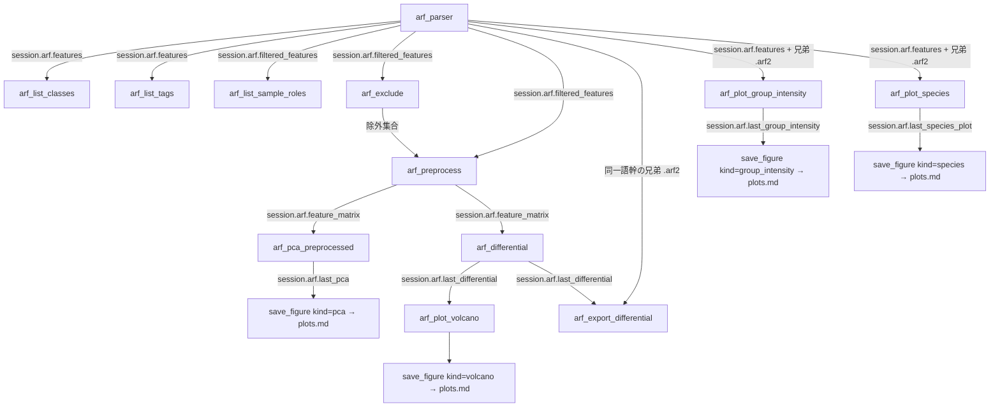

# ワークフロー: `.arf`（サンプル別ピーク）

`.arf` は 1 スポット = 全サンプル分の検出ピーク行を持つ、サンプル間比較の主データ源。
ARF 系ツールは `session.arf` を介して状態を受け渡す。生行列の PCA（`arf_parser`）と
前処理済み行列の PCA（`arf_pca_preprocessed`）は**独立した経路**で、混同しないこと。

## arf_parser

前提: なし（`file_path` 省略時は最新バッチの PeakProperties.arf を自動選択）
状態変更: `session.arf` に features / filtered_features / tag_index / class_index /
last_pca を格納。以降の ARF 系ツールの土台。

フィルタ条件を変えた再 PCA は本ツールを引数違いで再呼び出しする。ファイルは
セッションにキャッシュされるので再パースは走らない。手動除外（`arf_exclude`）は
PCA 直前に非破壊で適用される（手順 7）。

1. metabolomix/arf/tools.py  arf_parser()
2. └─ metabolomix/core/path_resolvers.py  resolve_arf_file_path()
3. └─ metabolomix/core/session_state.py  ArfState.load_data()
4. └─ metabolomix/msdial/tags.py  filter_arf_by_tags()
5. └─ metabolomix/msdial/classes.py  filter_arf_by_class_ids()
6. └─ metabolomix/core/path_resolvers.py  _filter_arf_spots()
7. └─ metabolomix/arf/exclusions.py  prune_spots()
8. └─ metabolomix/arf/reader.py  count_peak_property_rows()
9. └─ metabolomix/arf/reader.py  build_pca_matrix()
10. └─ metabolomix/analysis/pca.py  run_pca()
11. └─ metabolomix/msdial/classes.py  assign_sample_groups()
12. └─ metabolomix/core/tool_helpers.py  _format_pca_plot_block()
13. └─ metabolomix/core/tool_helpers.py  _remember_arf_pca_plot()
14. └─ metabolomix/arf/reader.py  get_pca_loading_features()
15. └─ metabolomix/core/tool_helpers.py  _format_pca_loadings_md()
16. └─ metabolomix/core/session_state.py  AnalysisSession.maybe_prepend_caveat()

## arf_list_classes

前提: `arf_parser` または `load_dataset` 実行済み（未実行なら手順 2 で `MissingState`）
状態変更: なし

語彙は常に `session.arf.features`（データセット全体）から作る。直前の
`arf_parser(class_ids=...)` の絞り込みを引き継ぐと、「何で絞れるか」を尋ねる本ツールが
黙って痩せた語彙を返してしまうため。

1. metabolomix/arf/tools.py  arf_list_classes()
2. └─ metabolomix/core/mcp_errors.py  missing_state()
3. └─ metabolomix/msdial/sample_factors.py  arf_sample_names()
4. └─ metabolomix/msdial/sample_factors.py  build_sample_facets()
5. └─ metabolomix/core/tool_helpers.py  _class_factors_by_position()
6. └─ metabolomix/msdial/sample_factors.py  token_vocabulary()

## arf_list_tags

前提: `arf_parser` または `load_dataset` 実行済み（未実行なら手順 2 で `MissingState`）
状態変更: なし

`session.arf.tag_index` の `summary` をそのまま返すだけで、ヘルパは介さない。

1. metabolomix/arf/tools.py  arf_list_tags()
2. └─ metabolomix/core/mcp_errors.py  missing_state()

## arf_list_sample_roles

前提: `arf_parser` または `load_dataset` 実行済み（未実行なら手順 2 で `MissingState`）
状態変更: なし。前処理を**適用せず**に sample/qc/blank の分類だけを返す。

返り値は列名を 1 回だけ出す TSV 表（sample / role / group / batch / run_order /
excluded）。全行で同じ値になる `batch_source` はヘッダ行にまとめる。

1. metabolomix/arf/tools.py  arf_list_sample_roles()
2. └─ metabolomix/core/mcp_errors.py  missing_state()
3. └─ metabolomix/core/tool_helpers.py  _pp_build_matrix()
4. └─ metabolomix/core/session_state.py  _build_sample_meta()
5. └─ metabolomix/arf2/reader.py  format_spots_as_table()

## arf_exclude

前提: `arf_parser` または `load_dataset` 実行済み（未実行なら手順 2 で `MissingState`）
状態変更: `session.arf.excluded_samples` / `excluded_spots` を更新。`filtered_features`
自体は変えないので、`mode="remove"` / `"clear"` で元に戻せる（可逆・非破壊）。

手順 4 の解決は `mode="add"` / `"remove"` のときだけ走る。`mode="clear"` は集合を空にし、
`mode="list"` は何もせず現状を報告する。どの経路でも手順 5〜6 の再集計は必ず通り、
除外後の残サンプル数・残スポット数が返る。

1. metabolomix/arf/tools.py  arf_exclude()
2. └─ metabolomix/core/mcp_errors.py  missing_state()
3. └─ metabolomix/arf/exclusions.py  roster()
4. ├─ [mode=add/remove のみ] metabolomix/arf/tools.py  _resolve_exclude_specs()
5. │  └─ metabolomix/msdial/sample_factors.py  build_sample_facets()
6. │  └─ metabolomix/msdial/sample_factors.py  expand_sample_specs()
7. └─ metabolomix/arf/exclusions.py  prune_spots()
8. └─ metabolomix/arf/exclusions.py  roster()

## arf_preprocess

前提: `arf_parser` または `load_dataset` 実行済み（未実行なら手順 2 で `MissingState`）
状態変更: `session.arf.feature_matrix` / `pp_sample_names` / `pp_feature_names` /
`sample_meta` / `preprocessing_recipe` を格納。`arf_pca_preprocessed` と
`arf_differential` の前提になる。

ブランクは背景除去の参照に使い終えたあと、手順 7 で解析行列から外す（残すと桁違いに
低い総強度が PC1 を支配する）。QC は残す —— QC クラスタの締まり具合を PCA で見るため。
手動除外の状態は 0 件でも手順 8 で必ず開示する。

1. metabolomix/arf/tools.py  arf_preprocess()
2. └─ metabolomix/core/mcp_errors.py  missing_state()
3. └─ metabolomix/arf/exclusions.py  prune_spots()
4. └─ metabolomix/core/tool_helpers.py  _pp_build_matrix()
5. └─ metabolomix/core/session_state.py  _build_sample_meta()
6. └─ metabolomix/analysis/preprocessing.py  detect_qc_strata()
7. └─ metabolomix/analysis/preprocessing.py  preprocess()
8. └─ metabolomix/analysis/preprocessing.py  drop_samples_by_role()
9. └─ metabolomix/arf/tools.py  _manual_exclusion_caveat()

## arf_pca_preprocessed

前提: `arf_preprocess` 実行済み（未実行なら手順 3 で `MissingState`）
状態変更: `session.arf.last_pca` を更新。`save_figure(kind="pca")` の入力になる。

`arf_parser` の生行列 PCA とは**独立した経路**。同じ図に見えても前処理の有無が違う。
色分け（`group_levels` / `group_factors`）や log 変換だけを変えて再実行しても、
前処理はやり直さない。

1. metabolomix/arf/tools.py  arf_pca_preprocessed()
2. └─ metabolomix/core/tool_helpers.py  _pp_has_preprocessed()
3. └─ metabolomix/core/mcp_errors.py  missing_state()
4. └─ metabolomix/analysis/pca.py  run_pca()
5. └─ metabolomix/msdial/classes.py  assign_sample_groups()
6. └─ metabolomix/core/tool_helpers.py  _format_pca_plot_block()
7. └─ metabolomix/core/tool_helpers.py  _remember_arf_pca_plot()
8. └─ metabolomix/arf/reader.py  get_pca_loading_features()
9. └─ metabolomix/core/tool_helpers.py  _format_pca_loadings_md()

## arf_differential

前提: `arf_preprocess` 実行済み（未実行なら手順 2 で `MissingState`）。
`session.arf.feature_matrix` を直接見るため、`_pp_has_preprocessed()` は経由しない。
状態変更: `session.arf.last_differential` を更新。`arf_plot_volcano` の入力になる。

群⊥バッチ交絡・小 n・正規化状態の caveat は第一級の所見として必ず出力に出る。
QC / blank は群ラベルを `None` にして両群のどちらにも寄らせない（Class ID が
`group_a` のトークンを含む QC がプールに紛れ込むのを防ぐ）。多群 ANOVA は MCP 非公開で、
関心の 2 群を因子トークンで切り出す設計。`group_a` / `group_b` の片方でも欠けると
手順 4 以降には進まず error を返す。

手順 10〜12 は `_annotate_with_names()` の内側。ARF 側の代表 Name が Unknown の
スポットが残るときだけ、同一アラインメントの兄弟 `.arf2` を読んで橋渡しする。

1. metabolomix/arf/tools.py  arf_differential()
2. └─ metabolomix/core/mcp_errors.py  missing_state()
3. └─ metabolomix/arf/tools.py  _manual_exclusion_caveat()
4. └─ metabolomix/arf/tools.py  _pool_group_labels()
5. └─ metabolomix/analysis/differential.py  check_confounding()
6. └─ metabolomix/analysis/differential.py  two_group_test()
7. └─ metabolomix/analysis/differential.py  add_fdr()
8. └─ metabolomix/analysis/differential.py  summarize_two_group()
9. └─ metabolomix/arf/tools.py  _annotate_with_names()
10. │  └─ metabolomix/arf/tools.py  _spot_id_of()
11. │  └─ metabolomix/arf/tools.py  _sibling_arf2_path()
12. │  └─ metabolomix/arf2/reader.py  load_catalog()
13. └─ metabolomix/analysis/differential.py  volcano_data()

## arf_export_differential

前提: `arf_differential`（2群）実行済み、かつ読み込み中の `.arf` と同一語幹の
兄弟 `.arf2` が存在すること。どちらかが無ければ `MissingState` を返し、ファイルは
書かない。差次的結果の契約版・符号が現行値と違う場合も再実行を要求する。
状態変更: なし。指定された `output_path` へ契約 TSV を上書きする。

`session.arf.last_differential` の全特徴を、`.arf2` の `MasterAlignmentID` で
InChIKey・Ontology・m/z・RT と結合する。InChIKey が無い特徴は本文から除外するが、
`n_unannotated` に件数を残す。有意行だけに絞らないため、下流の濃縮解析は検出化合物を
背景として使える。NaN / inf の数値セルは文字列化せず空欄にし、下流の契約リーダが
欠測として扱える形にする。InChIKey 付き行が 0 件なら、本文 0 行の不適合ファイルを
残さずエラーにする。`msi_level` は `arf2_annotate_identities` と同じ保守的な
クラス上限であり、MS/MS 取得有無を表さない。

列の組み立ては `metabolomix/analysis/export_contract.py` に閉じている（mzTab-M 経路の
`dataset_export_differential` と同一の関数。[dataset_analysis.md](dataset_analysis.md) 参照）。
15 列目 `significant` の判定も `is_significant()` に一本化してあり、ここには無い
——ARF 側は `q_value`、DatasetState 側は `q` というキーで同じ量を持つため、
判定を各経路に置くと 2 実装に分裂する（実際に分裂していた）。

1. metabolomix/arf/tools.py  arf_export_differential()
2. ├─ metabolomix/core/mcp_errors.py  missing_state()
3. ├─ metabolomix/arf/tools.py  _sibling_arf2_path()
4. ├─ metabolomix/arf2/reader.py  load_catalog()
5. ├─ metabolomix/arf/identity_join.py  join_identity()
6. ├─ metabolomix/analysis/export_contract.py  build_meta()
7. ├─ metabolomix/analysis/export_contract.py  is_significant()
8. └─ metabolomix/analysis/export_contract.py  format_row()
9.    └─ metabolomix/analysis/export_contract.py  format_number()

`metabolomix/arf/tools.py` の `_format_export_number` は `export_contract.format_number`
への別名で、**どこからも呼ばれていない**（後方互換のため意図的に残置）。連鎖に
現れないのが正しい。

## arf_plot_volcano

前提: `arf_differential` 実行済み（未実行なら手順 2 で `MissingState`）
状態変更: なし。ファイルは書かない。

**既定は画像**（`output="image"`）。サーバ側で描いた PNG を、件数を書いた 1 行の
キャプションと一緒に返す。座標点列（`lipidmix.volcano.v1`）が要るクライアントは
`output="payload"` か env `LIPIDMIX_PLOT_OUTPUT=payload`。payload モードでは
`up` / `down` の点は全件残し、`ns` の点だけ `max_points` に収まるよう間引く。

画像は間引かず全特徴を描く（間引きは payload のトークン対策であって図には不要）。
キャプションに up / down / ns / 検定不能の件数を書くのは、件数を図から読み取らせない
ため。PNG をファイルに保存したいときは `save_figure(kind="volcano")`（[plots.md](plots.md)）。

1. metabolomix/arf/tools.py  arf_plot_volcano()
2. └─ metabolomix/core/mcp_errors.py  missing_state()
3. └─ metabolomix/plots/render.py  resolve_plot_output()
4. ├─ [output=payload] metabolomix/plots/volcano.py  build_volcano_plot_payload()
5. └─ [output=image] metabolomix/arf/tools.py  _volcano_counts()
6.    └─ metabolomix/plots/volcano.py  render_volcano_plot()
7.    └─ metabolomix/plots/render.py  figure_to_png()

## arf_plot_group_intensity

前提: ARF を読み込み済みで、同じアラインメントの `.arf2` が隣にある（無ければ `MissingState`）
状態変更: `session.arf.last_group_intensity`（payload・title・ncols）を更新。ファイルは書かない。
`save_figure(kind="group_intensity")`（[plots.md](plots.md)）がここから読んで保存する。

選んだクラス・分子種ごとに、試料群の試料別 PeakHeight 合計を並べる。項目と群の解決・payload・
描画は `metabolomix/plots/group_intensity.py` の純関数で、本ツールは ARF・`.arf2`・
キュレーションの判断と最新レビュー・param ファイルを集めて渡す層。検定はしない
（群間の検定は `arf_differential`）。

手順 3 の `missing_state()` は手順 2 の `_require_arf_with_arf2()`（`arf_plot_species` も共有）が 2 か所から呼ぶ:
ARF が未読み込みのときと、手順 4 が兄弟 `.arf2` を見つけられなかったとき。どちらも返して終わる。
項目・群・除外の解決は手順 7 の `arf/selection.py build_selection()` に切り出してあり
（分子種ごとの図・分子種 PCA と共有する）、手順 8〜17 はその内側。
`arf_exclude` した試料は群の解決と描画から外すが、`standard_samples` の判定（手順 15）には
除外前の全試料の行を使う（標準液を `arf_exclude` していても「標準液にだけある分子種」を判定できる）。
手順 5・6・7・10・16 などが投げる `ValueError`（出力形式・`ncols` の不正・群が当たらない・項目数など）と
`detection_limit` の不正は捕まえ、`{"status":"error","message":...}` を返して終わる。手順 2 の後で前回の図
（`last_group_intensity`）を破棄し、画像モードでは描画に成功してから図を保持する。
手順 13 で判断の記録ファイルが読めなければ `FlagFileError` を捕まえ、同じ形のエラーを返して終わる。
手順 16 は `arf_exclude` で除いたスポット（`excluded_spots`）も除外する。手順 14 は、レビューが無ければ除かずに caveat に出す。
手順 17 は MS/MS の裏付け（照合結果の `has_msms` かつ `.arf2` の Name が `no MS2:` /
`w/o MS2:` でない）を作る。手順 18〜19 は検出下限（引数が優先、無ければ param ファイルの
`Minimum peak height`）。

1. metabolomix/arf/tools.py  arf_plot_group_intensity()
2. └─ metabolomix/arf/tools.py  _require_arf_with_arf2()
3. │  └─ metabolomix/core/mcp_errors.py  missing_state()
4. │  └─ metabolomix/arf/tools.py  _sibling_arf2_path()
5. └─ metabolomix/plots/render.py  resolve_plot_output()
6. └─ metabolomix/arf/tools.py  _check_ncols()
7. └─ metabolomix/arf/selection.py  build_selection()
8. │  └─ metabolomix/arf/reader.py  alignment_feature_row()
9. │  └─ metabolomix/msdial/sample_factors.py  build_sample_facets()
10. │  └─ metabolomix/plots/group_intensity.py  resolve_groups()
11. │  └─ metabolomix/plots/group_intensity.py  resolve_sample_specs()
12. │  └─ metabolomix/arf2/reader.py  load_catalog()
13. │  └─ [apply_curation] metabolomix/curation/apply.py  flags_for_arf2()
14. │  └─ [exclude_auto_likely_wrong] metabolomix/curation/suggest.py  latest_review()
15. │  └─ [standard_samples] metabolomix/plots/group_intensity.py  standard_only_spots()
16. │  └─ metabolomix/plots/group_intensity.py  resolve_items()
17. │  └─ metabolomix/arf2/match_results.py  load_spot_annotations()
18. └─ metabolomix/msdial/analysis_params.py  find_param_file()
19. └─ metabolomix/msdial/analysis_params.py  read_analysis_params()
20. └─ metabolomix/plots/group_intensity.py  build_group_intensity_payload()
21. ├─ [output=payload] metabolomix/core/serialization.py  json_payload()
22. └─ [output=image] metabolomix/plots/group_intensity.py  render_group_intensity_plot()
23.    └─ metabolomix/plots/render.py  figure_to_png()
24.    └─ metabolomix/arf/tools.py  _group_intensity_caption()

## arf_plot_species

前提: ARF を読み込み済みで、同じアラインメントの `.arf2` が隣にある（無ければ `MissingState`）
状態変更: `session.arf.last_species_plot`（payload・title・ncols）を更新。ファイルは書かない。
`save_figure(kind="species")`（[plots.md](plots.md)）がここから読んで保存する。

選んだクラスを分子種（アラインメントスポット）に展開し、1 分子種 1 パネルで群ごとの試料別の値を並べる。
項目・群・除外の解決は `arf_plot_group_intensity` と同じ `arf/selection.py`。`value="share"` の分母は
`share_basis`（省略時は `items`）を同じ規則で解決したスポットの合計（手順 7 をもう 1 回呼ぶ）。
入力の誤り・パネル超過（40 枚）・判断の記録ファイルの破損は `{"status":"error","message":...}` を返して終わる。

1. metabolomix/arf/species_tools.py  arf_plot_species()
2. └─ metabolomix/arf/tools.py  _require_arf_with_arf2()
3. │  └─ metabolomix/core/mcp_errors.py  missing_state()
4. │  └─ metabolomix/arf/tools.py  _sibling_arf2_path()
5. └─ metabolomix/plots/render.py  resolve_plot_output()
6. └─ metabolomix/arf/tools.py  _check_ncols()
7. └─ metabolomix/arf/selection.py  build_selection()
8. │  └─ metabolomix/plots/group_intensity.py  resolve_items()
9. └─ metabolomix/arf/selection.py  expand_spots()
10.└─ metabolomix/plots/species.py  build_species_payload()
11.├─ [output=payload] metabolomix/core/serialization.py  json_payload()
12.└─ [output=image] metabolomix/plots/species.py  render_species_plot()
13.   └─ metabolomix/plots/render.py  figure_to_png()
14.   └─ metabolomix/arf/species_tools.py  _species_caption()

## arf_pca_species

前提: ARF を読み込み済みで、同じアラインメントの `.arf2` が隣にある（無ければ `MissingState`）
状態変更: `session.arf.last_species_pca`（スコア・ローディング全量・寄与率・provenance）を更新。ファイルは書かない。
`save_figure(kind="pca", source="species")` と `plot_pca_loadings(source="species")` がここから読む。

分子種の選び方は `arf_plot_species` と同じ（手順 4〜5）。試料 × 分子種の PeakHeight 行列を作り、
`normalize="total"` なら試料ごとの合計で割り、log10(x + 1)、計算に使う試料（低信頼を除く）で
autoscale して PCA（手順 6）。低信頼の試料は投影だけする。`orient_by` で符号をそろえ、相関 r を計算する（手順 7）。
入力の誤り（計算に使う試料が 3 未満・合計 0 の試料・未知の `orient_by` など）は `{"status":"error"}`。

1. metabolomix/arf/species_tools.py  arf_pca_species()
2. └─ metabolomix/arf/tools.py  _require_arf_with_arf2()
3. └─ metabolomix/plots/render.py  resolve_plot_output()
4. └─ metabolomix/arf/selection.py  build_selection()
5. └─ metabolomix/arf/selection.py  expand_spots()
6. └─ metabolomix/analysis/pca.py  run_pca_fit_subset()
7. └─ metabolomix/analysis/pca.py  loading_correlations()
8. └─ metabolomix/analysis/result_state.py  new_provenance()
9. ├─ [output=payload] metabolomix/core/serialization.py  json_payload()
10.└─ [output=image] metabolomix/plots/pca_scores.py  render_pca_scores()
11.   └─ metabolomix/plots/render.py  figure_to_png()
