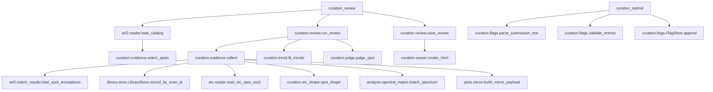

# ワークフロー: アラインメントのキュレーション

注釈付きスポットの証拠を集めて機械判別し、ビューアを書き出し、ユーザーのフラグを記録する経路。
値の**意味**は [curation.md（output_format）](../output_format/curation.md)。

## curation_review

前提: `.arf2` が解決できること（無ければ `missing_state("arf2_file", ["load_dataset", "arf2_parser"])`）、
`session.library.store` があること（無ければ `missing_state("library", ["library_load"])`）。
状態変更: `session.curation.last_review_id` と `review_dirs[review_id]`。ディスクに
`<arf2 のフォルダ>/curation/review-<id>.json` と `.html` を書く。

1. lipidmix/core/path_resolvers.py  resolve_arf2_file_path()
2. lipidmix/curation/judge.py  resolve_thresholds()
3. lipidmix/arf2/reader.py  load_catalog()
4. lipidmix/curation/evidence.py  select_spots()（load_catalog() が返したカタログを渡す）
5. lipidmix/curation/review.py  run_review()
6. │  └─ lipidmix/curation/evidence.py  collect()
7. │     ├─ lipidmix/arf2/match_results.py  load_spot_annotations()
8. │     ├─ lipidmix/dcl/reader.py  deserialize_dcl()
9. │     ├─ lipidmix/curation/evidence.py  _arf_rows()
10. │     │  └─ lipidmix/arf/reader.py  deserialize()
11. │     ├─ lipidmix/curation/evidence.py  _reference()
12. │     │  └─ lipidmix/library/store.py  LibraryStore.record_by_scan_id()
13. │     ├─ lipidmix/analysis/spectral_match.py  match_spectrum()
14. │     ├─ lipidmix/plots/mirror.py  build_mirror_payload()
15. │     ├─ lipidmix/eic/reader.py  read_eic_spot_css1()
16. │     └─ lipidmix/curation/eic_shape.py  spot_shape()
17. │  └─ lipidmix/curation/trend.py  composition()
18. │  └─ lipidmix/curation/trend.py  fit_trends()
19. │  └─ lipidmix/curation/flags.py  FlagStore.effective()
20. │  └─ lipidmix/curation/judge.py  judge_spot()
21. lipidmix/curation/review.py  save_review()
22. └─ lipidmix/curation/viewer.py  render_html()
23. lipidmix/curation/review.py  summary_tsv()

## curation_submit

前提: `review_id` のレビューがディスクにあること。状態変更: `flags.jsonl` へ追記。

1. lipidmix/curation/flags.py  parse_submission_text()（`submission_text` のとき）
2. lipidmix/curation/review.py  load_review()
3. lipidmix/curation/flags.py  validate_entries()
4. lipidmix/curation/flags.py  alignment_key()（レビュー時の sha256 と一致しなければ拒否）
5. lipidmix/curation/flags.py  FlagStore.append()

## curation_flags

1. lipidmix/curation/flags.py  alignment_key()
2. lipidmix/curation/flags.py  FlagStore.effective()

## curation_view_data

1. lipidmix/curation/review.py  load_review()
2. lipidmix/curation/review.py  page()
