# ワークフロー: アラインメントのキュレーション

注釈付きスポットの証拠を集めて機械判別し、ビューアを書き出し、ユーザーのフラグを記録する経路。
値の**意味**は [curation.md（output_format）](../output_format/curation.md)。

```mermaid
flowchart TD
    CR[curation_review] --> LOAD[arf2.reader.load_catalog]
    LOAD --> SEL[curation.evidence.select_spots]
    CR --> RUN[curation.review.run_review]
    RUN --> COL[curation.evidence.collect]
    COL --> ANN[arf2.match_results.load_spot_annotations]
    COL --> REF[library.store.LibraryStore.record_by_scan_id]
    COL --> EIC[eic.reader.read_eic_spot_css1]
    COL --> SHP[curation.eic_shape.spot_shape]
    COL --> MS[analysis.spectral_match.match_spectrum]
    COL --> MIR[plots.mirror.build_mirror_payload]
    RUN --> TR[curation.trend.fit_trends]
    RUN --> AI[curation.adduct_isomer.find_adduct_isomer]
    RUN --> JG[curation.judge.judge_spot]
    CR --> SAV[curation.review.save_review]
    SAV --> HTML[curation.viewer.render_html]
    CS[curation_submit] --> PAR[curation.flags.parse_submission_text]
    CS --> SUB[curation.submission.submit_flags]
    SUB --> VAL[curation.flags.validate_entries]
    SUB --> APP[curation.flags.FlagStore.append]
    SUB --> WB[curation.msdial_writeback.sync_tags]
    WB --> TAG[msdial.tags.update_alignment_tag]
    CG[curation_suggest] --> LRV[curation.suggest.latest_review]
    CG --> RS[curation.suggest.run_suggestion]
    RS --> TG[curation.suggest.select_targets]
    RS --> IF[arf2.ion_features.load_ion_features]
    RS --> AP[msdial.analysis_params.resolve_analysis_params]
    RS --> COL
    RS --> LC[curation.candidates.build_library_candidates]
    RS --> FR[curation.relations.find_relations]
    CG --> SS[curation.suggest.save_suggestion]
    SS --> SH[curation.viewer.render_suggest_html]
    CS --> LD[curation.submission.load_saved]
    LD --> LS[curation.suggest.load_suggestion]
    SUB --> EX[curation.suggest.expand_entries]
```

## curation_review

前提: `.arf2` が解決できること（無ければ `missing_state("arf2_file", ["load_dataset", "arf2_parser"])`）、
`session.library.store` があること（無ければ `missing_state("library", ["library_load"])`）。
状態変更: `session.curation.last_review_id` と `review_dirs[review_id]`。ディスクに
`<arf2 のフォルダ>/curation/review-<id>.json` と `.html` を書く。

1. metabolomix/core/path_resolvers.py  resolve_arf2_file_path()
2. metabolomix/curation/judge.py  resolve_thresholds()
3. metabolomix/arf2/reader.py  load_catalog()
4. metabolomix/curation/evidence.py  select_spots()（load_catalog() が返したカタログを渡す）
5. metabolomix/curation/review.py  run_review()
6. │  └─ metabolomix/curation/flags.py  alignment_key()
7. │  └─ metabolomix/curation/flags.py  FlagStore.rows()（重い収集の**前**に読む。読めない行は `FlagFileError` → エラー payload）
8. │  └─ metabolomix/curation/flags.py  effective_flags()
9. │  └─ metabolomix/curation/flags.py  orphaned_count()（以前の版の `.arf2` に付いたフラグ → `warnings`）
10. │  └─ metabolomix/curation/flags.py  cleared_spots()（人が取り消したスポット → `flag_cleared`）
11. │  └─ metabolomix/curation/apply.py  confirmed_spots()（記録の confirmed ∪ `_tags.xml` の Confirmed − 最新が wrong / suspect → `confirmed`）
12. │  └─ metabolomix/curation/evidence.py  collect()
13. │     ├─ metabolomix/curation/evidence.py  _arf_rows()
14. │     │  └─ metabolomix/arf/reader.py  deserialize()
15. │     ├─ metabolomix/curation/evidence.py  _check_file_ids()（`.arf` に無い `file_ids` は `UnknownFileIdsError` → エラー payload）
16. │     ├─ metabolomix/arf2/match_results.py  load_spot_annotations()
17. │     ├─ metabolomix/arf2/reader.py  load_isotopic_peaks()（Key 53 IsotopicPeaks。カタログには載せない）
18. │     ├─ metabolomix/dcl/reader.py  deserialize_dcl()
19. │     ├─ metabolomix/curation/evidence.py  _reference()
20. │     │  ├─ metabolomix/library/store.py  LibraryStore.library_id_for()（`.dbs` の注釈器 Key → ライブラリ名。無ければ GUI の `<名前>_<n>` 規則）
21. │     │  └─ metabolomix/library/store.py  LibraryStore.record_by_scan_id()
22. │     ├─ metabolomix/library/store.py  LibraryStore.rt_used_for()（MS-DIAL がその照合で RT を使ったか → `rt_used_by_annotation`）
23. │     ├─ metabolomix/analysis/spectral_match.py  match_spectrum()
24. │     ├─ metabolomix/plots/mirror.py  build_mirror_payload()
25. │     ├─ metabolomix/eic/reader.py  read_eic_spot_css1()
26. │     ├─ metabolomix/curation/eic_shape.py  spot_shape()
27. │     ├─ metabolomix/curation/evidence.py  _downsample_points()（形状計算の後に payload だけ間引く）
28. │     ├─ metabolomix/curation/isotope.py  measured_envelope()（→ `isotopes.measured`）
29. │     └─ metabolomix/curation/isotope.py  theoretical_envelope()（組成式＋アダクトの原子。`msdial/adducts.py` `adduct_composition()` → `isotopes.theoretical`）
30. │  └─ metabolomix/curation/trend.py  composition()（`LipidParser` はモジュールで 1 つだけ作る）
31. │  └─ metabolomix/curation/trend.py  fit_trends()
32. │  └─ metabolomix/curation/review.py  _adduct_isomer_pool()（対象に絞らずアラインメントの注釈付き全スポット）
33. │     ├─ metabolomix/arf2/match_results.py  load_spot_annotations()
34. │     ├─ metabolomix/arf2/reader.py  load_catalog()（同じファイルならキャッシュ済み）
35. │     └─ metabolomix/curation/adduct_isomer.py  pool_entry()（`evidence_tier()` で証拠の段階を付ける）
36. │  └─ metabolomix/curation/judge.py  lipid_rules_active()（脂質規則フラグが 1 件でも True か）
37. │  └─ metabolomix/curation/adduct_isomer.py  find_adduct_isomer()（有効な `wrong` フラグのスポットは相手から外す → `adduct_isomer`）
38. │  └─ metabolomix/curation/judge.py  judge_spot()
39. │  └─ metabolomix/curation/judge.py  auto_note()（判定根拠の文 → `auto_note`）
40. metabolomix/curation/review.py  save_review()
41. └─ metabolomix/curation/viewer.py  render_html()
42. metabolomix/curation/review.py  n_summary_rows()
43. metabolomix/curation/review.py  summary_tsv()（`max_rows` で先頭だけ）
44. metabolomix/curation/review.py  trend_summary()

## curation_suggest

前提: `.arf2` が解決できること、`session.library.store` があること（無ければ
`missing_state("library", ["library_load"])`）、このアラインメントのレビューがあること（無ければ
`missing_state("curation_review", ["curation_review"])`）。状態変更: `session.curation.review_dirs[suggestion_id]`。
ディスクに `<arf2 のフォルダ>/curation/suggest-<id>.json` と `.html` を書く。

1. metabolomix/core/path_resolvers.py  resolve_arf2_file_path()
2. metabolomix/curation/judge.py  resolve_thresholds()
3. metabolomix/curation/flags.py  alignment_key()
4. metabolomix/curation/suggest.py  latest_review()（同じ sha256 のアラインメントに対する最新のレビュー。`review_id` を渡せば `_find_review()` でそれ）
5. metabolomix/curation/suggest.py  run_suggestion()
6. │  └─ metabolomix/curation/flags.py  FlagStore.effective()（有効な判断。読めない行は `FlagFileError` → エラー payload）
7. │  └─ metabolomix/arf2/ion_features.py  load_ion_features()（同位体・アダクト・インソースのリンク）
8. │  └─ metabolomix/msdial/analysis_params.py  resolve_analysis_params()（検索アダクトと RT 窓）
9. │  └─ metabolomix/curation/suggest.py  select_targets()（wrong フラグ・likely_wrong・未注釈から対象を選ぶ）
10. │  └─ metabolomix/curation/trend.py  fit_trends()（相手 Y = 注釈付きで対象でも wrong / redundant でもないスポットの傾向）
11. │  └─ metabolomix/curation/evidence.py  collect()（`keep_measured=True` で対象の証拠を集める）
12. │  └─ metabolomix/curation/candidates.py  build_library_candidates()（① MS-DIAL の下位候補 ② 閾値を緩めた再検索）
13. │  └─ metabolomix/curation/relations.py  find_relations()（④ 別スポットの同位体・アダクト・インソース断片としての説明）
14. metabolomix/curation/suggest.py  save_suggestion()
15. └─ metabolomix/curation/viewer.py  render_suggest_html()
16. metabolomix/curation/suggest.py  summary_tsv()（`max_rows` で先頭だけ）

`curation_submit` は `review_id` が `cs-…` のとき、`curation.flags.validate_entries` の代わりに
`curation.suggest.expand_entries` で候補 ID を記録行へ展開する。

## curation_submit

前提: `review_id` のレビューがディスクにあること。状態変更: `flags.jsonl` へ追記し、
アラインメントの `_tags.xml` の Misannotation と Confirmed を書き換える（書く前に `curation/tags-backup/` へ控え）。
レビューの探し先は、セッションの `review_dirs` → 送信用テキストの `arf2_path` →
引数 `file_path` → 既定の `.arf2` の順（サーバ再起動の後でも貼った文で送れる）。

1. metabolomix/curation/flags.py  parse_submission_text()（`submission_text` のとき）
2. metabolomix/curation/review.py  is_valid_review_id()（形が違えばパスに使う前にエラー。`cs-…` は metabolomix/curation/suggest.py  is_valid_suggestion_id() も許す）
3. metabolomix/tools/curation_tools.py  _find_review()
4. └─ metabolomix/tools/curation_tools.py  _load_any()
5.    └─ metabolomix/curation/submission.py  load_saved()（ID の接頭辞で読み分ける）
6.       ├─ [cr-…] metabolomix/curation/review.py  load_review()（候補フォルダを順に）
7.       └─ [cs-…] metabolomix/curation/suggest.py  load_suggestion()（候補フォルダを順に）
8. metabolomix/curation/submission.py  submit_flags()（ビューアの受け口と共有。`SubmissionError` → エラー payload）
9. ├─ [cr-…] metabolomix/curation/flags.py  validate_entries()
10. ├─ [cs-…] metabolomix/curation/suggest.py  expand_entries()（候補 ID を記録行へ展開。偽の候補 ID は書く前に拒否）
11. └─ 以下は `_WRITE_LOCK` の中（MCP ツールと HTTP スレッドの書き込みを直列化）
12.    ├─ metabolomix/curation/flags.py  alignment_key()（レビュー時の sha256 と一致しなければ拒否）
13.    ├─ metabolomix/curation/flags.py  FlagStore.rows()（読めない行があれば追記せずにエラー）
14.    ├─ metabolomix/curation/flags.py  FlagStore.append()
15.    └─ metabolomix/curation/msdial_writeback.py  sync_tags()（失敗しても記録は残し `tags_xml.error`。assign / redundant は触らない）
16.       └─ metabolomix/msdial/tags.py  update_alignment_tags()（Misannotation と Confirmed を 1 回で書く）
17.          └─ metabolomix/core/atomic_io.py  atomic_write_bytes()

## curation_flags

1. metabolomix/curation/flags.py  alignment_key()
2. metabolomix/curation/flags.py  FlagStore.effective()

## curation_view_data

1. metabolomix/curation/review.py  is_valid_review_id()
2. metabolomix/tools/curation_tools.py  _find_review()
3. └─ metabolomix/curation/review.py  load_review()
4. metabolomix/curation/review.py  page()
