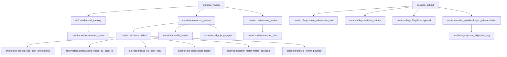

# ワークフロー: アラインメントのキュレーション

注釈付きスポットの証拠を集めて機械判別し、ビューアを書き出し、ユーザーのフラグを記録する経路。
値の**意味**は [curation.md（output_format）](../output_format/curation.md)。

## curation_review

前提: `.arf2` が解決できること（無ければ `missing_state("arf2_file", ["load_dataset", "arf2_parser"])`）、
`session.library.store` があること（無ければ `missing_state("library", ["library_load"])`）。
状態変更: `session.curation.last_review_id` と `review_dirs[review_id]`。ディスクに
`<arf2 のフォルダ>/curation/review-<id>.json` と `.html` を書く。

1. lipidmix/core/path_resolvers.py  resolve_arf2_file_path()
2. lipidmix/curation/judge.py  resolve_thresholds()
3. lipidmix/arf2/reader.py  load_catalog()
4. lipidmix/curation/evidence.py  select_spots()（load_catalog() が返したカタログを渡す）
5. lipidmix/curation/review.py  run_review()
6. │  └─ lipidmix/curation/flags.py  alignment_key()
7. │  └─ lipidmix/curation/flags.py  FlagStore.rows()（重い収集の**前**に読む。読めない行は `FlagFileError` → エラー payload）
8. │  └─ lipidmix/curation/flags.py  effective_flags()
9. │  └─ lipidmix/curation/flags.py  orphaned_count()（以前の版の `.arf2` に付いたフラグ → `warnings`）
10. │  └─ lipidmix/curation/flags.py  cleared_spots()（人が取り消したスポット → `flag_cleared`）
11. │  └─ lipidmix/curation/evidence.py  collect()
12. │     ├─ lipidmix/curation/evidence.py  _arf_rows()
13. │     │  └─ lipidmix/arf/reader.py  deserialize()
14. │     ├─ lipidmix/curation/evidence.py  _check_file_ids()（`.arf` に無い `file_ids` は `UnknownFileIdsError` → エラー payload）
15. │     ├─ lipidmix/arf2/match_results.py  load_spot_annotations()
16. │     ├─ lipidmix/dcl/reader.py  deserialize_dcl()
17. │     ├─ lipidmix/curation/evidence.py  _reference()
18. │     │  └─ lipidmix/library/store.py  LibraryStore.record_by_scan_id()
19. │     ├─ lipidmix/analysis/spectral_match.py  match_spectrum()
20. │     ├─ lipidmix/plots/mirror.py  build_mirror_payload()
21. │     ├─ lipidmix/eic/reader.py  read_eic_spot_css1()
22. │     ├─ lipidmix/curation/eic_shape.py  spot_shape()
23. │     └─ lipidmix/curation/evidence.py  _downsample_points()（形状計算の後に payload だけ間引く）
24. │  └─ lipidmix/curation/trend.py  composition()（`LipidParser` はモジュールで 1 つだけ作る）
25. │  └─ lipidmix/curation/trend.py  fit_trends()
26. │  └─ lipidmix/curation/judge.py  lipid_rules_active()（脂質規則フラグが 1 件でも True か）
27. │  └─ lipidmix/curation/judge.py  judge_spot()
28. │  └─ lipidmix/curation/judge.py  auto_note()（判定根拠の文 → `auto_note`）
29. lipidmix/curation/review.py  save_review()
30. └─ lipidmix/curation/viewer.py  render_html()
31. lipidmix/curation/review.py  n_summary_rows()
32. lipidmix/curation/review.py  summary_tsv()（`max_rows` で先頭だけ）
33. lipidmix/curation/review.py  trend_summary()

## curation_submit

前提: `review_id` のレビューがディスクにあること。状態変更: `flags.jsonl` へ追記し、
アラインメントの `_tags.xml` の Misannotation を書き換える（書く前に `curation/tags-backup/` へ控え）。
レビューの探し先は、セッションの `review_dirs` → 送信用テキストの `arf2_path` →
引数 `file_path` → 既定の `.arf2` の順（サーバ再起動の後でも貼った文で送れる）。

1. lipidmix/curation/flags.py  parse_submission_text()（`submission_text` のとき）
2. lipidmix/curation/review.py  is_valid_review_id()（形が違えばパスに使う前にエラー）
3. lipidmix/tools/curation_tools.py  _find_review()
4. └─ lipidmix/curation/review.py  load_review()（候補フォルダを順に）
5. lipidmix/curation/flags.py  validate_entries()
6. lipidmix/curation/flags.py  alignment_key()（レビュー時の sha256 と一致しなければ拒否）
7. lipidmix/curation/flags.py  FlagStore.rows()（読めない行があれば追記せずにエラー）
8. lipidmix/curation/flags.py  FlagStore.append()
9. lipidmix/curation/msdial_writeback.py  sync_misannotation()（失敗しても記録は残し `tags_xml.error`）
10. └─ lipidmix/msdial/tags.py  update_alignment_tag()
11.    └─ lipidmix/core/atomic_io.py  atomic_write_bytes()

## curation_flags

1. lipidmix/curation/flags.py  alignment_key()
2. lipidmix/curation/flags.py  FlagStore.effective()

## curation_view_data

1. lipidmix/curation/review.py  is_valid_review_id()
2. lipidmix/tools/curation_tools.py  _find_review()
3. └─ lipidmix/curation/review.py  load_review()
4. lipidmix/curation/review.py  page()
