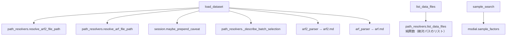

# ワークフロー: データセット投入の入口

`load_dataset` はユーザーがフォルダを渡したときの唯一の入口で、arf2 概観 → arf PCA を
一括実行するオーケストレータ。`arf2_parser` / `arf_parser` を**そのまま呼ぶ**ので、
連鎖の続きは [arf2.md](arf2.md) / [arf.md](arf.md) を参照。

## list_data_files

前提: なし
状態変更: なし

ツール層（`tools/dataset.py`）は純関数（`path_resolvers.list_data_files`、
`resolve_*_file_path` から呼ばれるのと同じもの）の結果を拡張子ごとにまとめて返す。
**既定は解析できる拡張子だけ**（.arf / .arf2 / .pai2 / .dcl / .EIC.aef / .mddata /
.mdproject）。MS-DIAL の出力フォルダには測定生データ（.wiff 等）が同居し、実データでは
495 ファイル中 7 割以上がそれだった。全部見たいときだけ `all_files=True`。

`all_files=True` と `extension` 明示のときだけ、**フォルダ形式の計測データ**
（Agilent・Bruker の `.d`、Waters の `.raw`）も一覧に含める。フォルダを一律に
除外すると、その形式だけが入った生データフォルダが「空」に見えて入口で誤読される。
どのフォルダが計測データかの判定は `console/job_manager.py` の `is_raw_input()` が
持ち（上流 `AnalysisFilesParser.ReadFolderContents` の `isVendorDirectory` と同じ規則）、
`path_resolvers` はそれを借りる——同じ規則を 2 か所に書くとドリフトするため。

純関数側は見つからなければ**空リスト**を返す。文面（「存在しません」等）を持つのは
ツール層だけで、以前のようにエラー文字列がパスの位置に紛れ込むことはない。

1. metabolomix/tools/dataset.py  list_data_files()
2. └─ metabolomix/core/path_resolvers.py  list_data_files()

## load_dataset

前提: なし（`directory` 省略時は `mcp_core.DATA_DIR` を使う）
状態変更: `directory` 指定時に `mcp_core.DATA_DIR` を差し替える。以降 `arf2_parser` /
`arf_parser` がそれぞれ `session` を更新する。

意味論ダイジェストは入口の先頭で 1 回だけ前置する。ここで発火させると、後段の
`arf2_parser` / `arf_parser` 内の同じガードは `caveat_emitted` により no-op になる。

1. metabolomix/tools/dataset.py  load_dataset()
2. └─ metabolomix/core/path_resolvers.py  resolve_arf2_file_path()
3. └─ metabolomix/core/path_resolvers.py  resolve_arf_file_path()
4. └─ metabolomix/core/session_state.py  AnalysisSession.maybe_prepend_caveat()
5. └─ metabolomix/core/path_resolvers.py  _describe_batch_selection()
6. └─ metabolomix/arf2/tools.py  arf2_parser()
7. └─ metabolomix/arf/tools.py  arf_parser()

## sample_search

前提: なし（ARF ロード前でも動く）
状態変更: なし

1. metabolomix/tools/samples.py  sample_search()
2. └─ metabolomix/msdial/sample_factors.py  token_vocabulary()
3. └─ metabolomix/msdial/sample_factors.py  expand_sample_specs()
4. └─ metabolomix/tools/samples.py  _collect_facets()
5. └─ metabolomix/tools/samples.py  _apply_role_filter()
6. └─ metabolomix/tools/samples.py  _describe()
