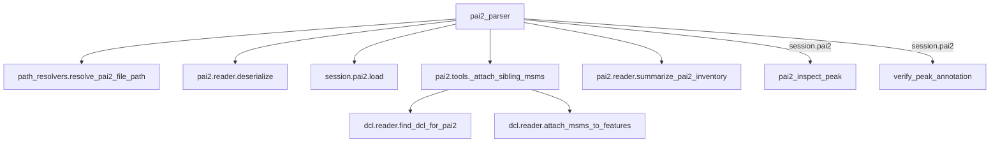

# ワークフロー: `.pai2`（単一測定の検出ピーク）

1 ファイル = 1 サンプルの全検出ピーク（アライン前）。**MS/MS スペクトルの実体は
`.pai2` にはない。** `has_msms` は取得参照が存在することしか記録していない。
`pai2_parser` は兄弟の `.dcl` を自動で探して実フラグメントを充填する（[dcl.md](dcl.md)）。

単一サンプルなのでサンプル間比較（PCA・差次的解析）は原理的にできない。`session.pai2`
は `session.arf` とは別スロットで、ピーク検証のために往復しても ARF 解析は壊れない。

## pai2_parser

前提: なし（`file_path` 省略時は最新バッチを自動選択）
状態変更: `session.pai2` に features / filtered_features を格納。`.dcl` が見つかれば
MS/MS も充填済み。

MS/MS の充填（手順 5）はセッション格納（手順 4）の**後**に、格納済みの
`session.pai2.features` を直接書き換える形で走る。`.dcl` が見つからなくても
`caveat` を添えて解析は続行する。

1. metabolomix/pai2/tools.py  pai2_parser()
2. └─ metabolomix/core/path_resolvers.py  resolve_pai2_file_path()
3. └─ metabolomix/pai2/reader.py  deserialize()
4. └─ metabolomix/core/session_state.py  Pai2State.load()
5. │  └─ metabolomix/core/session_state.py  Pai2State.apply_filter()
6. │     └─ metabolomix/pai2/reader.py  filter_features_by_params()
7. └─ metabolomix/pai2/tools.py  _attach_sibling_msms()
8. │  └─ metabolomix/dcl/reader.py  find_dcl_for_pai2()
9. │  └─ metabolomix/dcl/reader.py  deserialize_dcl()
10. │  └─ metabolomix/dcl/reader.py  attach_msms_to_features()
11. └─ metabolomix/pai2/reader.py  summarize_pai2_inventory()
12. └─ metabolomix/core/session_state.py  AnalysisSession.maybe_prepend_caveat()

## pai2_inspect_peak

前提: `pai2_parser` 実行済み（未実行なら手順 2 で `MissingState`）
状態変更: なし

1. metabolomix/pai2/tools.py  pai2_inspect_peak()
2. └─ metabolomix/core/mcp_errors.py  missing_state()
3. └─ metabolomix/pai2/reader.py  inspect_peak_details()

## verify_peak_annotation

前提: `pai2_parser` 実行済み（未実行なら手順 2 で `MissingState`）
状態変更: なし

MSI Level 2 を主張する前に、返り値の `analytical_checks.msms.band` を見ること。
`PASS` は実スペクトルを見たという意味、`FLAG_ONLY` はフラグが立っていただけという意味で、
両者を同一視してはならない。`PASS` を得るには `pai2_parser` が兄弟 `.dcl` の充填に
成功している必要がある。

蓄積ノートの語彙（手順 3）は生物学的妥当性の材料としてドシエに載る。ヒットが複数ある
場合は手順 4 が件数分繰り返される。

1. metabolomix/pai2/tools.py  verify_peak_annotation()
2. └─ metabolomix/core/mcp_errors.py  missing_state()
3. └─ metabolomix/corpus/knowledge_store.py  load_vocab()
4. └─ metabolomix/core/tool_helpers.py  _build_verification_dossier()
5. │  └─ metabolomix/pai2/reader.py  get_signal_to_noise()
